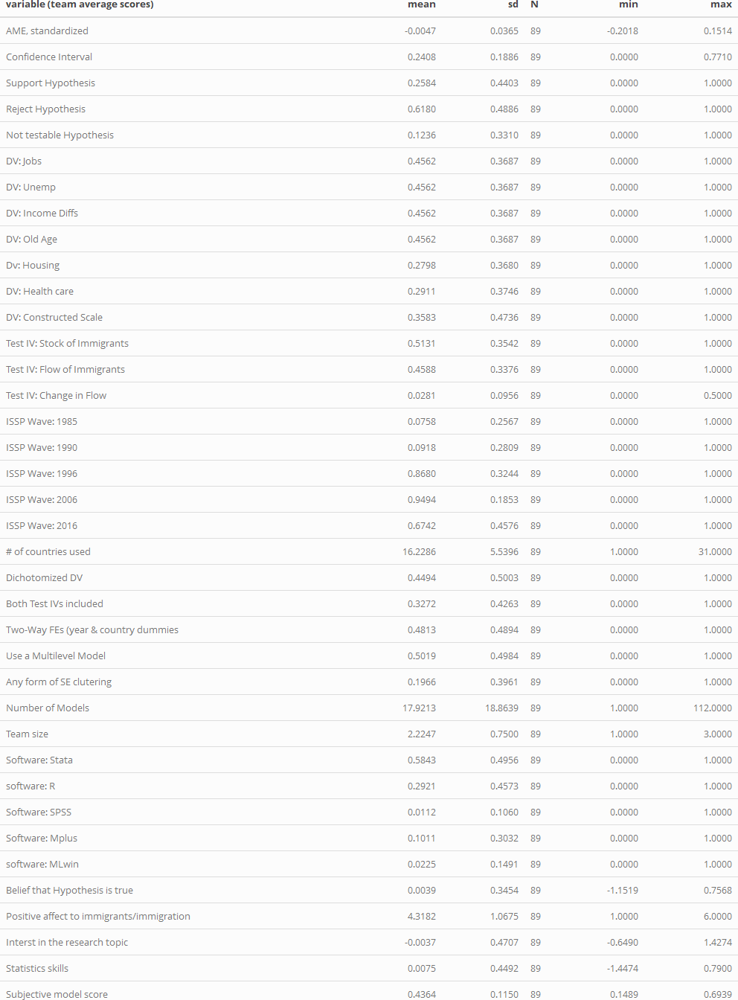
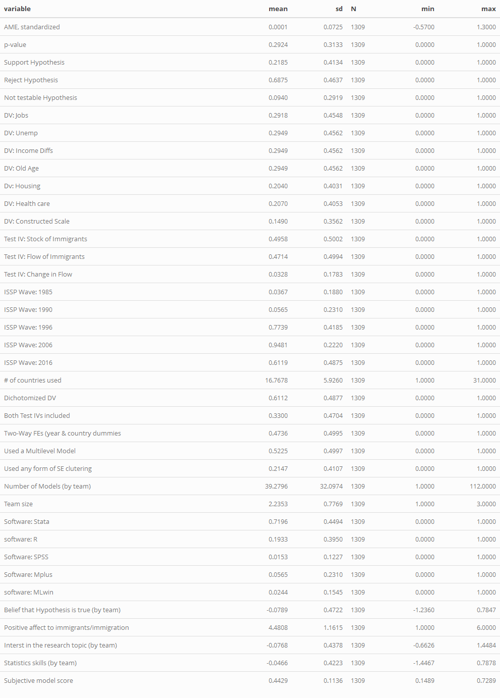
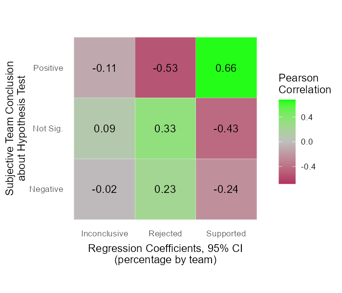

   
   

```{r setup, include=FALSE}
rm(list = ls())
library(pacman)

pacman::p_load("dplyr","knitr","kableExtra","reshape","ggplot2","ragg")

```

### Data

The datasets in thie file were worked up in the project file [01_CRI_Data_Prep.Rm](https://github.com/nbreznau/CRI/blob/master/01_CRI_Data_Prep.Rmd). In the [CRI.Rproj](https://github.com/nbreznau/CRI/blob/master/CRI.Rproj). Project and data available via GitHub.

1. *cri.csv* = model-level data, numerical values
2. *cri_team.csv* = team-level data


```{r load, warning=F,message=F, include =F}
cri <- read.csv(file = "data/cri.csv", header = T)
cri_team <- read.csv(file = "data/cri_team.csv", header = T)

```


### Descriptives

There were `r sum(cri_team$team_size)-2` participants in `r length(unique(cri$u_teamid))` teams that produced `r length(cri$u_teamid[cri$u_teamid > 0])` models. 

There were `r sum(duplicated(cri_team$u_teamid))` teams that came to more than one conclusion. For example, finding support of the hypothesis for immigration stock models, but finding rejection of the hypothesis for immigration flow models. Therefore, we have `r length(cri_team$u_teamid)` observations ('results') in the team-level data that derive from `r length(unique(cri_team$u_teamid))-1` teams plus we include the conclusion from the study by Brooks and Manza ([2006](https://doi.org/10.1177/000312240607100306)) that provides an example of a state of the art study for testing this hypothesis.


```{r descriptive, warning = F, message = F, include = F}
sum1 <- summarise_at(cri, vars(AME_Z, p, Hsup, Hrej, Hno, Jobs:ChangeFlow, w1985:w2016, countries, dichotomize,  main_IV_as_control, twowayfe, mlm_any, cluster_any, inv_weight, team_size, stata, r, spss, mplus, mlwin, belief, pro_immigrant, topic, stat, total_score), funs(mean), na.rm = T)

sum1.1 <- summarise_at(cri,vars(AME_Z, p, Hsup, Hrej, Hno, Jobs:ChangeFlow, w1985:w2016, countries, dichotomize,  main_IV_as_control, twowayfe, mlm_any, cluster_any, inv_weight, team_size, stata, r, spss, mplus, mlwin, belief, pro_immigrant, topic, stat, total_score), funs(sd), na.rm = T)

# need to fix to get accurate N counts at some point
sum2 <- summarise_at(cri, vars(AME_Z, p, Hsup, Hrej, Hno, Jobs:ChangeFlow, w1985:w2016, countries, dichotomize,  main_IV_as_control, twowayfe, mlm_any, cluster_any, inv_weight, team_size, stata, r, spss, mplus, mlwin, belief, pro_immigrant, topic, stat, total_score), funs(n()))

sum3 <- summarise_at(cri, vars(AME_Z, p, Hsup, Hrej, Hno, Jobs:ChangeFlow, w1985:w2016, countries, dichotomize,  main_IV_as_control, twowayfe, mlm_any, cluster_any, inv_weight, team_size, stata, r, spss, mplus, mlwin, belief, pro_immigrant, topic, stat, total_score), funs(min), na.rm = T)

sum4 <- summarise_at(cri, vars(AME_Z, p, Hsup, Hrej, Hno, Jobs:ChangeFlow, w1985:w2016, countries, dichotomize,  main_IV_as_control, twowayfe, mlm_any, cluster_any, inv_weight, team_size, stata, r, spss, mplus, mlwin, belief, pro_immigrant, topic, stat, total_score), funs(max), na.rm = T)

sum1[2,] <- c("AME, standardized","Confidence Interval","Support Hypothesis", "Reject Hypothesis", "Not testable Hypothesis", "DV: Jobs", "DV: Unemp", "DV: Income Diffs","DV: Old Age", "Dv: Housing", "DV: Health care", "DV: Constructed Scale", "Test IV: Stock of Immigrants", "Test IV: Flow of Immigrants", "Test IV: Change in Flow", "ISSP Wave: 1985", "ISSP Wave: 1990", "ISSP Wave: 1996", "ISSP Wave: 2006", "ISSP Wave: 2016", "# of countries used", "Dichotomized DV", "Both Test IVs included","Two-Way FEs (year & country dummies", "Used a Multilevel Model", "Used any form of SE clutering","Number of Models (by team)","Team size","Software: Stata","software: R","Software: SPSS","Software: Mplus","software: MLwin", "Belief that Hypothesis is true (by team)", "Positive affect to immigrants/immigration","Interst in the research topic (by team)","Statistics skills (by team)", "Subjective model score")

cri_sum <- rbind(sum1, sum1.1, sum2, sum3, sum4)

cri_sum <- as.data.frame(t(cri_sum))

colnames(cri_sum) <- c("mean","variable", "sd","N","min","max")

cri_sum <- select(cri_sum, variable, mean, everything())

cri_sum$mean <- round(as.numeric(cri_sum$mean), 4)
cri_sum$sd <- round(as.numeric(cri_sum$sd), 4)
cri_sum$min <- round(as.numeric(cri_sum$min), 4)
cri_sum$max <- round(as.numeric(cri_sum$max), 4)

t2 <- kable(cri_sum, row.names = F)
```


```{r desc_team, warning=F, message=F, include=F}
sum1 <- summarise_at(cri_team, vars(AME_Z, p, Hsup, Hrej, Hno, Jobs:ChangeFlow, w1985:w2016, countries, dichotomize,  main_IV_as_control, twowayfe, mlm_any, cluster_any, inv_weight, team_size, stata, r, spss, mplus, mlwin, belief, pro_immigrant, topic, stat, total_score), funs(mean), na.rm = T)

sum1.1 <- summarise_at(cri_team, vars(AME_Z, p, Hsup, Hrej, Hno, Jobs:ChangeFlow, w1985:w2016, countries, dichotomize,  main_IV_as_control, twowayfe, mlm_any, cluster_any, inv_weight, team_size, stata, r, spss, mplus, mlwin, belief, pro_immigrant, topic, stat, total_score), funs(sd), na.rm = T)

# need to fix to get accurate N counts at some point
sum2 <- summarise_at(cri_team, vars(AME_Z, p, Hsup, Hrej, Hno, Jobs:ChangeFlow, w1985:w2016, countries, dichotomize,  main_IV_as_control, twowayfe, mlm_any, cluster_any, inv_weight, team_size, stata, r, spss, mplus, mlwin, belief, pro_immigrant, topic, stat, total_score), funs(n()))

sum3 <- summarise_at(cri_team, vars(AME_Z, p, Hsup, Hrej, Hno, Jobs:ChangeFlow, w1985:w2016, countries, dichotomize,  main_IV_as_control, twowayfe, mlm_any, cluster_any, inv_weight, team_size, stata, r, spss, mplus, mlwin, belief, pro_immigrant, topic, stat, total_score), funs(min), na.rm = T)

sum4 <- summarise_at(cri_team, vars(AME_Z, p, Hsup, Hrej, Hno, Jobs:ChangeFlow, w1985:w2016, countries, dichotomize,  main_IV_as_control, twowayfe, mlm_any, cluster_any, inv_weight, team_size, stata, r, spss, mplus, mlwin, belief, pro_immigrant, topic, stat, total_score), funs(max), na.rm = T)

sum1[2,] <- c("AME, standardized","Confidence Interval","Support Hypothesis", "Reject Hypothesis", "Not testable Hypothesis", "DV: Jobs ", "DV: Unemp ", "DV: Income Diffs ","DV: Old Age ", "Dv: Housing ", "DV: Health care ", "DV: Constructed Scale ", "Test IV: Stock of Immigrants ", "Test IV: Flow of Immigrants ", "Test IV: Change in Flow ", "ISSP Wave: 1985 ", "ISSP Wave: 1990 ", "ISSP Wave: 1996 ", "ISSP Wave: 2006 ", "ISSP Wave: 2016 ", "# of countries used ", "Dichotomized DV ", "Both Test IVs included ","Two-Way FEs (year & country dummies ", "Use a Multilevel Model ", "Any form of SE clutering ","Number of Models ","Team size","Software: Stata","software: R","Software: SPSS","Software: Mplus","software: MLwin","Belief that Hypothesis is true", "Positive affect to immigrants/immigration","Interst in the research topic","Statistics skills", "Subjective model score")

cri_sum <- rbind(sum1, sum1.1, sum2, sum3, sum4)

cri_sum <- as.data.frame(t(cri_sum))

colnames(cri_sum) <- c("mean","variable", "sd","N","min","max")

cri_sum <- select(cri_sum, variable, mean, everything())

colnames(cri_sum) <- c("variable (team average scores)","mean", "sd","N","min","max")

cri_sum$mean <- round(as.numeric(cri_sum$mean), 4)
cri_sum$sd <- round(as.numeric(cri_sum$sd), 4)
cri_sum$min <- round(as.numeric(cri_sum$min), 4)
cri_sum$max <- round(as.numeric(cri_sum$max), 4)

rm(sum1,sum1.1,sum2,sum3,sum4)


t1 <- kable(cri_sum, row.names = F)
```

#### Table 1. Team-Results-Level Descriptive Statistics

```{r desc_team1, warning=F, message=F, include=F}
kable_styling(t1) %>%
  as_image(width = 4, file = "results/Table1.png")
```

```{r table1, warning=F, message=F, echo=T}

```

#### Table 2. Model-Level Descriptive Statistics

```{r descriptive1, warning = F, message = F, include=F}

kable_styling(t2) %>%
  as_image(width = 4, file = "results/Table2.png")

```

```{r table2, warning=F, message=F, echo=T}

```

### Main Findings - Tables 1-3

# Inlcude team 105 in the upper panel (all teams). They conducted measurement models and determined it could not (should not) be tested. Team 1 included as well, they had non-convergence.

This chunk preps some of the stats for Tables 1-3, these tables will be completed in 05_CRI_Main_Analyses.Rmd

```{r Tbl1_3_data_prep}
# remove original study and non-conclusive results
cri0 <- subset(cri, u_teamid != 0)
cri_team0 <- subset(cri_team, u_teamid != 0 & u_teamid != 1)

tm_avg <- round(mean(cri_team0$inv_weight, na.rm=T),2)
tm_sd <- round(sd(cri_team0$inv_weight, na.rm=T),2)
tm_min <- min(cri_team0$inv_weight, na.rm=T)
tm_max <- max(cri_team0$inv_weight, na.rm=T)
```


This chunk creates the matrix and saves it for export to 


```{r Tbl_1}

# create table frame
tbl1 <- matrix(nrow = 14, ncol = 3)
tbl1[1:14,1] <- c("","","Test Results","Positive","Insignificant","Negative","(test failed)",	"TOTAL","Sujective Conclusion: Hypothesis is?","Supported",	"Not testable/inconclusive",	"Rejected",	"TOTAL","")
tbl1[2,2] <- paste0("(out of ",length(unique(cri_team0$u_teamid))," teams)")
tbl1[2,3] <- paste0("(out of ",length(cri0$AME)," models)")
tbl1[1,2:3] <- c("Average Rate","Rate[a]")
tbl1[14,1] <- paste0("Of the ", length(unique(cri_team0$u_teamid)), " teams in the CRI,", sum(duplicated(cri_team0$u_teamid)), " of them treated stock and flow measures as independent tests of the hypothesis. Therefore, there are ", length(cri_team0$u_teamid), " team-level observed tests, each with an independent subjective conclusion. Of these ", length(cri_team0$u_teamid), " team-level results there was an average of ", tm_avg, " test models per team [sd =", tm_sd, ", min =", tm_min, ", max =", tm_max, "].")

# fill in descriptive results

# need to calculate rate carefully because teams 1 and 105 had failed tests

tbl1[4,2] <- mean(cri_team0$pos_test_pct_p05, na.rm = T)
tbl1[4,3] <- mean(cri0$AME_sup_p05, na.rm = T)
tbl1[5,2] <- mean(cri_team0$ns_test_pct_p05, na.rm = T)
tbl1[5,3] <- mean(cri0$AME_ns_p05, na.rm = T)
tbl1[6,2] <- mean(cri_team0$neg_test_pct_p05, na.rm = T)
tbl1[6,3] <- mean(cri0$AME_neg_p05, na.rm = T)
tbl1[7,2] <- 1- (sum(as.numeric(tbl1[4:6,2]), na.rm = T))
tbl1[7,3] <- 1- (sum(as.numeric(tbl1[4:6,3]), na.rm = T))

tbl1[8,2:3] <- 1

tbl1[10,2] <- (mean(cri_team0$Hsup, na.rm = T)*87)/89
tbl1[11,2] <- ((mean(cri_team0$Hnotest, na.rm = T)*87)+2)/89
tbl1[12,2] <- (mean(cri_team0$Hrej, na.rm = T)*87)/89
tbl1[13,2] <- 1

write.csv(tbl1, file = "results/tbl1.csv")
  
```

#### Correlation heatmap for Tbl1 obj and subj results

```{r}
cor_team <- select(cri_team0, Hsup, Hno, Hrej, pos_test_pct_p05, ns_test_pct_p05, neg_test_pct_p05)
cormat <- round(cor(cor_team),2)

sq_cormat <- cormat[-c(4:6),-c(1:3)]
colnames(sq_cormat) <- c("Positive","Not Sig.","Negative")
rownames(sq_cormat) <- c("Supported","Inconclusive","Rejected")
sq_cormat_melted <- melt(sq_cormat)

agg_png(filename = "results/Tbl1_cor.png", res = 144, height = 600, width = 700)
ggplot(data = sq_cormat_melted, aes(X1, X2, fill = value))+
 geom_tile(color = "white")+
 scale_fill_gradient2(low = "maroon", high = "green", mid = "grey", 
   midpoint = 0, limit = c(-0.68,0.68), space = "Lab", 
   name="Pearson\nCorrelation") +
  theme_minimal() +
  coord_fixed() +
  xlab("Regression Coefficients, 95% CI\n(percentage by team)") +
  ylab("Subjective Team Conclusion\nabout Hypothesis Test") +
  geom_text(aes(X1, X2, label = value), color = "black", size = 4) +
  theme(panel.grid.major = element_blank(),
        axis.title.x = element_text(vjust = -0.8),
      panel.border = element_blank(),
      panel.background = element_blank(),
      axis.ticks = element_blank())
dev.off()



```

