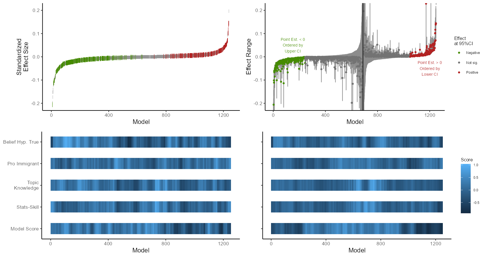
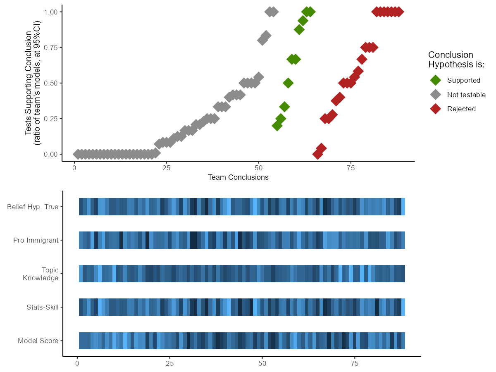

### Setup
   

```{r setup, include=FALSE}
rm(list = ls())
library(pacman)


pacman::p_load("devtools","ggplot2","tidyverse","readr","ExPanDaR","plotscale","lattice","tidyr","mlogit","knitr","grid","zoo","ggpubr","ragg","factoextra","cluster","kableExtra","skimr","WeightedCluster")

# Load Researcher Degrees of Freedom Analysis package
#  
# devtools::install_github("joachim-gassen/rdfanalysis")
library(rdfanalysis)


```


```{r load, warning=F,message=F, include=F}

cri <- read.csv(file = "data/cri.csv", header = T)
cri <- subset(cri, u_teamid != 0)
cri_str <- read.csv(file = "data/cri_str.csv", header = T)
cri_str <- subset(cri_str, u_teamid!=0)
cri_team <- read.csv(file = "data/cri_team.csv", header = T)
cri_team <- subset(cri_team, u_teamid!=0)

```


## Specification Curves

### Data Prep

```{r data_prep, warning=F, message=F, include=F}

# prep data
crispectest <- dplyr::select(cri_str, id, u_teamid, dv_type, iv_type, software, indepv, mator, dichotomize, twowayfe, cluster_any, Jobs:Scale,  w1985:w2016, p, AME_Z, lower_Z, upper_Z, id, eeurope, allavailable, mlm_any, Hresult, orig13, BELIEF_HYPOTHESIS, PRO_IMMIGRANT, TOPIC_KNOWLEDGE, STATISTICS_SKILL, MODEL_SCORE, main_IV_measurement, emplrate_ivC:gdp_ivC)

# create sample variables 
crispectest <- crispectest %>%
  mutate(w1985 = ifelse(is.na(w1985), "Other", w1985),
         w1990 = ifelse(is.na(w1990), "Other", w1990),
         w1996 = ifelse(is.na(w1996), "Other", w1996),
         w2006 = ifelse(is.na(w2006), "Other", w2006),
         w2016 = ifelse(is.na(w2016), "Other", w2016),
         orig13 = ifelse(is.na(orig13), "Other", orig13),
         eeurope = ifelse(is.na(eeurope), "Other", eeurope),
         allavailable = ifelse(is.na(allavailable), "Other", allavailable))

crispectest <- crispectest %>%
  mutate(SURVEY_WAVES = ifelse(w1985 == "Other" & w1990 == "Other" & w1996 == "w1996" & w2006 == "w2006" & w2016 == "Other", "1996 & 2006", ifelse(w1985 == "Other" & w1990 == "Other" & w1996 == "w1996" & w2006 == "w2006" & w2016 == "w2016", "1996, 2006 & 2016", ifelse(w1985 == "Other" & w1990 == "Other" & w1996 == "Other" & w2006 == "w2006" & w2016 == "w2016", "2006 & 2016", "Other"))),
         COUNTRIES = ifelse(orig13 == "orig13", "13 Rich Democracies Only", ifelse(allavailable == "allavailable", "All Available (~26)", ifelse(eeurope == "eeurope", "Includes Eastern/CE Europe", "Other"))))

#Remove NAs
crispectest <- subset(crispectest, !is.na(crispectest$AME_Z))
crispectest <- subset(crispectest, !is.na(crispectest$lower_Z))
  
  # some upper and lower bounds are exactly zero, adjust fix this
crispectest$lower_Z <- ifelse(crispectest$lower_Z > -0.00000001 & crispectest$lower_Z < 0.00000001, -0.0001, crispectest$lower_Z)
crispectest$upper_Z <- ifelse(crispectest$upper_Z > -0.00000001 & crispectest$upper_Z < 0.00000001, 0.0001, crispectest$upper_Z)

  #trim to have better plot range
  crispectest$lower_Z <- ifelse(crispectest$lower_Z < -0.75, -0.75, crispectest$lower_Z)
  crispectest$upper_Z <- ifelse(crispectest$upper_Z > 0.75, 0.75, crispectest$upper_Z)
  crispectest$upper_Z <- ifelse(crispectest$upper_Z < -0.75, -0.745, crispectest$upper_Z)
  crispectest$AME_Z <- ifelse(crispectest$AME_Z < -0.75, -0.747, crispectest$AME_Z)
  crispectest$AME_Z <- ifelse(crispectest$AME_Z > 0.75, 0.747, crispectest$AME_Z)
  
  #data prep
crispectest$est <- round(crispectest$AME_Z, 6)
crispectest$lb <- round(crispectest$lower_Z, 6)
crispectest$ub <- round(crispectest$upper_Z, 6)

# set up subjective conclusions at team level as 1 support, 0 not testable and -1 reject

cri_team <- cri_team %>%
  mutate(est = ifelse(Hsup == 1, 0.1, ifelse(Hrej == 1, -0.1, ifelse(Hno == 1, 0, NA))),
         ub = est+0.01,
         lb = est-0.01)

# import researcher aspects to crispectest
cri_merge <- select(cri, id, belief_ipred, pro_immigrant, topic_ipred, stats_ipred, total_score)

crispectest <- left_join(crispectest, cri_merge, by = "id")

```


### Model-Level Effect Specifications

#### Fig 1. Main Visual Results

This figure combines many spec curves. Two big ones with researcher characteristics, and several small ones with the sub-domains of specifications.

First two are ordered by effect size, the other by confidence interval minimum/maximum relative to the hypothesis.

##### Panel A. By Effect Size

```{r fig1_alt}
# remove original study
crispectest <- subset(crispectest, u_teamid != 0)
cri_team <- subset(cri_team, u_teamid !=0)

# order rows to make counter
crispectest <- crispectest[order(crispectest$est),]
crispectest$count <- 1:nrow(crispectest)

# create identifier of neg, ns, pos
crispectest <- crispectest %>%
  mutate(sig_group = as.factor(ifelse(est < 0 & ub > 0, NA, ifelse(est > 0 & lb < 0, NA, ifelse(est < 0 & ub < 0, 1, ifelse(est > 0 & lb > 0, 3, 2))))),
         est_sig = ifelse(!is.na(sig_group), est, NA),
         est_ns = ifelse(is.na(sig_group), est, NA),
         sig_group2 = as.factor(ifelse(is.na(sig_group), 2, sig_group)))

g1 <- ggplot(crispectest) +
  #geom_errorbar(aes(ymin = lb, ymax = ub), color = "thistle1") +
  geom_point(aes(x = count, y = est_ns), color = "grey55", shape = "|", size = 2, show.legend =F) + 
  geom_point(aes(x = count, y = est_sig, color = sig_group), shape = "|", size = 3) +
  scale_color_manual(values = c("chartreuse4","NA", "firebrick"), labels = c("Negative","Not sig.","Positive"," ")) +
  ylim(-0.21, 0.21) +
  labs(color = "Effect at 95%CI", x = "Model", y = " \n \nStandardized\nEffect Size") +
  theme_classic() +
  guides(color = guide_legend(override.aes = list(size=7, color=c("chartreuse4","grey55", "firebrick","NA")))) +
  theme(
    legend.key.size = unit(2,"line"),
    legend.position = "none",
    axis.title.x = element_blank())

```

#### Panel B. By Confidence Interval

```{r fig1_alt2}


# create identifier of neg, ns, pos
crispectest <- crispectest %>%
  mutate(ci = ifelse(sig_group2 == 1, ub, ifelse(sig_group2 == 3, lb, ifelse(est <= 0 & sig_group2 == 2, ub, ifelse(est > 0 & sig_group2 == 2, lb, NA)))),
         ub_order = ifelse(est <= 0 & sig_group2 == 1, 0, ifelse(est <= 0 & sig_group2==2, 1, ifelse(est > 0 & sig_group2==2, 2, ifelse(est > 0 & sig_group2 == 3, 3, NA)))),
         )

# order rows to make counter

crispectest <- crispectest[order(crispectest$ub_order, crispectest$ci),]
crispectest$count2 <- 1:nrow(crispectest)

# make an estimate where error bars show only for significant at 95% results
crispectest <- crispectest %>%
  mutate(est2 = ifelse(sig_group2 == 2, 0, est))

g2 <- ggplot(crispectest) +
  geom_errorbar(aes(x = count2, ymin = lb, ymax = ub), color = "grey55") +
  geom_point(aes(x = count2, y = est, color = sig_group2), size = 1) +
  scale_color_manual(values = c("chartreuse4","grey45", "firebrick"), labels = c("Negative","Not sig.","Positive")) +
  coord_cartesian(ylim = c(-0.21,0.21)) +
  labs(color = "Effect\nat 95%CI", x = "Model", y = "Effect Range", size = 2) +
  annotate("text", x = 150, y = 0.05,label = "Point Est. < 0\nOrdered by\nUpper CI", size = 2.5, color = "chartreuse4") +
  annotate("text", x = 1200, y = -0.05,label = "Point Est. > 0\nOrdered by\nLower CI", size = 2.5, color = "firebrick") +
  geom_vline(xintercept = 688) +
  theme_classic() +
  theme(
    legend.text = element_text(size = 6),
    legend.title = element_text(size = 8),
    axis.title.x = element_blank()
  )
  

```

#### Panels B & D. Researcher Characteristics

Heatmap Concept

we create a 'rolling average' of researcher characteristics across rows ordered by effect size. This is visually pleasing and helps identify any patterns (one tick per model for so many models is really hard visually with a continuous color scale)

```{r rolling_average}
# create rolling average for effect ordering
crispectest <- crispectest[order(crispectest$count),]

# mean replacement, then rolling average, replace ends of rolling average w/ reg scores
crispectest <- crispectest %>%
  mutate(belief_ipredm = scale(ifelse(is.na(belief_ipred), mean(belief_ipred, na.rm=T), belief_ipred)),
         pro_immigrantm = scale(ifelse(is.na(pro_immigrant), mean(pro_immigrant, na.rm=T), pro_immigrant)),
         topic_ipredm = scale(ifelse(is.na(topic_ipred), mean(topic_ipred, na.rm=T), topic_ipred)),
         stats_ipredm = scale(ifelse(is.na(stats_ipred), mean(stats_ipred, na.rm=T), stats_ipred)),
         total_scorem = scale(ifelse(is.na(total_score), mean(total_score, na.rm=T), total_score)),
         belief_roll = zoo::rollmean(belief_ipredm, k = 30, fill = NA),
         pro_roll = zoo::rollmean(pro_immigrantm, k = 30, fill = NA),
         topic_roll = zoo::rollmean(topic_ipredm, k = 30, fill = NA),
         stats_roll = zoo::rollmean(stats_ipredm, k = 30, fill = NA),
         total_roll = zoo::rollmean(total_scorem, k = 30, fill = NA),
         belief_roll = ifelse(is.na(belief_roll), mean(belief_ipredm[count>1230,]), ifelse(is.na(belief_roll) & count < 30, mean(belief_ipredm[count<40,]), belief_roll)),
         pro_roll = ifelse(is.na(pro_roll) & count > 1230, mean(pro_immigrantm[count>1230,]), ifelse(is.na(pro_roll) & count < 30, mean(pro_immigrantm[count < 40,]), pro_roll)),
         topic_roll = ifelse(is.na(topic_roll) & count > 1230, mean(topic_ipredm[count>1230,]), ifelse(is.na(topic_roll) & count < 30, mean(topic_ipredm[count<30,]), topic_roll)),
         stats_roll = ifelse(is.na(stats_roll) & count > 1230, mean(stats_ipredm[count>1215,]), ifelse(is.na(stats_roll) & count < 30, mean(stats_ipredm[count<30,]), stats_roll)),
         total_roll = ifelse(is.na(total_roll) & count > 1230, mean(total_scorem[count>1230,]), ifelse(is.na(total_roll) & count < 30, mean(total_scorem[count<30,]), total_roll))
                              )

# create rolling average for effect CI order
crispectest <- crispectest[order(crispectest$count2),]

# mean replacement, then rolling average then replace tails w/ mean
crispectest <- crispectest %>%
  mutate(belief_roll2 = zoo::rollmean(belief_ipredm, k = 30, fill = NA),
         pro_roll2 = zoo::rollmean(pro_immigrantm, k = 30, fill = NA),
         topic_roll2 = zoo::rollmean(topic_ipredm, k = 30, fill = NA),
         stats_roll2 = zoo::rollmean(stats_ipredm, k = 30, fill = NA),
         total_roll2 = zoo::rollmean(total_scorem, k = 30, fill = NA),         
         belief_roll2 = ifelse(is.na(belief_roll2), mean(belief_ipredm[count2>1230,]), ifelse(is.na(belief_roll2) & count2 < 30, mean(belief_ipredm[count2<30,]), belief_roll2)),
         pro_roll2 = ifelse(is.na(pro_roll2) & count2 > 1230, mean(pro_immigrantm[count2>1230,]), ifelse(is.na(pro_roll2) & count2 < 30, mean(pro_immigrantm[count2 < 30,]), pro_roll2)),
         topic_roll2 = ifelse(is.na(topic_roll2) & count2 > 1230, mean(topic_ipredm[count2>1230,]), ifelse(is.na(topic_roll2) & count2 < 30, mean(topic_ipredm[count2<30,]), topic_roll2)),
         stats_roll2 = ifelse(is.na(stats_roll2) & count2 > 1230, mean(stats_ipredm[count2>1215,]), ifelse(is.na(stats_roll2) & count2 < 30, mean(stats_ipredm[count2<30,]), stats_roll2)),
         total_roll2 = ifelse(is.na(total_roll2) & count2 > 1230, mean(total_scorem[count2>1230,]), ifelse(is.na(total_roll2) & count2 < 30, mean(total_scorem[count2<30,]), total_roll2))
                              )
labs_y <- c("Model Score","Stats-Skill","Topic\nKnowledge","Pro Immigrant","Belief Hyp. True")

g3 <- ggplot(crispectest) +
  geom_tile(aes(x = count, y = 5, fill = belief_roll), height = 0.5) +
  geom_tile(aes(x = count, y = 4, fill = pro_roll), height = 0.5) +
  geom_tile(aes(x = count, y = 3, fill = topic_roll), height = 0.5) +
  geom_tile(aes(x = count, y = 2, fill = stats_roll), height = 0.5) +
  geom_tile(aes(x = count, y = 1, fill = total_roll), height = 0.5) +
  scale_y_continuous(breaks = c(1,2,3,4,5), labels=labs_y) +
    theme_classic() +
  xlab("Models ordered by Effect Size") +
  theme(
    legend.position = "none",
    axis.title.y = element_blank()
  )
labs_y2 <- c("Model","l","e","t","e")


g4 <- ggplot(crispectest) +
  geom_tile(aes(x = count2, y = 5, fill = belief_roll2), height = 0.5) +
  geom_tile(aes(x = count2, y = 4, fill = pro_roll2), height = 0.5) +
  geom_tile(aes(x = count2, y = 3, fill = topic_roll2), height = 0.5) +
  geom_tile(aes(x = count2, y = 2, fill = stats_roll2), height = 0.5) +
  geom_tile(aes(x = count2, y = 1, fill = total_roll2), height = 0.5) +
  labs(fill = "Score") +
  scale_y_continuous(breaks = c(1,2,3,4,5), labels=labs_y2) +
  xlab("Models ordered by Minimum Confidence Boundary (95%CI)") +
    theme_classic() +
  theme(
    axis.text.y = element_text(color = "NA"),
    axis.title.y = element_blank(),
    legend.text = element_text(size = 6),
    legend.title = element_text(size = 8)
  )
```

### Fig 1. Combined

```{r ggplot}

agg_png(filename = "results/Fig1_new.png", res = 144, height = 900, width = 1700)
ggarrange(g1,g2,g3,g4, labels = c("A ","B ","C ","D "))
dev.off()


```


#### Fig 1. Sub-plots

We include two smaller versions of the spec-curves with four sub-domains of specifications below. This time without a rolling average.

First we recode our variables of interest into 1/0s for plotting

```{r recode_order}

crispectest <- crispectest %>%
  mutate(DV_Jobs = ifelse(is.na(Jobs), 0, 1), # Measurement
         DV_Unemp = ifelse(is.na(Unemp), 0, 1),
         DV_IncDiff = ifelse(is.na(IncDiff), 0, 1),
         DV_OldAge = ifelse(is.na(OldAge), 0, 1),
         DV_House = ifelse(is.na(House), 0, 1),
         DV_Health = ifelse(is.na(Health), 0, 1),
         DV_Scale = ifelse(is.na(Scale), 0, 1), 
         Test_Stock = ifelse(iv_type == "Stock", 1, 0),
         Test_Flow = ifelse(iv_type == "Flow", 1, 0),
         Test_ChangeFlow = ifelse(iv_type == "ChangeFlow", 1, 0),
         M_Gross = ifelse(main_IV_measurement == "Immigrant, foreign-born" | main_IV_measurement == "Refugee" | main_IV_measurement == "Non-Western Immigrant", 1, 0),
         M_Net = ifelse(main_IV_measurement == "Net Migration", 1, 0),
         W_Other = ifelse(SURVEY_WAVES == "Other", 1, 0), # Sample 
         W_96_06 = ifelse(SURVEY_WAVES == "1996 & 2006", 1, 0),
         W_96_06_16 = ifelse(SURVEY_WAVES == "1996, 2006 & 2016", 1, 0),
         W_06_16 = ifelse(SURVEY_WAVES == "2006 & 2016", 1, 0),
         C_13 = ifelse(COUNTRIES == "13 Rich Democracies Only", 1, 0),
         C_Other = ifelse(COUNTRIES == "Other", 1, 0),
         C_All = ifelse(COUNTRIES == "All Available (~26)", 1, 0),
         C_CEE = ifelse(COUNTRIES == "Includes Eastern/CE Europe", 1, 0),
         IV_Emp = ifelse(emplrate_ivC == "emplrate_ivC" | unemprate_ivC == "unemprate_ivC", 1, 0),
         IV_Emp = ifelse(is.na(IV_Emp), 0, IV_Emp),
         IV_GDP = ifelse(is.na(gdp_ivC), 0, 1),
         IV_Socx = ifelse(is.na(socx_ivC), 0, 1),
         IV_None = ifelse((IV_Emp + IV_GDP + IV_Socx) == 0, 1, 0),
         Est_ols = ifelse(mator == "ols", 1, 0),
         Est_logit = ifelse(mator == "logit", 1, 0),
         Est_mlglm = ifelse(mator == "ml_glm", 1, 0),
         Est_ologit = ifelse(mator == "ologit", 1, 0),
         Est_bayes = ifelse(mator == "bayes", 1, 0))


```


##### Measurement Specs

Six dependent variables, plus a scale variable


```{r fig1_test}
testlabs <- c("Stock", "Flow", "Change Flow")
#g7 <- 
  ggplot(crispectest) +
  geom_tile(aes(x = count, y = 3, fill = factor(Test_Stock)), height = 0.5) +
  geom_tile(aes(x = count, y = 2, fill = factor(Test_Flow)), height = 0.5) +
  geom_tile(aes(x = count, y = 1, fill = factor(Test_ChangeFlow)), height = 0.5) +
  scale_y_continuous(breaks = c(3,2,1), labels=testlabs) +
  scale_fill_manual(values = c("NA","blue")) +
  theme_classic() +
  ylab("Immigration Test Operationalization") +
  theme(
    axis.title.x = element_blank(),
    legend.position = "none",
    axis.line.x = element_blank(),
    axis.ticks.x = element_blank(),
    axis.text.x = element_blank(),
  )
```
```{r fig1_measure}
mlabs <- c("Immigrants (%)", "Net Migration")
#g8 <- 
  ggplot(crispectest) +
  geom_tile(aes(x = count, y = 2, fill = factor(M_Gross)), height = 0.5) +
  geom_tile(aes(x = count, y = 1, fill = factor(M_Net)), height = 0.5) +
  scale_y_continuous(breaks = c(2,1), labels=mlabs) +
  scale_fill_manual(values = c("NA","darkblue")) +
  theme_classic() +
  ylab("Immigration Test Measurement") +
  theme(
    axis.title.x = element_blank(),
    legend.position = "none",
    axis.line.x = element_blank(),
    axis.ticks.x = element_blank(),
    axis.text.x = element_blank(),
  )
```


```{r fig1_measure}
# set labels
dvlabs = c("Jobs","Unemp","IncDiff","OldAge","House","Health","Scale")

#g9 <- 
  ggplot(crispectest) +
  geom_tile(aes(x = count, y = 7, fill = factor(DV_Jobs)), height = 0.5) +
  geom_tile(aes(x = count, y = 6, fill = factor(DV_Unemp)), height = 0.5) +
  geom_tile(aes(x = count, y = 5, fill = factor(DV_IncDiff)), height = 0.5) +
  geom_tile(aes(x = count, y = 4, fill = factor(DV_OldAge)), height = 0.5) +
  geom_tile(aes(x = count, y = 3, fill = factor(DV_House)), height = 0.5) +
  geom_tile(aes(x = count, y = 2, fill = factor(DV_Health)), height = 0.5) +
  geom_tile(aes(x = count, y = 1, fill = factor(DV_Scale)), height = 0.5) +
  scale_y_continuous(breaks = c(7,6,5,4,3,2,1), labels=dvlabs) +
  scale_fill_manual(values = c("NA","blue")) +
    theme_classic() +
    ylab("Dependent Variable") +
  theme(
    axis.title.x = element_blank(),
    legend.position = "none",
    axis.line.x = element_blank(),
    axis.ticks.x = element_blank(),
    axis.text.x = element_blank(),
  )
  
```


```{r fig1_sample}
samplabs <- c("1996 & 2006","2006 & 2016","1996, 2006\n& 2016","Other")

# g9 <-
ggplot(crispectest) +
  geom_tile(aes(x = count, y = 4, fill = factor(W_96_06)), height = 0.5) +
  geom_tile(aes(x = count, y = 3, fill = factor(W_96_06_16)), height = 0.5) +
  geom_tile(aes(x = count, y = 2, fill = factor(W_06_16)), height = 0.5) +
  geom_tile(aes(x = count, y = 1, fill = factor(W_Other)), height = 0.5) +
  scale_y_continuous(breaks = c(4,3,2,1), labels=samplabs) +
  scale_fill_manual(values = c("NA","blue")) +
    theme_classic() +
  ylab("Survey Waves in Sample") +
  theme(
    axis.title.x = element_blank(),
    legend.position = "none",
    axis.line.x = element_blank(),
    axis.ticks.x = element_blank(),
    axis.text.x = element_blank(),
  )

  
```

```{r fig1_countries}
   

clabs <- c("Rich 13","CEE/East\nEurope","All\nAvailable","Other")

# g9 <-
ggplot(crispectest) +
  geom_tile(aes(x = count, y = 4, fill = factor(C_13)), height = 0.5) +
  geom_tile(aes(x = count, y = 3, fill = factor(C_CEE)), height = 0.5) +
  geom_tile(aes(x = count, y = 2, fill = factor(C_All)), height = 0.5) +
  geom_tile(aes(x = count, y = 1, fill = factor(C_Other)), height = 0.5) +
  scale_y_continuous(breaks = c(4,3,2,1), labels=clabs) +
  scale_fill_manual(values = c("NA","blue")) +
    theme_classic() +
  ylab("Countries in Sample") +
  theme(
    axis.title.x = element_blank(),
    legend.position = "none",
    axis.line.x = element_blank(),
    axis.ticks.x = element_blank(),
    axis.text.x = element_blank(),
  )

```

```{r fig1_ivs}

ivlabs <- c("(Un)Emp\nRate","GDP\nper cap", "Social\nSpending","None/other")

# g9 <-
ggplot(crispectest) +
  geom_tile(aes(x = count, y = 4, fill = factor(IV_Emp)), height = 0.5) +
  geom_tile(aes(x = count, y = 3, fill = factor(IV_GDP)), height = 0.5) +
  geom_tile(aes(x = count, y = 2, fill = factor(IV_Socx)), height = 0.5) +
  geom_tile(aes(x = count, y = 1, fill = factor(IV_None)), height = 0.5) +
  scale_y_continuous(breaks = c(4,3,2,1), labels=ivlabs) +
  scale_fill_manual(values = c("NA","blue")) +
    theme_classic() +
  ylab("Other Independent Variables in Model") +
  theme(
    axis.title.x = element_blank(),
    legend.position = "none",
    axis.line.x = element_blank(),
    axis.ticks.x = element_blank(),
    axis.text.x = element_blank(),
  )

   
```

```{r fig1_estimator}

estlabs <- c("OLS","Logit","ML/GLM","Ordered\nlogit","Bayes")

# g9 <-
ggplot(crispectest) +
  geom_tile(aes(x = count, y = 5, fill = factor(Est_ols)), height = 0.5) +
  geom_tile(aes(x = count, y = 4, fill = factor(Est_logit)), height = 0.5) +
  geom_tile(aes(x = count, y = 3, fill = factor(Est_mlglm)), height = 0.5) +
  geom_tile(aes(x = count, y = 2, fill = factor(Est_ologit)), height = 0.5) +
  geom_tile(aes(x = count, y = 1, fill = factor(Est_bayes)), height = 0.5) +
  scale_y_continuous(breaks = c(5,4,3,2,1), labels=estlabs) +
  scale_fill_manual(values = c("NA","blue")) +
    theme_classic() +
  ylab("Estimation Method") +
  theme(
    axis.title.x = element_blank(),
    legend.position = "none",
    axis.line.x = element_blank(),
    axis.ticks.x = element_blank(),
    axis.text.x = element_blank(),
  )

    
```

##### Sample Specs

##### Variable Specs

##### Equation & Estimation Specs


### Fig 2. Team-Level New

Order results by subjective conclusion and then percent ratio of effect sizes at p05 neg/pos.

```{r fig2team_setup}
cri_team <- cri_team %>%
  mutate(subj_concl <- factor(Hresult, levels = c("Reject","No test","Support")),
         pct_negpos = ifelse(subj_concl == "Reject", AME_neg_p05, 
                             ifelse(subj_concl == "No test", AME_ns_p05, AME_sup_p05)))
  
  # order rows to make counter
cri_team <- cri_team[order(cri_team$Hresult, cri_team$pct_negpos),]
cri_team$count <- 1:nrow(cri_team)


cri_team <- cri_team %>%
  mutate(belief_ipredm = scale(ifelse(is.na(belief_ipred), mean(belief_ipred, na.rm=T), belief_ipred)),
         pro_immigrantm = scale(ifelse(is.na(pro_immigrant), mean(pro_immigrant, na.rm=T), pro_immigrant)),
         topic_ipredm = scale(ifelse(is.na(topic_ipred), mean(topic_ipred, na.rm=T), topic_ipred)),
         stats_ipredm = scale(ifelse(is.na(stats_ipred), mean(stats_ipred, na.rm=T), stats_ipred)),
         total_scorem = scale(ifelse(is.na(total_score), mean(total_score, na.rm=T), total_score)))

labs_y <- c("Model Score","Stats-Skill","Topic\nKnowledge","Pro Immigrant","Belief Hyp. True")
```


```{r fig2team}
g5a <- ggplot(cri_team) +
  geom_point(aes(x = count, y = pct_negpos, color = Hresult), shape = 18, size = 6) +   scale_color_manual(values = c("chartreuse4","grey55", "firebrick"), labels = c("Supported","Not testable","Rejected"," ")) +
  labs(color = "Conclusion\nHypothesis is:", x = "Team Conclusions", y = "Tests Supporting Conclusion\n(ratio of team's models, at 95%CI)") +
  theme_classic() +
  theme(
    plot.margin=unit(c(0.2,0.2,0.2,1.05),"cm"),
    axis.title.y = element_text(size = 10),
    axis.title.x = element_text(size = 9)
  ) 

g5b <- ggplot(cri_team) +
  geom_tile(aes(x = count, y = 5, fill = belief_ipredm), height = 0.5) +
  geom_tile(aes(x = count, y = 4, fill = pro_immigrantm), height = 0.5) +
  geom_tile(aes(x = count, y = 3, fill = topic_ipredm), height = 0.5) +
  geom_tile(aes(x = count, y = 2, fill = stats_ipredm), height = 0.5) +
  geom_tile(aes(x = count, y = 1, fill = total_scorem), height = 0.5) +
  scale_y_continuous(breaks = c(1,2,3,4,5), labels=labs_y) +
    theme_classic() +
  theme(
    legend.position = "none",
    axis.title.y = element_blank(),
    axis.title.x = element_blank(),
    plot.margin=unit(c(0.2,3.2,0.2,0.3),"cm")
  )
agg_png(filename = "results/Fig2team_new.png", res = 144, height = 900, width = 1200)
ggarrange(g5a,g5b,ncol = 1)
dev.off()


```


#### Fig 2. Model Features Pooled

```{r}
crispectest2 <- crispectest %>%
  mutate(IMMIGRATION_MEASURE = iv_type,
         DV_MEASURE = dv_type)

crispectest2 <- subset(crispectest2, !is.na(crispectest2$IMMIGRATION_MEASURE))
crispectest2 <- subset(crispectest2, !is.na(crispectest2$DV_MEASURE))

crispectest2 <- select(crispectest2, IMMIGRATION_MEASURE, DV_MEASURE, est, lb, ub)

# remove/adjust attributes
  crispectest2 <- crispectest2[names(crispectest2)]
  choices <- 1:2
  attr(crispectest2, "choices") <- choices
  rownames(crispectest2) <- NULL
png(file = "results/Fig2_AME.png", width = 1200, height = 850, res = 144)

plot_rdf_spec_curve(crispectest2, "est", "lb", "ub", est_color = "grey", est_color_signeg = "red", est_color_sigpos = "blue", lower_to_upper = 1.5, est_label = "Average Marginal Effects\n(standardized)", choice_ind_point = F, pt_size = 0.3, ribbon = T)
dev.off()

knitr::include_graphics("results/Fig2_AME.png")
```
#### Fig 2_Stock. Model Features Stock Models Only

```{r fig2_stock}
crispectest3 <- subset(crispectest2, IMMIGRATION_MEASURE == "Stock")
crispectest3 <- select(crispectest3, -c(IMMIGRATION_MEASURE))

# remove/adjust attributes
  crispectest3 <- crispectest3[names(crispectest3)]
  choices <- 1
  attr(crispectest3, "choices") <- choices
  rownames(crispectest3) <- NULL
png(file = "results/Fig2_Stock_AME.png", width = 800, height = 650, res = 144)

plot_rdf_spec_curve(crispectest3, "est", "lb", "ub", est_color = "grey", est_color_signeg = "red", est_color_sigpos = "blue", lower_to_upper = 1.5, est_label = "Average Marginal Effects\n(standardized)", choice_ind_point = F, pt_size = 0.3, ribbon = T)
dev.off()

knitr::include_graphics("results/Fig2_Stock_AME.png")
```


#### Fig 2_Stock. Model Features Flow Models Only

```{r fig2_flow}
crispectest4 <- subset(crispectest2, IMMIGRATION_MEASURE == "Flow")
crispectest4 <- select(crispectest4, -c(IMMIGRATION_MEASURE))

# remove/adjust attributes
  crispectest4 <- crispectest4[names(crispectest4)]
  choices <- 1
  attr(crispectest4, "choices") <- choices
  rownames(crispectest4) <- NULL
png(file = "results/Fig2_Flow_AME.png", width = 800, height = 650, res = 144)

plot_rdf_spec_curve(crispectest3, "est", "lb", "ub", est_color = "grey", est_color_signeg = "red", est_color_sigpos = "blue", lower_to_upper = 1.5, est_label = "Average Marginal Effects\n(standardized)", choice_ind_point = F, pt_size = 0.3, ribbon = T)
dev.off()

knitr::include_graphics("results/Fig2_Flow_AME.png")
```

#### Fig 3. Sample Features

```{r fig3}
crispectest5 <- select(crispectest, SURVEY_WAVES, COUNTRIES, est, lb, ub)

crispectest5 <- subset(crispectest5, !is.na(crispectest5$SURVEY_WAVES))
crispectest5 <- subset(crispectest5, !is.na(crispectest5$COUNTRIES))


# remove/adjust attributes
  crispectest5 <- crispectest5[names(crispectest5)]
  choices <- 1:2
  attr(crispectest5, "choices") <- choices
  rownames(crispectest5) <- NULL
png(file = "results/Fig3_AME.png", width = 1200, height = 850, res = 144)

plot_rdf_spec_curve(crispectest5, "est", "lb", "ub", est_color = "grey", est_color_signeg = "red", est_color_sigpos = "blue", lower_to_upper = 1.5, est_label = "Average Marginal Effects\n(standardized)", choice_ind_point = F, pt_size = 0.3, ribbon = T)
dev.off()

knitr::include_graphics("results/Fig3_AME.png")
```

### Subjective Team Conclusions

#### Fig 4. By Researcher Qualities and 

```{r fig4_DV2, echo=F}


spec_team <- select(cri_team, BELIEF_HYPOTHESIS, PRO_IMMIGRANT, TOPIC_KNOWLEDGE, STATISTICS_SKILL, MODEL_SCORE, est, lb, ub)

spec_team <- subset(spec_team, !is.na(BELIEF_HYPOTHESIS))
spec_team <- subset(spec_team, !is.na(MODEL_SCORE))
# one problem with rdfanalysis is that it outputs the categories in the order they appear in the data, therefore we have to generate 3 rows of fake data to get the order right
  
fake <- as.data.frame(matrix(nrow = 3, ncol = 8))
fake[1,] <- c("Low","Low","Low","Low","Low",0,-0.01,0.01)
fake[2,] <- c("Mid","Mid","Mid","Mid","Mid",0,-0.01,0.01)
fake[3,] <- c("High","High","High","High","High",0,-0.01,0.01)
colnames(fake) <- c("BELIEF_HYPOTHESIS", "PRO_IMMIGRANT", "TOPIC_KNOWLEDGE", "STATISTICS_SKILL", "MODEL_SCORE", "est", "lb", "ub")
fake$est <- as.numeric(fake$est)
fake$ub <- as.numeric(fake$ub)
fake$lb <- as.numeric(fake$lb)

spec_team1 <- bind_rows(fake,spec_team)

# remove/adjust attributes
  spec_team1 <- spec_team1[names(spec_team1)]
  choices <- 1:5
  attr(spec_team1, "choices") <- choices
  rownames(spec_team1) <- NULL
png(file = "results/Fig4_AME.png", width = 700, height = 700, res = 144)

plot_rdf_spec_curve(spec_team1, "est", "lb", "ub", est_color = "grey", est_color_signeg = "red", est_color_sigpos = "blue", lower_to_upper = 1.5, est_label = "Subjective Conclusion", choice_ind_point = F, pt_size = 0.5, ribbon = T)
dev.off()

knitr::include_graphics("results/Fig4_AME.png")
```


#### Figure 5. (same as Fig 2 at team level)

#### Figure 6. (same as Fig 3 at team level)


## Dissimilarity Analysis

### Model Specification Count

The problem is that many of these model specifications were dropped because they were not the team's preferred models, or because in the margins extraction phase the PIs decided that the models were not preferable (only when the team provided them as 'extra' models). Therefore, some columns of the database have zero variance. These columns need to be removed.

```{r qual_codes, warning = F}
# Get data with only model specs
cri_spec_only <- cri

         
cri_spec_only <- select(cri_spec_only, -c(count:main_IV_measurement, num_countries, inv_weight, additionalinfo, Hsupport:HresultF, AME_sup_p05:MODEL_SCORE))


# convert character to numeric
cri_spec_only <- cri_spec_only %>%
  mutate(main_IV_time = as.numeric(as.factor(main_IV_time)),
         main_IV_effect = as.numeric(as.factor(main_IV_effect)),
         package = as.numeric(as.factor(package)))

# specifications with at least three teams using them
rownames(cri_spec_only) <- cri_spec_only$id
cri_spec_only_team <- aggregate(cri_spec_only, by = list(cri_spec_only$u_teamid), FUN = "mean")
# our analysis below revealed we should try a subset
cri_spec_only2 <- subset(cri_spec_only, u_teamid != 10 & u_teamid != 61 & u_teamid != 82)
cri_spec_only <- select(cri_spec_only,-c(u_teamid, id))
cri_spec_only2 <- select(cri_spec_only2,-c(u_teamid, id))
cri_sums <- colSums(Filter(is.numeric, cri_spec_only_team))
cri_sums <- as.data.frame(c("sum",cri_sums))
cri_sums[,1] <- as.numeric(cri_sums[,1])
cri_sums_uncommon <- subset(cri_sums, cri_sums[,1] < 3)

# remove zero variance columns
cri_spec_only <- cri_spec_only[ - as.numeric(which(apply(cri_spec_only, 2, var) == 0))]
cri_spec_only2 <- cri_spec_only2[ - as.numeric(which(apply(cri_spec_only2, 2, var) == 0))]

```

(when analyzing all) This demonstrates 3 clusters, but teams 10, 61 and 82 are obvious outliers. Therefore, we re-run the analysis with them removed.

```{r clus_cut, warning = F, message = F, echo = F}
# k-means clustering
# cri_km2 <- eclust(cri_spec_only2, "kmeans", nstart = 25)

# saveRDS(cri_km2, file = "results/cri_km2.Rds")

readRDS(cri_km2, file = "results/cri_km2.Rds")

#recombine
cri_spec_only2$cluster <- cri_km2$cluster

cri_spec_only2$id <- rownames(cri_spec_only2)

#create merge file
cri_so2_merge <- select(cri_spec_only2, id, cluster)

cri <- left_join(cri, cri_so2_merge, by = "id")
cri$cluster <- ifelse(is.na(cri$cluster), 10, cri$cluster)

rm(cri_spec_only,cri_spec_only2,cri_spec_only_team,cri_sums_uncommon)
```


```{r corrs_clusters}
test_cor <- select(cri, cluster, AME_Z, AME, p, Hsupport, u_teamid)
test_cor <- test_cor %>%
  mutate(clus01 = ifelse(cluster == 1, 1, 0),
         clus02 = ifelse(cluster == 2, 1, 0),
         clus03 = ifelse(cluster == 3, 1, 0),
         clus04 = ifelse(cluster == 4, 1, 0),
         clus05 = ifelse(cluster == 5, 1, 0),
         clus06 = ifelse(cluster == 6, 1, 0),
         clus07 = ifelse(cluster == 7, 1, 0),
         clus08 = ifelse(cluster == 8, 1, 0),
         clus09 = ifelse(cluster == 9, 1, 0),
         clus10 = ifelse(cluster == 10, 1, 0))

cor <- cor(test_cor, use = "pairwise.complete")
```

We see that there are a few clusters that are more likely to have effects in a certain direction, more likely to have higher p-values or more likely to have subjective conclusions go in support.

#### Cluster descriptives

```{r clus_des}
cri_clusters <- aggregate(cri, by = list(cri$cluster), FUN = "mean")

cri_clusters_tbl <- t(select(cri_clusters, Jobs:countries, u_teamid))

kable_styling(kable(cri_clusters_tbl[1:30,], digits = 2))
```