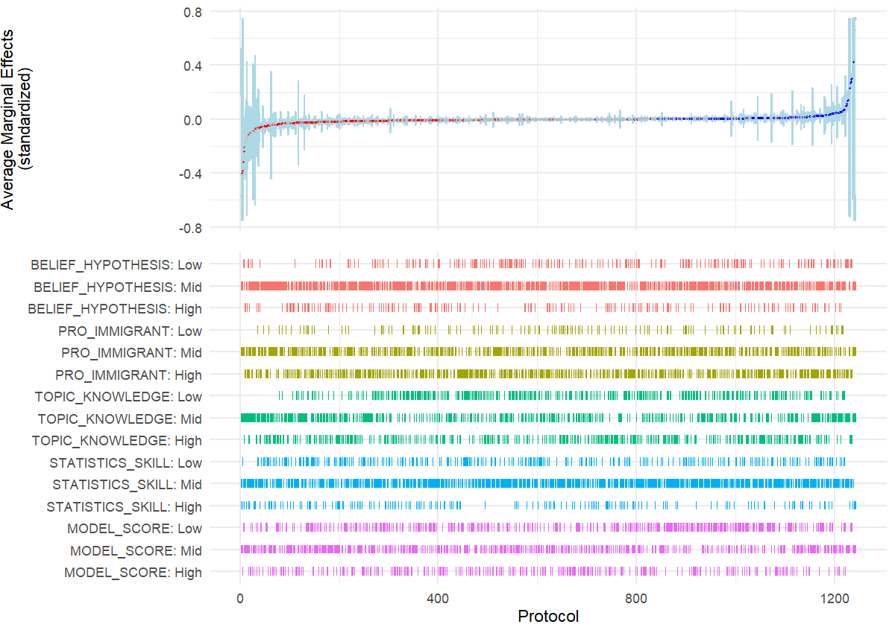
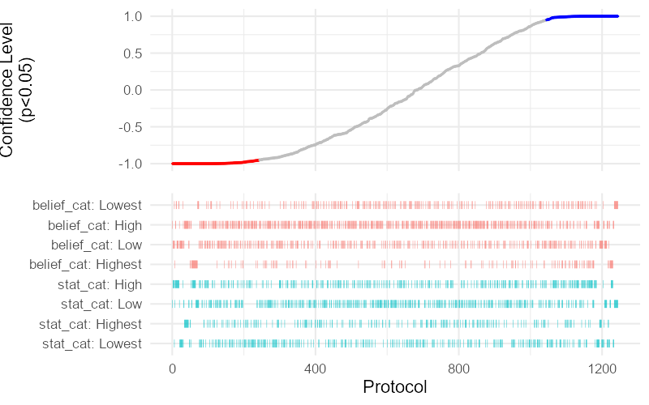
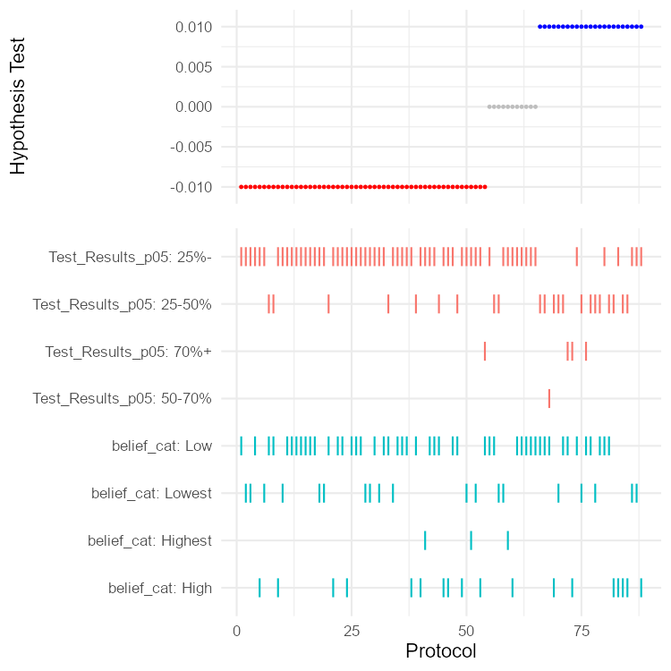

### Special Package
   We load the rdfanalysis package designed by <a href=https://joachim-gassen.github.io/rdfanalysis/>Joachim Gassen</a> to generate specification curves.
   
   

```{r setup, include=FALSE}
rm(list = ls())
library(pacman)


pacman::p_load("devtools","ggplot2","dplyr","readr","ExPanDaR","plotscale","lattice","tidyr","mlogit","knitr")

# Load Researcher Degrees of Freedom Analysis package
#  
# devtools::install_github("joachim-gassen/rdfanalysis")
library(rdfanalysis)


```


```{r load, warning=F,message=F, include=F}

cri <- read.csv(file = "data/cri.csv", header = T)
cri_str <- read.csv(file = "data/cri_str.csv", header = T)
cri_team <- read.csv(file = "data/cri_team.csv", header = T)

```


```{r recode_cats, warning=F, message=F, include=F}


# prep data
crispectest <- dplyr::select(cri_str, dv_type, iv_type, software, indepv, mator, dichotomize, twowayfe, cluster_any, Jobs:Scale,  w1985:w2016, p, AME_Z, lower_Z, upper_Z, id, eeurope, allavailable, mlm_any, Hresult, BELIEF_HYPOTHESIS, PRO_IMMIGRANT, TOPIC_KNOWLEDGE, STATISTICS_SKILL, MODEL_SCORE)

#Remove NAs
crispectest <- subset(crispectest, !is.na(crispectest$AME_Z))
crispectest <- subset(crispectest, !is.na(crispectest$lower_Z))
  
  # some upper and lower bounds are exactly zero, adjust fix this
crispectest$lower_Z <- ifelse(crispectest$lower_Z > -0.00000001 & crispectest$lower_Z < 0.00000001, -0.0001, crispectest$lower_Z)
crispectest$upper_Z <- ifelse(crispectest$upper_Z > -0.00000001 & crispectest$upper_Z < 0.00000001, 0.0001, crispectest$upper_Z)

  #trim to have better plot range
  crispectest$lower_Z <- ifelse(crispectest$lower_Z < -0.75, -0.75, crispectest$lower_Z)
  crispectest$upper_Z <- ifelse(crispectest$upper_Z > 0.75, 0.75, crispectest$upper_Z)
  crispectest$upper_Z <- ifelse(crispectest$upper_Z < -0.75, -0.745, crispectest$upper_Z)
  crispectest$AME_Z <- ifelse(crispectest$AME_Z < -0.75, -0.747, crispectest$AME_Z)
  crispectest$AME_Z <- ifelse(crispectest$AME_Z > 0.75, 0.747, crispectest$AME_Z)

```


## Specification Curves

### Average Marginal Effects

#### Researcher Qualities and Subjective Model Scoring

Standardized scores

```{r fig1_DV1, echo=F}


#data prep
crispectest$est <- round(crispectest$AME_Z, 6)
crispectest$lb <- round(crispectest$lower_Z, 6)
crispectest$ub <- round(crispectest$upper_Z, 6)

crispectest1 <- select(crispectest, BELIEF_HYPOTHESIS, PRO_IMMIGRANT, TOPIC_KNOWLEDGE, STATISTICS_SKILL, MODEL_SCORE, est, lb, ub)

crispectest1 <- subset(crispectest1, !is.na(crispectest1$PRO_IMMIGRANT))
crispectest1 <- subset(crispectest1, !is.na(crispectest1$TOPIC_KNOWLEDGE))
crispectest1 <- subset(crispectest1, !is.na(crispectest1$BELIEF_HYPOTHESIS))

  
# one problem with rdfanalysis is that it outputs the categories in the order they appear in the data, therefore we have to generate 3 rows of fake data to get the order right
  
fake <- as.data.frame(matrix(nrow = 3, ncol = 8))
fake[1,] <- c("Low","Low","Low","Low","Low",0,-0.00001,0.00001)
fake[2,] <- c("Mid","Mid","Mid","Mid","Mid",0,-0.00001,0.00001)
fake[3,] <- c("High","High","High","High","High",0,-0.00001,0.00001)
colnames(fake) <- c("BELIEF_HYPOTHESIS", "PRO_IMMIGRANT", "TOPIC_KNOWLEDGE", "STATISTICS_SKILL", "MODEL_SCORE", "est", "lb", "ub")
fake$est <- as.numeric(fake$est)
fake$ub <- as.numeric(fake$ub)
fake$lb <- as.numeric(fake$lb)

crispectest1 <- bind_rows(fake,crispectest1)

# remove/adjust attributes
  crispectest1 <- crispectest1[names(crispectest1)]
  choices <- 1:5
  attr(crispectest1, "choices") <- choices
  rownames(crispectest1) <- NULL
png(file = "results/Fig1_AME.png", width = 1200, height = 850, res = 144)

plot_rdf_spec_curve(crispectest1, "est", "lb", "ub", est_color = "grey", est_color_signeg = "red", est_color_sigpos = "blue", lower_to_upper = 1.5, est_label = "Average Marginal Effects\n(standardized)", choice_ind_point = F, pt_size = 0.3, ribbon = T)
dev.off()


```

#### Researcher Qualities and Subjective Model Scoring


### P-Values


```{r pvalcrv, echo=T}
df1 <- as.data.frame(select(crispectest, belief_cat, stat_cat, p, lb, ub))

df1 <- subset(df1, !is.na(df1$belief_cat))

# make negative p-values for negative effects, and make 1-p

df1$p <- 1-df1$p
df1$p <- ifelse((df1$ub+df1$lb)<0, df1$p*-1, df1$p)
df1$lb <- df1$p-0.949999
df1$ub <- df1$p+0.949999
df1$ub <- ifelse(df1$ub > 1, 1.000001 , df1$ub)
df1$lb <- ifelse(df1$lb < -1, -1.000001 , df1$lb)

# make the confidence interval transparent for better viz

# THANKS TO:
## Transparent colors
## Mark Gardener 2015
## www.dataanalytics.org.uk

t_col <- function(color, percent = 50, name = NULL) {
  #      color = color name
  #    percent = % transparency
  #       name = an optional name for the color

# Get RGB values for named color
rgb.val <- col2rgb(color)

# Make new color using input color as base and alpha set by transparency
t.col <- rgb(rgb.val[1], rgb.val[2], rgb.val[3],
             max = 255,
             alpha = (100 - percent) * 255 / 100,
             names = name)
# Save the color
invisible(t.col)
}
hidecolor <- t_col("pink", perc = 100, name = "lt.pink")

  # remove/adjust attributes
  choic <- 1:2
  attr(df1, "choices") <- choic
  rownames(df1) <- NULL
agg_png(file = "results/Fig2_pcurve.png", width = 800, height = 500, res = 144)
  plot_rdf_spec_curve(df1, est = "p", "lb", "ub", est_color = "grey", est_color_signeg = "red",  choice_ind_point = F, ribbon_color = hidecolor, lower_to_upper = 1, est_label = "Confidence Level\n(p<0.05)", ribbon = F)
dev.off()



```
### Subjective Test Results

Support, Reject, No Test


```{r team_hresultspec}
df_team <- select(cri_team, software, pos_test_pct_p05, pos_test_pct_p10, belief_cat, stat_cat, topic_cat, total_score_cat, Hresult)

df_team <- df_team %>%
  mutate(Test_Results_p05 = ifelse(pos_test_pct_p05 > 0.7, "70%+", ifelse(pos_test_pct_p05 > 0.5, "50-70%", ifelse(pos_test_pct_p05 > 0.25, "25-50%", "25%-"))),
         est = ifelse(Hresult == "Support", 0.01, ifelse(Hresult == "Reject", -0.01, 0)),
         lb = ifelse(est == 0.01, 0.009, ifelse(est == -0.01, -0.011, -0.01)),
         ub = ifelse(est == 0.01, 0.011, ifelse(est == -0.01, -0.009, 0.01)))

df3 <- select(df_team, Test_Results_p05, belief_cat, est, ub, lb)

df3 <- subset(df3, !is.na(belief_cat))
# remove/adjust attributes
  choic <- 1:2
  attr(df3, "choices") <- choic
  rownames(df3) <- NULL

  agg_png(file = "results/Fig3_subj.png", width = 750, height = 750, res = 144)
  plot_rdf_spec_curve(df3, est = "est", "lb", "ub", est_color = "grey", est_color_signeg = "red",  choice_ind_point = F, ribbon_color = hidecolor, pt_size = .5, lower_to_upper = 2, est_label = "Hypothesis Test", ribbon = F)
dev.off()


  
```


