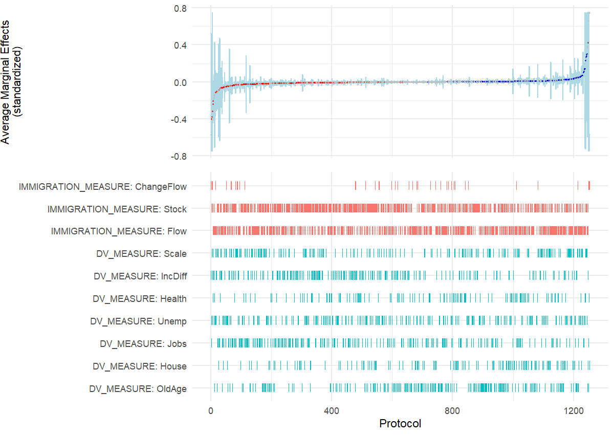
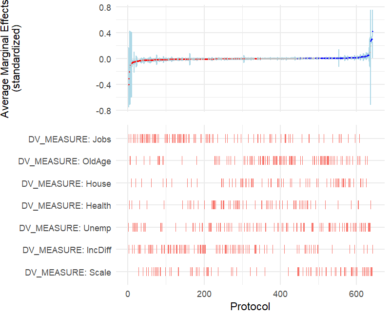
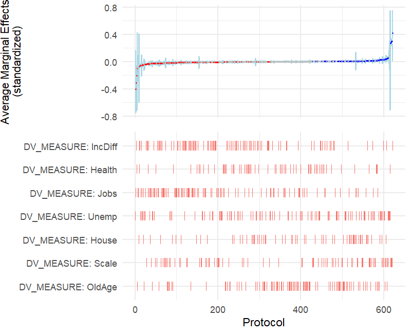
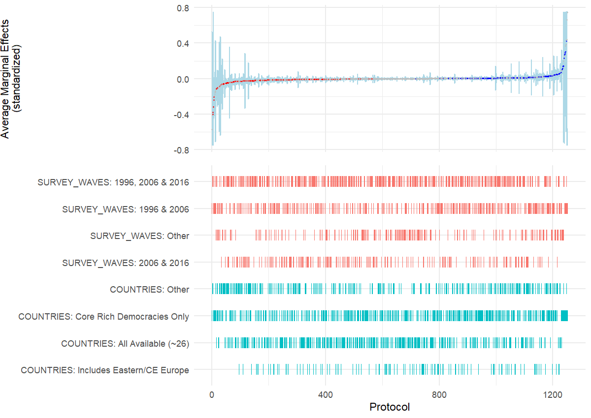
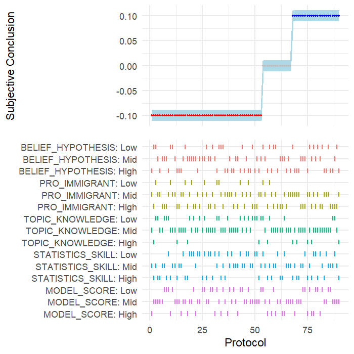

### Special Package
   We load the rdfanalysis package designed by <a href=https://joachim-gassen.github.io/rdfanalysis/>Joachim Gassen</a> to generate specification curves.
   
   

```{r setup, include=FALSE}
rm(list = ls())
library(pacman)


pacman::p_load("devtools","ggplot2","dplyr","readr","ExPanDaR","plotscale","lattice","tidyr","mlogit","knitr")

# Load Researcher Degrees of Freedom Analysis package
#  
# devtools::install_github("joachim-gassen/rdfanalysis")
library(rdfanalysis)


```


```{r load, warning=F,message=F, include=F}

cri <- read.csv(file = "data/cri.csv", header = T)
cri_str <- read.csv(file = "data/cri_str.csv", header = T)
cri_team <- read.csv(file = "data/cri_team.csv", header = T)

```


```{r data_prep, warning=F, message=F, include=F}

# prep data
crispectest <- dplyr::select(cri_str, dv_type, iv_type, software, indepv, mator, dichotomize, twowayfe, cluster_any, Jobs:Scale,  w1985:w2016, p, AME_Z, lower_Z, upper_Z, id, eeurope, allavailable, mlm_any, Hresult, orig13, BELIEF_HYPOTHESIS, PRO_IMMIGRANT, TOPIC_KNOWLEDGE, STATISTICS_SKILL, MODEL_SCORE)

# create sample variables 
crispectest <- crispectest %>%
  mutate(w1985 = ifelse(is.na(w1985), "Other", w1985),
         w1990 = ifelse(is.na(w1990), "Other", w1990),
         w1996 = ifelse(is.na(w1996), "Other", w1996),
         w2006 = ifelse(is.na(w2006), "Other", w2006),
         w2016 = ifelse(is.na(w2016), "Other", w2016),
         orig13 = ifelse(is.na(orig13), "Other", orig13),
         eeurope = ifelse(is.na(eeurope), "Other", eeurope),
         allavailable = ifelse(is.na(allavailable), "Other", allavailable))

crispectest <- crispectest %>%
  mutate(SURVEY_WAVES = ifelse(w1985 == "Other" & w1990 == "Other" & w1996 == "w1996" & w2006 == "w2006" & w2016 == "Other", "1996 & 2006", ifelse(w1985 == "Other" & w1990 == "Other" & w1996 == "w1996" & w2006 == "w2006" & w2016 == "w2016", "1996, 2006 & 2016", ifelse(w1985 == "Other" & w1990 == "Other" & w1996 == "Other" & w2006 == "w2006" & w2016 == "w2016", "2006 & 2016", "Other"))),
         COUNTRIES = ifelse(orig13 == "orig13", "Core Rich Democracies Only", ifelse(allavailable == "allavailable", "All Available (~26)", ifelse(eeurope == "eeurope", "Includes Eastern/CE Europe", "Other"))))

#Remove NAs
crispectest <- subset(crispectest, !is.na(crispectest$AME_Z))
crispectest <- subset(crispectest, !is.na(crispectest$lower_Z))
  
  # some upper and lower bounds are exactly zero, adjust fix this
crispectest$lower_Z <- ifelse(crispectest$lower_Z > -0.00000001 & crispectest$lower_Z < 0.00000001, -0.0001, crispectest$lower_Z)
crispectest$upper_Z <- ifelse(crispectest$upper_Z > -0.00000001 & crispectest$upper_Z < 0.00000001, 0.0001, crispectest$upper_Z)

  #trim to have better plot range
  crispectest$lower_Z <- ifelse(crispectest$lower_Z < -0.75, -0.75, crispectest$lower_Z)
  crispectest$upper_Z <- ifelse(crispectest$upper_Z > 0.75, 0.75, crispectest$upper_Z)
  crispectest$upper_Z <- ifelse(crispectest$upper_Z < -0.75, -0.745, crispectest$upper_Z)
  crispectest$AME_Z <- ifelse(crispectest$AME_Z < -0.75, -0.747, crispectest$AME_Z)
  crispectest$AME_Z <- ifelse(crispectest$AME_Z > 0.75, 0.747, crispectest$AME_Z)
  
  #data prep
crispectest$est <- round(crispectest$AME_Z, 6)
crispectest$lb <- round(crispectest$lower_Z, 6)
crispectest$ub <- round(crispectest$upper_Z, 6)

# set up subjective conclusions at team level as 1 support, 0 not testable and -1 reject

cri_team <- cri_team %>%
  mutate(est = ifelse(Hsup == 1, 0.1, ifelse(Hrej == 1, -0.1, ifelse(Hno == 1, 0, NA))),
         ub = est+0.01,
         lb = est-0.01)

```


## Specification Curves

### Average Marginal Effects

#### Fig 1. Researcher Qualities and Subjective Model Scoring

```{r fig1_DV1, echo=F}


crispectest1 <- select(crispectest, BELIEF_HYPOTHESIS, PRO_IMMIGRANT, TOPIC_KNOWLEDGE, STATISTICS_SKILL, MODEL_SCORE, est, lb, ub)

crispectest1 <- subset(crispectest1, !is.na(crispectest1$PRO_IMMIGRANT))
crispectest1 <- subset(crispectest1, !is.na(crispectest1$TOPIC_KNOWLEDGE))
crispectest1 <- subset(crispectest1, !is.na(crispectest1$BELIEF_HYPOTHESIS))

  
# one problem with rdfanalysis is that it outputs the categories in the order they appear in the data, therefore we have to generate 3 rows of fake data to get the order right
  
fake <- as.data.frame(matrix(nrow = 3, ncol = 8))
fake[1,] <- c("Low","Low","Low","Low","Low",0,-0.00001,0.00001)
fake[2,] <- c("Mid","Mid","Mid","Mid","Mid",0,-0.00001,0.00001)
fake[3,] <- c("High","High","High","High","High",0,-0.00001,0.00001)
colnames(fake) <- c("BELIEF_HYPOTHESIS", "PRO_IMMIGRANT", "TOPIC_KNOWLEDGE", "STATISTICS_SKILL", "MODEL_SCORE", "est", "lb", "ub")
fake$est <- as.numeric(fake$est)
fake$ub <- as.numeric(fake$ub)
fake$lb <- as.numeric(fake$lb)

crispectest1 <- bind_rows(fake,crispectest1)

# remove/adjust attributes
  crispectest1 <- crispectest1[names(crispectest1)]
  choices <- 1:5
  attr(crispectest1, "choices") <- choices
  rownames(crispectest1) <- NULL
png(file = "results/Fig1_AME.png", width = 1200, height = 850, res = 144)

plot_rdf_spec_curve(crispectest1, "est", "lb", "ub", est_color = "grey", est_color_signeg = "red", est_color_sigpos = "blue", lower_to_upper = 1.5, est_label = "Average Marginal Effects\n(standardized)", choice_ind_point = F, pt_size = 0.3, ribbon = T)
dev.off()

knitr::include_graphics("results/Fig1_AME.png")
```

#### Fig 2. Model Features Pooled

```{r}
crispectest2 <- crispectest %>%
  mutate(IMMIGRATION_MEASURE = iv_type,
         DV_MEASURE = dv_type)

crispectest2 <- subset(crispectest2, !is.na(crispectest2$IMMIGRATION_MEASURE))
crispectest2 <- subset(crispectest2, !is.na(crispectest2$DV_MEASURE))

crispectest2 <- select(crispectest2, IMMIGRATION_MEASURE, DV_MEASURE, est, lb, ub)

# remove/adjust attributes
  crispectest2 <- crispectest2[names(crispectest2)]
  choices <- 1:2
  attr(crispectest2, "choices") <- choices
  rownames(crispectest2) <- NULL
png(file = "results/Fig2_AME.png", width = 1200, height = 850, res = 144)

plot_rdf_spec_curve(crispectest2, "est", "lb", "ub", est_color = "grey", est_color_signeg = "red", est_color_sigpos = "blue", lower_to_upper = 1.5, est_label = "Average Marginal Effects\n(standardized)", choice_ind_point = F, pt_size = 0.3, ribbon = T)
dev.off()


```
#### Fig 2_Stock. Model Features Stock Models Only

```{r fig2_stock}
crispectest3 <- subset(crispectest2, IMMIGRATION_MEASURE == "Stock")
crispectest3 <- select(crispectest3, -c(IMMIGRATION_MEASURE))

# remove/adjust attributes
  crispectest3 <- crispectest3[names(crispectest3)]
  choices <- 1
  attr(crispectest3, "choices") <- choices
  rownames(crispectest3) <- NULL
png(file = "results/Fig2_Stock_AME.png", width = 800, height = 650, res = 144)

plot_rdf_spec_curve(crispectest3, "est", "lb", "ub", est_color = "grey", est_color_signeg = "red", est_color_sigpos = "blue", lower_to_upper = 1.5, est_label = "Average Marginal Effects\n(standardized)", choice_ind_point = F, pt_size = 0.3, ribbon = T)
dev.off()


```


#### Fig 2_Stock. Model Features Flow Models Only

```{r fig2_flow}
crispectest4 <- subset(crispectest2, IMMIGRATION_MEASURE == "Flow")
crispectest4 <- select(crispectest4, -c(IMMIGRATION_MEASURE))

# remove/adjust attributes
  crispectest4 <- crispectest4[names(crispectest4)]
  choices <- 1
  attr(crispectest4, "choices") <- choices
  rownames(crispectest4) <- NULL
png(file = "results/Fig2_Flow_AME.png", width = 800, height = 650, res = 144)

plot_rdf_spec_curve(crispectest3, "est", "lb", "ub", est_color = "grey", est_color_signeg = "red", est_color_sigpos = "blue", lower_to_upper = 1.5, est_label = "Average Marginal Effects\n(standardized)", choice_ind_point = F, pt_size = 0.3, ribbon = T)
dev.off()


```

#### Fig 3. Sample Features

```{r fig3}
crispectest5 <- select(crispectest, SURVEY_WAVES, COUNTRIES, est, lb, ub)

crispectest5 <- subset(crispectest5, !is.na(crispectest5$SURVEY_WAVES))
crispectest5 <- subset(crispectest5, !is.na(crispectest5$COUNTRIES))


# remove/adjust attributes
  crispectest5 <- crispectest5[names(crispectest5)]
  choices <- 1:2
  attr(crispectest5, "choices") <- choices
  rownames(crispectest5) <- NULL
png(file = "results/Fig3_AME.png", width = 1200, height = 850, res = 144)

plot_rdf_spec_curve(crispectest5, "est", "lb", "ub", est_color = "grey", est_color_signeg = "red", est_color_sigpos = "blue", lower_to_upper = 1.5, est_label = "Average Marginal Effects\n(standardized)", choice_ind_point = F, pt_size = 0.3, ribbon = T)
dev.off()


```

### Subjective Team Conclusions

#### Fig 4. By Researcher Qualities and 

```{r fig4_DV2, echo=F}


spec_team <- select(cri_team, BELIEF_HYPOTHESIS, PRO_IMMIGRANT, TOPIC_KNOWLEDGE, STATISTICS_SKILL, MODEL_SCORE, est, lb, ub)

spec_team <- subset(spec_team, !is.na(BELIEF_HYPOTHESIS))
spec_team <- subset(spec_team, !is.na(MODEL_SCORE))
# one problem with rdfanalysis is that it outputs the categories in the order they appear in the data, therefore we have to generate 3 rows of fake data to get the order right
  
fake <- as.data.frame(matrix(nrow = 3, ncol = 8))
fake[1,] <- c("Low","Low","Low","Low","Low",0,-0.01,0.01)
fake[2,] <- c("Mid","Mid","Mid","Mid","Mid",0,-0.01,0.01)
fake[3,] <- c("High","High","High","High","High",0,-0.01,0.01)
colnames(fake) <- c("BELIEF_HYPOTHESIS", "PRO_IMMIGRANT", "TOPIC_KNOWLEDGE", "STATISTICS_SKILL", "MODEL_SCORE", "est", "lb", "ub")
fake$est <- as.numeric(fake$est)
fake$ub <- as.numeric(fake$ub)
fake$lb <- as.numeric(fake$lb)

spec_team1 <- bind_rows(fake,spec_team)

# remove/adjust attributes
  spec_team1 <- spec_team1[names(spec_team1)]
  choices <- 1:5
  attr(spec_team1, "choices") <- choices
  rownames(spec_team1) <- NULL
png(file = "results/Fig4_AME.png", width = 700, height = 700, res = 144)

plot_rdf_spec_curve(spec_team1, "est", "lb", "ub", est_color = "grey", est_color_signeg = "red", est_color_sigpos = "blue", lower_to_upper = 1.5, est_label = "Subjective Conclusion", choice_ind_point = F, pt_size = 0.5, ribbon = T)
dev.off()


```