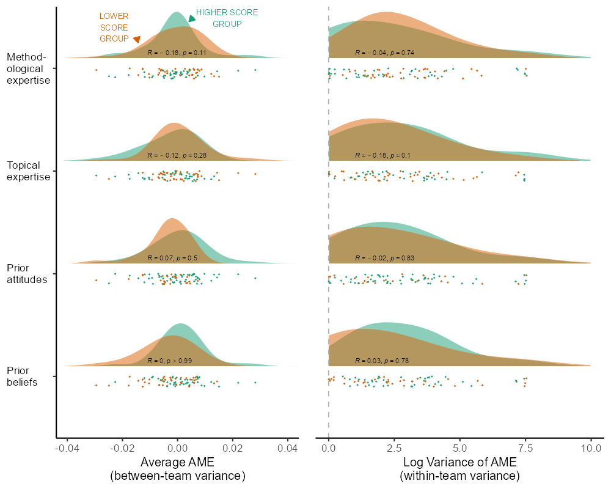
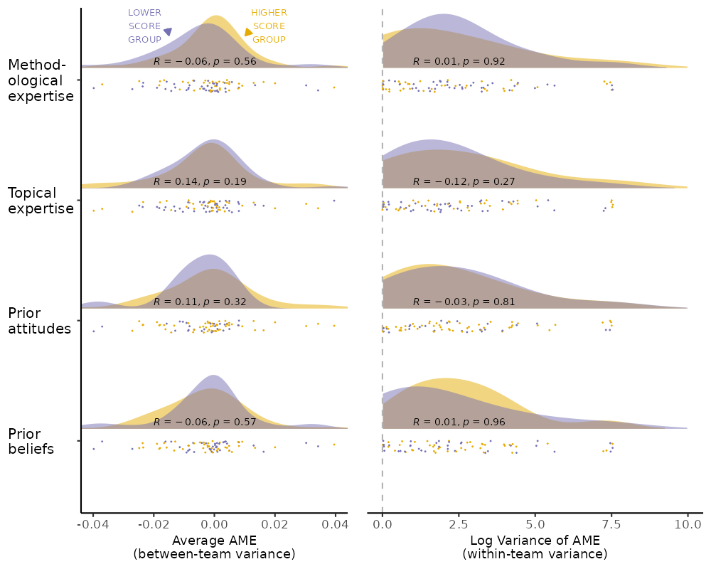

Variance function regressions.

```{r setup, include=FALSE, warning=F}

rm(list = ls())
library(pacman)

#necessayr for nnet::multinom and tab_model to work together
# install.packages("devtools")
# devtools::install_github("easystats/insight")
# devtools::install_github("easystats/effectsize")


pacman::p_load("ggplot2","dplyr","readr","plotscale","lattice","tidyr","readxl","mlogit","jtools","sjPlot","sjmisc","sjlabelled","knitr","kableExtra","lavaan","reshape2","semPlot","lavaanPlot","leaps","lme4","multilevelTools","rvest","nnet","parameters","insight","effectsize","ggtext","mdthemes","ragg", "ggpubr","readr","cowplot")

source(file = "script/R_rainclouds.R")
source(file = "script/summarySE.R")


# add in variance estimates (more than 2-digits)
# disable scientific notation
options(scipen = 999)

# Column no missing function
completeFun <- function(data, desiredCols) {
  completeVec <- complete.cases(data[, desiredCols])
  return(data[completeVec, ])
}
```

## Data Prep

These datasets were worked up from the file 01_CRI_Data_Prep.Rmd. 

cri = numerical values
cri_str = string values
cri_team = team-level data (by conclusion)
cri_team_combine = team-level data parsed by type of test variable (stock and flow)
cri_indiv = participant-level data from our survey, identifying characteristics redacted
crispectest = datafile created in the file 03_Spec_Analysis

### Load Data

```{r load, warning=F,message=F}
cri <- read.csv(file = "data/cri.csv", header = T)
cri_str <- read.csv(file = "data/cri_str.csv", header = T)
cri_team <- read.csv(file = "data/cri_team.csv", header = T)
cri_indiv <- read.csv(file = "data/cri_indv.csv", header = T)
crispectest <- read.csv(file = "results/crispectest.csv", header = T)

# setup multilevel dataset

cri_ml <- select(cri,u_teamid, id, u_delibtreatmentgroup1, AME:main_IV_source, main_IV_measurement:package, countries, Jobs:anynonlin,AME_Z,lower_Z,upper_Z,Hsup,Hrej,Hno,AME_sup_p05:AME_ns_p05,u_expgroup1,belief_strength:belief_ipred, HresultF, STATISTICS_SKILL, BELIEF_HYPOTHESIS, TOPIC_KNOWLEDGE, MODEL_SCORE, PRO_IMMIGRANT)

# create a team ID variable to identify the independent tests by team. Again, 16 of 71 teams had independent conclusions - seeing stock v flow immigration measures as representative of independent tests of the hypothesis. Therefore, we have a team-test level that replaces the team level.

cri_ml$team <- cri_ml %>% group_indices(u_teamid, HresultF)

cri_ml <- select(cri_ml, u_teamid, id, team, AME_Z, upper_Z, lower_Z, everything())

# remove team 0
cri_ml <- subset(cri_ml, u_teamid != 0)
cri_team <- subset(cri_team, u_teamid != 0)

#mean replace team 27
cri_team <- cri_team %>%
  mutate(belief_ipred = ifelse(is.na(belief_ipred), mean(belief_ipred, na.rm = T), belief_ipred),
         topic_ipred = ifelse(is.na(topic_ipred), mean(topic_ipred, na.rm = T), topic_ipred),
         stats_ipred = ifelse(is.na(stats_ipred), mean(stats_ipred, na.rm = T), stats_ipred),)

```

### Within and Between Variables

```{r wandb, warning = F, message = F}
cri_ml <- cri_ml %>%
  group_by(team) %>%
  mutate(AME_Z_b = mean(AME_Z, na.rm = T),
         AME_Z_w =AME_Z-AME_Z_b,
         jobs_b = mean(Jobs, na.rm = T),
         unemp_b = mean(Unemp, na.rm = T),
         incdiff_b = mean(IncDiff, na.rm = T),
         oldage_b = mean(OldAge, na.rm = T),
         house_b = mean(House, na.rm = T),
         health_b = mean(Health, na.rm = T),
         jobs_w = Jobs-jobs_b,
         unemp_w = Unemp-unemp_b,
         incdiff_w = IncDiff-incdiff_b,
         oldage_w = OldAge-oldage_b,
         house_w = House-house_b,
         health_w = Health-health_b,
         scale_b = mean(Scale, na.rm = T),
         scale_w = Scale-scale_b,
         un_emp_rate_ivC = ifelse(emplrate_ivC == 1 | unemprate_ivC == 1, 1, 0)) %>%
  ungroup()

# create factors for measurement
cri_ml <- cri_ml %>%
  mutate(main_IV_factor = as.factor(main_IV_measurement))

# team 27 is missing the survey variables
# as it is just one team, mean replacement should be fine
cri_ml <- cri_ml %>%
  mutate(stats_ipred = ifelse(is.na(stats_ipred), mean(stats_ipred, na.rm=T), stats_ipred),
         belief_ipred = ifelse(is.na(belief_ipred), mean(belief_ipred, na.rm =T), belief_ipred),
         topic_ipred = ifelse(is.na(topic_ipred), mean(topic_ipred, na.rm =T), topic_ipred))

# u_expgroup missing from team-level data
t1 <- aggregate(cri_ml, FUN = mean, by = list(cri_ml$u_teamid), na.rm =T)
t1 <- select(t1, u_teamid, u_expgroup1)

cri_team <- left_join(cri_team, t1, by = "u_teamid")
```

# Variance as Outcome

## Variance Plots

Here we identify the residual variance within each team and then attempt to explain this with our idiosyncratic and subjective variables

```{r variance_plots}
cri_ml <- cri_ml[complete.cases(cri_ml$AME_Z),]

m07adj <- lmer(AME_Z ~ Jobs + IncDiff + House + logit + ols + Stock + ChangeFlow + w1996 + w2006 + w2016 + w2006*w2016 + orig13  + eeurope + allavailable + twowayfe + level_cyear + (1 | team), data = cri_ml)

# predicted values
cri_ml$AME_pred <- predict(m07adj, newdata = cri_ml)
# residual
cri_ml$AME_resid <- cri_ml$AME_pred - cri_ml$AME_Z 

# intercept and sd by team
t <- as.data.frame(ranef(m07adj))
colnames(t) <- c("x","y","team","AME_team_int","AME_team_sd")
t <- select(t, team, AME_team_int, AME_team_sd)
t$team <- as.numeric(t$team)

cri_ml <- left_join(cri_ml, t, by = "team")

# cor test - are intercepts correlated with predictions?

cor1 <- select(cri_ml, AME_team_int, AME_team_sd, AME_pred, AME_resid, AME_Z)
cor2 <- cor(cor1, use = "complete")

# yes, that means they need to be removed, fastest way is to center

cri_ml <- cri_ml %>%
    group_by(team) %>%
    mutate(predM = mean(AME_pred),
           residM = mean(AME_resid),
           AME_pred_center = round(AME_pred - predM, 4),
           AME_resid_center = round(AME_resid - residM, 4)) %>%
    ungroup()

cor1 <- select(cri_ml, AME_team_int, AME_team_sd, AME_pred, AME_pred_center, AME_resid, AME_resid_center, AME_Z)
cor2 <- cor(cor1, use = "complete")

# the estimates from ranef seem to be the standard error, not the variance by team!
# square to get variance - this appears to be wrong

cri_ml$AME_team_var <- cri_ml$AME_team_sd^2

#add values to team-level data
cri_teams <- cri_ml %>%
    group_by(team) %>%
    summarise(team = mean(team),
              AME_Z_int = mean(AME_Z), # raw scores
              AME_Z_sd = sd(AME_Z_w),
              AME_Z_var = AME_Z_sd^2,
              AME_team_int = mean(AME_team_int), # residuals from M7
              AME_team_sd = sd(AME_resid_center), 
              AME_team_var = AME_team_sd^2,
              stats_ipred = mean(stats_ipred),
              belief_ipred = mean(belief_ipred),
              pro_immigrant = mean(pro_immigrant),
              topic_ipred = mean(topic_ipred),
              total_score = mean(total_score),
              numofmodels = mean(inv_weight_H)) %>%
    ungroup()

cri_teams <- cri_teams %>%
    mutate(AME_team_var = ifelse(is.na(AME_team_var), 0, AME_team_var), # here NA means a single model or no variance, recode to 0
           AME_Z_var = ifelse(is.na(AME_Z_var), 0, AME_Z_var),
           AME_team_var2 = ifelse(AME_team_var > 0.03, 0.03, AME_team_var),  # three teams are outliers
           AME_Z_var2 = ifelse(AME_Z_var > 0.03, 0.03, AME_Z_var),
           AME_team_var = ifelse(AME_team_var > 0.004, 0.004, AME_team_var),  # three teams are outliers
           AME_Z_var = ifelse(AME_Z_var > 0.004, 0.004, AME_Z_var))

```


## Plots of Variance and Intercepts - Adjusted

First we use an adjusted version of Model 7 (see 04_CRI_Main_Analyses.Rmd) to estimate the residual, unexplained intercepts and variances. We compare these to our researcher characteristics under the potential threat that random luck/noise has led some researchers with certain characteristics to select use certain models that lead to the appearance of variance in results by characteristic. Thus, the comparisons are 'all else equal'. They are the most conservative test, because they remove the likelihood that reseracher characteristics lead to certain model specification choices, and that these choices lead to certain outcomes. 

### Linear plots. Supplementary.

Here we plot linearly the within-team and between-team unexplained variance. Within-team variance scores zero when there is only one model.


```{r plots}

agg_png(filename = "results/FigX_varint_belief.png", height = 600, width = 800, res = 144)
ggplot(cri_teams, ) +
    geom_point(aes(y = scale(AME_team_var), x = belief_ipred), color = "goldenrod", shape = 2) +
    geom_point(aes(y = scale(AME_team_int), x = belief_ipred), color = "royalblue1", shape = 4) +
    geom_smooth(aes(y = scale(AME_team_var), x = belief_ipred), color = "goldenrod", method = "lm", se = F) +
    geom_smooth(aes(y = scale(AME_team_int), x = belief_ipred), color = "royalblue1", method = "lm", se = F) +
    ylim(-2,2) +
    annotate(geom = "text", x = -1.4, y = -0.6, label = "Variances by Team (\u0394)", hjust = 0, color = "goldenrod") +
    annotate(geom = "text", x = -1.4, y = 0.2, label = "Intercepts by Team (X)", hjust = 0, color = "royalblue1") +
    xlab("Prior Belief Hypothesis is True") +
    ylab("Variances and Intercepts\n(independently standardized values)") +
    #stat_cor(digits = 2, p.accuracy = 0.001) +
    theme_classic()
dev.off()

agg_png(filename = "results/FigX_varint_stats.png", height = 600, width = 800, res = 144)
ggplot(cri_teams, ) +
    geom_point(aes(y = scale(AME_team_var), x = stats_ipred), color = "goldenrod", shape = 2) +
    geom_point(aes(y = scale(AME_team_int), x = stats_ipred), color = "royalblue1", shape = 4) +
    geom_smooth(aes(y = scale(AME_team_var), x = stats_ipred), color = "goldenrod", method = "lm", se = F) +
    geom_smooth(aes(y = scale(AME_team_int), x = stats_ipred), color = "royalblue1", method = "lm", se = F) +
    ylim(-2,2) +
    annotate(geom = "text", x = -1.5, y = -0.3, label = "Variances by Team (\u0394)", hjust = 0, color = "goldenrod") +
    annotate(geom = "text", x = -1.5, y = 0.65, label = "Intercepts by Team (X)", hjust = 0, color = "royalblue1") +
    xlab("Methodological Expertise") +
    ylab("Variances and Intercepts\n(indep. standardized values)") +
    #stat_cor(digits = 2, p.accuracy = 0.001) +
    theme_classic()
dev.off()

agg_png(filename = "results/FigX_varint_attitude.png", height = 600, width = 800, res = 144)
ggplot(cri_teams, ) +
    geom_point(aes(y = scale(AME_team_var), x = pro_immigrant), color = "goldenrod", shape = 2) +
    geom_point(aes(y = scale(AME_team_int), x = pro_immigrant), color = "royalblue1", shape = 4) +
    geom_smooth(aes(y = scale(AME_team_var), x = pro_immigrant), color = "goldenrod", method = "lm", se = F) +
    geom_smooth(aes(y = scale(AME_team_int), x = pro_immigrant), color = "royalblue1", method = "lm", se = F) +
    ylim(-2,2) +
    annotate(geom = "text", x = 1, y = -1, label = "Variances by Team (\u0394)", hjust = 0, color = "goldenrod") +
    annotate(geom = "text", x = 1, y = 0.5, label = "Intercepts by Team (X)", hjust = 0, color = "royalblue1") +
    xlab("Prior Attitudes toward Immigration") +
    ylab("Variances and Intercepts\n(indep. standardized values)") +
    #stat_cor(digits = 2, p.accuracy = 0.001) +
    theme_classic()
dev.off()

agg_png(filename = "results/FigX_varint_topic.png", height = 600, width = 800, res = 144)
ggplot(cri_teams, ) +
    geom_point(aes(y = scale(AME_team_var), x = topic_ipred), color = "goldenrod", shape = 2) +
    geom_point(aes(y = scale(AME_team_int), x = topic_ipred), color = "royalblue1", shape = 4) +
    geom_smooth(aes(y = scale(AME_team_var), x = topic_ipred), color = "goldenrod", method = "lm", se = F) +
    geom_smooth(aes(y = scale(AME_team_int), x = topic_ipred), color = "royalblue1", method = "lm", se = F) +
    ylim(-2,2) +
    annotate(geom = "text", x = 0.5, y = 0.1, label = "Variances by Team (\u0394)", hjust = 0, color = "goldenrod") +
    annotate(geom = "text", x = 0.4, y = -1.8, label = "Intercepts by Team (X)", hjust = 0, color = "royalblue1") +
    xlab("Topical Expertise") +
    ylab("Variances and Intercepts\n(indep. standardized values)") +
    #stat_cor(digits = 2, p.accuracy = 0.001) +
    theme_classic()
dev.off()
```

Here we group and stack the data for plotting. One row for each team and characteristic (data repeated 4 times).

```{r rainclouds_prep}
# create grouped data
cri_team_groups <- cri_teams %>%
  mutate(beliefZ = ifelse(scale(belief_ipred) > 0, 1, 0),
         proZ = ifelse(scale(pro_immigrant) > 0, 1, 0),
         statsZ = ifelse(scale(stats_ipred) > 0, 1, 0),
         topicZ = ifelse(scale(topic_ipred) > 0, 1, 0),
         AME_team_var_log = log(AME_team_var2),
         AME_Z_var_log = log(AME_Z_var2),
         AME_team_var = AME_team_var_log + 11,
         AME_Z_var = AME_Z_var_log + 11,
         AME_team_var = ifelse(AME_team_var == "-Inf", 0, AME_team_var),
         AME_Z_var = ifelse(AME_Z_var == "-Inf", 0, AME_Z_var)) %>%
  select(AME_team_int, AME_team_var, AME_team_int, beliefZ, proZ, statsZ, topicZ, belief_ipred, pro_immigrant, stats_ipred, topic_ipred, AME_Z_var, AME_Z_int, AME_Z_var)

# group 1 belief
cri_team_groups1 <- cri_team_groups %>%
  mutate(group = 4,
         high = beliefZ)

cri_team_groups2 <- cri_team_groups %>%
  mutate(group = 3,
         high = proZ)

cri_team_groups3 <- cri_team_groups %>%
  mutate(group = 1,
         high = statsZ)

cri_team_groups4 <- cri_team_groups %>%
  mutate(group = 2,
         high = topicZ)

cri_team_g <- rbind(cri_team_groups1, cri_team_groups2, cri_team_groups3, cri_team_groups4)

cri_team_g <- subset(cri_team_g, !is.na(AME_team_int))
cri_team_g$group <- as.factor(cri_team_g$group)
cri_team_g$high <- as.factor(cri_team_g$high)

```

### Rainclouds. Residuals M7. Supplementary

Allen M, Poggiali D, Whitaker K et al. Raincloud plots: a multi-platform tool for robust data visualization [version 2; peer review: 2 approved]. Wellcome Open Res ([2021](https://doi.org/10.12688/wellcomeopenres.15191.2)), 4:63.


```{r rainclouds_b}
g1 <- 
  
  ggplot(cri_team_g, aes(x = group, y = AME_team_int)) +
  geom_flat_violin(aes(x = group, fill = high), 
                   position = position_nudge(x = .1, y = 0), 
                   adjust = 1.5, 
                   trim = F, 
                   alpha = .5, 
                   colour = NA) +
  geom_point(aes(x = as.numeric(group) - 0.05, y = AME_team_int, colour = high), position = position_jitter(width = 0.05), size = 0.25, shape = 20) +
  scale_colour_brewer(palette = "Dark2", breaks = c(0,1),
                   labels = c("Higher","Lower"), name = "") +
  scale_fill_brewer(palette = "Dark2", breaks = c(0,1),
                   labels = c("Higher","Lower"), name = "") +
  scale_x_discrete(breaks = c(1,2,3,4),
                   labels = c("Prior\nbeliefs","Prior\nattitudes","Topical\nexpertise","Method-\nological\nexpertise")) +
  ylab("Average AME\n(between-team variance)") +
  stat_cor(aes(x = belief_ipred, y = AME_team_int), r.digits = 3, r.accuracy = 0.01, p.accuracy = 0.01, label.x = 1.15, label.y = -0.011, size = 2, data = cri_team_groups1) +
  stat_cor(aes(x = pro_immigrant, y = AME_team_int), r.digits = 3, r.accuracy = 0.01, p.accuracy = 0.01, label.x = 2.15, label.y = -0.011, size = 2, data = cri_team_groups2) +
  stat_cor(aes(x = stats_ipred, y = AME_team_int), r.digits = 3, r.accuracy = 0.01, p.accuracy = 0.01, label.x = 3.15, label.y = -0.011, size = 2, data = cri_team_groups2) +
  stat_cor(aes(x = topic_ipred, y = AME_team_int), r.digits = 3, r.accuracy = 0.01, p.accuracy = 0.01, label.x = 4.15, label.y = -0.011, size = 2, data = cri_team_groups2) +
  annotate(geom = "text", x = 4.4, y = -0.023, 
           label = "LOWER\nSCORE\nGROUP", 
           color = "#D95F02",
           size = 2.3
           ) +
  annotate(geom = "text", x = 4.49, y = 0.018, 
           label = "HIGHER SCORE\nGROUP", 
           color = "#1B9E77",
           size = 2.3
           ) +
  annotate(geom = "segment", x = 4.3, xend = 4.25, y = -0.0148, yend = -0.0143, color = "#D95F02", arrow = arrow(length=unit(0.18,"cm"), type = "closed")) +
  annotate(geom = "segment", x = 4.5, xend = 4.455, y = 0.0058, yend = 0.0042, color = "#1B9E77", arrow = arrow(length=unit(0.18,"cm"), type = "closed")) +
  coord_flip(ylim = c(-0.04,0.04)) + 
  theme_classic() +
  theme(legend.position = "none",
        axis.text.y = element_text(hjust = 0, color = "black"),
        axis.title.y = element_blank(),
        axis.title.x = element_text(size = 10))


```

```{r rainclouds_w}
g2 <- ggplot(cri_team_g, aes(x = group, y = AME_team_var)) +
  geom_flat_violin(aes(x = group, fill = high), 
                   position = position_nudge(x = .1, y = 0), 
                   adjust = 1.5, 
                   trim = F, 
                   alpha = .5, 
                   colour = NA) +
  geom_hline(yintercept = 0, linetype = "dashed", color = "grey70", size = 0.5, show.legend = FALSE) +
  geom_point(aes(x = as.numeric(group) - 0.05, y = AME_team_var, colour = high), position = position_jitter(width = 0.05, height = 0.05), size = 0.25, shape = 20) +
  stat_cor(aes(x = belief_ipred, y = AME_team_var), r.digits = 3, r.accuracy = 0.01, p.accuracy = 0.01, label.x = 1.15, label.y = 1, size = 2, data = cri_team_groups1) +
  stat_cor(aes(x = pro_immigrant, y = AME_team_var), r.digits = 3, r.accuracy = 0.01, p.accuracy = 0.01, label.x = 2.15, label.y = 1, size = 2, data = cri_team_groups2) +
  stat_cor(aes(x = stats_ipred, y = AME_team_var), r.digits = 3, r.accuracy = 0.01, p.accuracy = 0.01, label.x = 3.15, label.y = 1, size = 2, data = cri_team_groups2) +
  stat_cor(aes(x = topic_ipred, y = AME_team_var), r.digits = 3, r.accuracy = 0.01, p.accuracy = 0.01, label.x = 4.15, label.y = 1, size = 2, data = cri_team_groups2) +
  scale_colour_brewer(palette = "Dark2", breaks = c(0,1),
                   labels = c("Higher","Lower"), name = "") +
  scale_fill_brewer(palette = "Dark2", breaks = c(0,1),
                   labels = c("Higher","Lower"), name = "", expand = c(0, 0)) +
  scale_x_discrete(breaks = c(1,2,3,4), 
                   labels = c("Prior\nbeliefs","Prior\nattitudes","Topical\nexpertise","Method-\nological\nexpertise")) +
  ylab("Log Variance of AME\n(within-team variance)") +
  ylim(0,10) +
  coord_flip() + 
  theme_classic() +
  theme(legend.position = "none",
        axis.ticks.y = element_blank(),
        axis.text.y = element_blank(),
        axis.title.y = element_blank(),
        axis.title.x = element_text(size = 10),
        axis.line.y = element_blank())


```


```{r combine}
agg_png(filename = "results/Fig2_supplementary.png", width = 1000, height = 800, res = 144)
ggarrange(g1,g2) 
dev.off()


```

### Rainclouds. Figure 2. Main


```{r fig2}
g3 <- 
  
  ggplot(cri_team_g, aes(x = group, y = AME_Z_int)) +
  geom_flat_violin(aes(x = group, fill = high), 
                   position = position_nudge(x = .1, y = 0), 
                   adjust = 1.5, 
                   trim = F, 
                   alpha = .5, 
                   colour = NA) +
  geom_point(aes(x = as.numeric(group) - 0.05, y = AME_Z_int, colour = high), position = position_jitter(width = 0.05), size = 0.25, shape = 20) +
  scale_colour_brewer(palette = "Dark2", breaks = c(0,1),
                   labels = c("Higher","Lower"), name = "") +
  scale_fill_brewer(palette = "Dark2", breaks = c(0,1),
                   labels = c("Higher","Lower"), name = "") +
  scale_x_discrete(breaks = c(1,2,3,4),
                   labels = c("Prior\nbeliefs","Prior\nattitudes","Topical\nexpertise","Method-\nological\nexpertise")) +
  ylab("Average AME\n(between-team variance)") +
  stat_cor(aes(x = belief_ipred, y = AME_Z_int), r.digits = 3, r.accuracy = 0.01, p.accuracy = 0.01, label.x = 1.15, label.y = -0.011, size = 2, data = cri_team_groups1) +
  stat_cor(aes(x = pro_immigrant, y = AME_Z_int), r.digits = 3, r.accuracy = 0.01, p.accuracy = 0.01, label.x = 2.15, label.y = -0.011, size = 2, data = cri_team_groups2) +
  stat_cor(aes(x = stats_ipred, y = AME_Z_int), r.digits = 3, r.accuracy = 0.01, p.accuracy = 0.01, label.x = 3.15, label.y = -0.011, size = 2, data = cri_team_groups2) +
  stat_cor(aes(x = topic_ipred, y = AME_Z_int), r.digits = 3, r.accuracy = 0.01, p.accuracy = 0.01, label.x = 4.15, label.y = -0.011, size = 2, data = cri_team_groups2) +
  annotate(geom = "text", x = 4.45, y = -0.023, 
           label = "LOWER\nSCORE\nGROUP", 
           color = "#D95F02",
           size = 2.3
           ) +
  annotate(geom = "text", x = 4.45, y = 0.018, 
           label = "HIGHER\nSCORE\nGROUP", 
           color = "#1B9E77",
           size = 2.3
           ) +
  annotate(geom = "segment", x = 4.43, xend = 4.37, y = -0.0155, yend = -0.015, color = "#D95F02", arrow = arrow(length=unit(0.18,"cm"), type = "closed")) +
  annotate(geom = "segment", x = 4.413, xend = 4.368, y = 0.0118, yend = 0.0102, color = "#1B9E77", arrow = arrow(length=unit(0.18,"cm"), type = "closed")) +
  coord_flip(ylim = c(-0.04,0.04)) + 
  theme_classic() +
  theme(legend.position = "none",
        axis.text.y = element_text(hjust = 0, color = "black"),
        axis.title.y = element_blank(),
        axis.title.x = element_text(size = 10))


```

```{r rainclouds_w}
g4 <- ggplot(cri_team_g, aes(x = group, y = AME_Z_var)) +
  geom_flat_violin(aes(x = group, fill = high), 
                   position = position_nudge(x = .1, y = 0), 
                   adjust = 1.5, 
                   trim = F, 
                   alpha = .5, 
                   colour = NA) +
  geom_hline(yintercept = 0, linetype = "dashed", color = "grey70", size = 0.5, show.legend = FALSE) +
  geom_point(aes(x = as.numeric(group) - 0.05, y = AME_Z_var, colour = high), position = position_jitter(width = 0.05, height = 0.05), size = 0.25, shape = 20) +
  stat_cor(aes(x = belief_ipred, y = AME_Z_var), r.digits = 3, r.accuracy = 0.01, p.accuracy = 0.01, label.x = 1.15, label.y = 1, size = 2, data = cri_team_groups1) +
  stat_cor(aes(x = pro_immigrant, y = AME_Z_var), r.digits = 3, r.accuracy = 0.01, p.accuracy = 0.01, label.x = 2.15, label.y = 1, size = 2, data = cri_team_groups2) +
  stat_cor(aes(x = stats_ipred, y = AME_Z_var), r.digits = 3, r.accuracy = 0.01, p.accuracy = 0.01, label.x = 3.15, label.y = 1, size = 2, data = cri_team_groups2) +
  stat_cor(aes(x = topic_ipred, y = AME_Z_var), r.digits = 3, r.accuracy = 0.01, p.accuracy = 0.01, label.x = 4.15, label.y = 1, size = 2, data = cri_team_groups2) +
  scale_colour_brewer(palette = "Dark2", breaks = c(0,1),
                   labels = c("Higher","Lower"), name = "") +
  scale_fill_brewer(palette = "Dark2", breaks = c(0,1),
                   labels = c("Higher","Lower"), name = "", expand = c(0, 0)) +
  scale_x_discrete(breaks = c(1,2,3,4), 
                   labels = c("Prior\nbeliefs","Prior\nattitudes","Topical\nexpertise","Method-\nological\nexpertise")) +
  ylab("Log Variance of AME\n(within-team variance)") +
  ylim(0,10) +
  coord_flip() + 
  theme_classic() +
  theme(legend.position = "none",
        axis.ticks.y = element_blank(),
        axis.text.y = element_blank(),
        axis.title.y = element_blank(),
        axis.title.x = element_text(size = 10),
        axis.line.y = element_blank())


```


```{r combine}
agg_png(filename = "results/Fig2.png", width = 1000, height = 800, res = 144)
ggarrange(g3,g4) 
dev.off()


```

## Variance Function Regression

Following the technique of Western and Bloome [(2009)](https://doi.org/10.1111/j.1467-9531.2009.01222.x)

Adapted to predict variance across teams following Christoph Spörlein's [multi_varfun](https://github.com/chspoerlein/multi.varfun/blob/master/multi.varfun/R/multi_varfun.R)


First runs of the model suggest too many variables, we had to pair down those that were less of interest. 

```{r multivarfun}

# setup macros

## we tried all variables from m07adj but it had poor convergence, so we paired it down
# indep <- "Jobs + IncDiff + House + logit + ols + Stock + ChangeFlow + w2016 + orig13  + eeurope + belief_ipred + pro_immigrant + topic_ipred + stats_ipred"

## we run an alternative assuming that the subjective variables are primary - that they determine the model specifications and ran a model only with these
indep <- "belief_ipred + pro_immigrant + topic_ipred + stats_ipred + total_score"

outcome <- "AME_Z"
level2 <- "u_teamid"

form0 <- paste0(outcome,"~",indep,"+",level2)

mod <- lm(form0, data=cri_ml)

# get all non-missing cases
datanomiss <- mod$model

# setup equations
form <- paste0(outcome,"~",indep,"+(1 |",level2,")")
form2 <- paste0("resmod~",indep,"+(1 |",level2,")")

  
meanmodel <- lmer(formula=form, data=datanomiss, REML=F)
  
datanomiss$resmod <- residuals(meanmodel)^2
 
varmod <- glmer(formula=form2, data=datanomiss, family=Gamma(link = "log"), nAGQ=0)
  
datanomiss$fitmod <- fitted(varmod)

datanomiss$LOGLIK <- -.5*(log(datanomiss$fitmod)+(datanomiss$resmod/datanomiss$fitmod))
LLO <- sum(datanomiss$LOGLIK)
DLL <- 1
  
datanomiss$weight <- 1/datanomiss$fitmod

  
#### loop

  
while(DLL > .0001){
  model <- lmer(formula=form, weights=weight, data=datanomiss, REML=F)
  datanomiss$resmod <- residuals(model)^2
  varmod <- glmer(formula=form2, data=datanomiss, family=Gamma(link = "log"))
  datanomiss$fitmod <- fitted(varmod)
  datanomiss$weight <- 1/datanomiss$fitmod
  datanomiss$LOGLIK <- -.5*(log(datanomiss$fitmod)+(datanomiss$resmod/datanomiss$fitmod))
  LLN <- sum(datanomiss$LOGLIK)
  DLL <- LLN-LLO
  LLO <- LLN
  print(DLL)
  }

results <- list("meanmodel"=meanmodel,"varmod"=varmod, "model"=model)

Tbl11 <- as.data.frame(matrix(nrow = 6, ncol = 4))

Tbl11[,1] <- c("Variable","Belief in Hypothesis","Pro-Immigrant","Topical Knowledge","Stats Experience","Model Score")

Tbl11[,2] <- round(varmod@beta,3)
Tbl11[,3] <- round(meanmodel@beta,3)
Tbl11[,4] <- round(model@beta,3)

Tbl11[1,] <- c("Variable","Variance Coeff","Mean Coeff","Standard Coeff")

write.csv(Tbl11, file = "results/Tbl11.csv")

# summary(varmod)
# summary(meanmod)
# summary(model)

```

