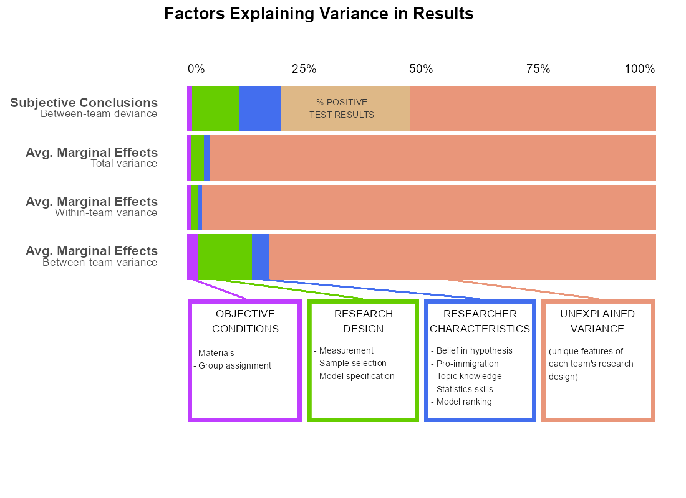

   

```{r setup, include=FALSE, warning=F}

rm(list = ls())
library(pacman)

#necessayr for nnet::multinom and tab_model to work together
# install.packages("devtools")
# devtools::install_github("easystats/insight")
# devtools::install_github("easystats/effectsize")


pacman::p_load("ggplot2","dplyr","readr","plotscale","lattice","tidyr","readxl","mlogit","jtools","sjPlot","sjmisc","sjlabelled","knitr","kableExtra","lavaan","reshape2","semPlot","lavaanPlot","leaps","lme4","multilevelTools","rvest","nnet","parameters","insight","effectsize","ggtext","mdthemes","ragg")

# add in variance estimates (more than 2-digits)
# disable scientific notation
options(scipen = 999)

# Column no missing function
completeFun <- function(data, desiredCols) {
  completeVec <- complete.cases(data[, desiredCols])
  return(data[completeVec, ])
}
```

## Data Prep

These datasets were worked up from the file 01_CRI_Data_Prep.Rmd. 

cri = numerical values
cri_str = string values
cri_team = team-level data (by conclusion)
cri_team_combine = team-level data parsed by type of test variable (stock and flow)
cri_indiv = participant-level data from our survey, identifying characteristics redacted

### Load Data

```{r load, warning=F,message=F}
cri <- read.csv(file = "data/cri.csv", header = T)
cri_str <- read.csv(file = "data/cri_str.csv", header = T)
cri_team <- read.csv(file = "data/cri_team.csv", header = T)
cri_indiv <- read.csv(file = "data/cri_indv.csv", header = T)

# setup multilevel dataset

cri_ml <- select(cri,u_teamid, id, u_delibtreatmentgroup1, AME:main_IV_source, main_IV_measurement:package, countries, Jobs:anynonlin,AME_Z,lower_Z,upper_Z,Hsup,Hrej,Hno,AME_sup_p05:AME_ns_p05,u_expgroup1,belief_strength:belief_ipred, HresultF, STATISTICS_SKILL, BELIEF_HYPOTHESIS, TOPIC_KNOWLEDGE, MODEL_SCORE, PRO_IMMIGRANT)

# create a team ID variable to identify the independent tests by team. Again, 16 of 71 teams had independent conclusions - seeing stock v flow immigration measures as representative of independent tests of the hypothesis. Therefore, we have a team-test level that replaces the team level.

cri_ml$team <- cri_ml %>% group_indices(u_teamid, HresultF)

cri_ml <- select(cri_ml, u_teamid, id, team, AME_Z, upper_Z, lower_Z, everything())

# remove team 0
cri_ml <- subset(cri_ml, u_teamid != 0)
cri_team <- subset(cri_team, u_teamid != 0)

```

### Within and Between Variables

```{r wandb, warning = F, message = F}
cri_ml <- cri_ml %>%
  group_by(team) %>%
  mutate(AME_Z_b = mean(AME_Z, na.rm = T),
         AME_Z_w =AME_Z-AME_Z_b,
         jobs_b = mean(Jobs, na.rm = T),
         unemp_b = mean(Unemp, na.rm = T),
         incdiff_b = mean(IncDiff, na.rm = T),
         oldage_b = mean(OldAge, na.rm = T),
         house_b = mean(House, na.rm = T),
         health_b = mean(Health, na.rm = T),
         jobs_w = Jobs-jobs_b,
         unemp_w = Unemp-unemp_b,
         incdiff_w = IncDiff-incdiff_b,
         oldage_w = OldAge-oldage_b,
         house_w = House-house_b,
         health_w = Health-health_b,
         scale_b = mean(Scale, na.rm = T),
         scale_w = Scale-scale_b,
         un_emp_rate_ivC = ifelse(emplrate_ivC == 1 | unemprate_ivC == 1, 1, 0)) %>%
  ungroup()

# create factors for measurement
cri_ml <- cri_ml %>%
  mutate(main_IV_factor = as.factor(main_IV_measurement))

# team 27 is missing the survey variables
# as it is just one team, mean replacement should be fine
cri_ml <- cri_ml %>%
  mutate(stats_ipred = ifelse(is.na(stats_ipred), mean(stats_ipred, na.rm=T), stats_ipred),
         belief_ipred = ifelse(is.na(belief_ipred), mean(belief_ipred, na.rm =T), belief_ipred),
         topic_ipred = ifelse(is.na(topic_ipred), mean(topic_ipred, na.rm =T), topic_ipred))

# u_expgroup missing from team-level data
t1 <- aggregate(cri_ml, FUN = mean, by = list(cri_ml$u_teamid), na.rm =T)
t1 <- select(t1, u_teamid, u_expgroup1)

cri_team <- left_join(cri_team, t1, by = "u_teamid")
```


# Regresssion Approach to Explaining Variance

## Explaining Average Marginal Effects

### Objective Conditions

Here we consider that the design of the CRI has an influence on the findings of the researchers. This includes the 6 variables to potentially use for the DV and the experimental conditions. We do not include the variable 'Scale' here because this required a conscious choice by the teams to deviate from the observed DVs that were provided.

We consider random assignment to the opaque or transparent replication group (variable = u_expgroup1) and the deliberation group (variable = u_delibtreatmentgroup1) as objectively imposed conditions (not a choice by the teams).

The problem we face is that there is only an average of roughly 13 models per team, and 87 teams. This means we start to lose the ability to explain variance. A degrees of freedom problem. Therefore, in this process we have to reduce complexity. 


```{r obj_mlms}
m00 <- lmer(AME_Z ~ (1 | team), data = cri_ml)
#m01a <- lmer(AME_Z ~ Jobs + Unemp + IncDiff + OldAge + House + Health + (1 | team), data = cri_ml)

# these variables do all the work, so we reduce complexity
m01 <- lmer(AME_Z ~ Jobs + IncDiff + House + (1 | team), data = cri_ml)
m02 <- lmer(AME_Z ~ Jobs + IncDiff + House + u_expgroup1 + u_delibtreatmentgroup1 + (1 | team), data = cri_ml)

m00v <- as.data.frame(VarCorr(m00))
m01v <- as.data.frame(VarCorr(m01))
m02v <- as.data.frame(VarCorr(m02))

m01vars <- "AME_Z ~ Jobs + IncDiff + House"

```

### Subjective Decisions

#### Measurement

The teams had several possibilities to measure the DV (or DVs) including linear, logit or multinomial. Also, immigration could be stock or flow and some teams elected for change in flow. A few teams used measures like refugee or non-western instead of simply foreign-born. These decisions are reflected here.

note that logit is the only one that seems to matter, surprisingly the 'type' of measure does not matter (foreign-born, non-western, refugee, etc.; although there are far fewer models that do not simply use foreign-born)

```{r subj_measurement_mlms}

m03 <- lmer(paste0(m01vars, "+ logit + ologit + lpm + mlogit + ols + (1 | team)"), data = cri_ml)

#note that Flow is the omitted category (ChangeFlow is too rare to make a good omitted category)

# m04 <- lmer(paste0(m01vars, "+ logit + ologit + lpm + mlogit + ols + Stock + Flow + main_IV_factor + (1 | team)"), data = cri_ml)

m04 <- lmer(paste0(m01vars, "+ logit + ols + Stock + ChangeFlow + (1 | team)"), data = cri_ml)

m03v <- as.data.frame(VarCorr(m03))
m04v <- as.data.frame(VarCorr(m04))

m04vars <- "+ logit + ols + Stock + ChangeFlow"

```


#### Data and Sample

```{r subj_datasamp_mlms, warning = F}

m05 <- lmer(paste0(m01vars, m04vars, "+ w1996 + w2006 + w2016 + w2006*w2016 + (1 | team)"), data = cri_ml)

# several interactions were tried here that seemed useful in the single-level equation, but they just wash out the results, many making the variance worse

m06 <- lmer(paste0(m01vars, m04vars, "+ w1996 + w2006 + w2016 + w2006*w2016 + orig13  + eeurope + allavailable +  (1 | team)"), data = cri_ml)

m05v <- as.data.frame(VarCorr(m05))
m06v <- as.data.frame(VarCorr(m06))


m06vars <- "+ w1996 + w2006 + w2016 + w2006*w2016 + orig13  + eeurope + allavailable"
```


#### Model Design

m07 estimator, mlm structure

main IVs in same model or not (this causes one team to get dropped so we don't use it, didn't add anything when added anyways)

m08 independent vars l2 selection

```{r subj_model_mlms}

m07 <- lmer(paste0(m01vars, m04vars, m06vars, " + twowayfe + level_cyear + mlm_fe + mlm_re  + (1 | team)"), data = cri_ml)
m08 <- lmer(paste0(m01vars, m04vars, m06vars, " + twowayfe + mlm_fe + level_cyear  + mlm_re  + gdp_ivC + anynonlin + (1 | team) "), data = cri_ml)
# tried ml_glm, w2016*twowayfe, bayes, un_emp_rate_ivC 

m07v <- as.data.frame(VarCorr(m07))
m08v <- as.data.frame(VarCorr(m08))

m07vars <- " + twowayfe + level_cyear + mlm_fe + mlm_re"
m08vars <- "+ twowayfe + mlm_fe + level_cyear  + mlm_re  + gdp_ivC + anynonlin"

# mlm_fe + mlm_re doesn't help
m07adj_vars <- " + twowayfe + level_cyear"
```


### Researcher Aspects

*belief_ipred* - Belief that Hypothesis is true (that immigration reduces support), team average of predicted factor scores
*pro_immigrant* - Support laws to better integrate immigrants, team average, single question
*topic_ipred* - Knowledge and experience with the topic of immigration and welfare state preferences, team average of predicted factor scores
*stats_ipred* - Knowledge and experience with quantiative statistical analysis, team average of predicted factor scores
*total_score* - Average score of each model from subjective voting amongst participants, each participant reviewed 3 to 4 models

Maximum variance explained

It becomes clear that models 7 and 8 are detrimental to the variance explained,
therefore the following results combine only with m06

Using the R^2 'hacking' tool we found some combinations of these variables that maximized r^2 (m11)

These probably need to be run independently, so that we see the reduction for each one.

```{r res_aspects_mlms}
m09 <- lmer(paste0(m01vars, m04vars, m06vars, m07adj_vars, "+ belief_ipred + (1 | team)"), data = cri_ml)
m10 <- lmer(paste0(m01vars, m04vars, m06vars, m07adj_vars, "+ pro_immigrant +  (1 | team)"), data = cri_ml) 

m11 <- lmer(paste0(m01vars, m04vars, m06vars, m07adj_vars, "+ topic_ipred + (1 | team)"), data = cri_ml) 

m12 <- lmer(paste0(m01vars, m04vars, m06vars, m07adj_vars, "+ stats_ipred + (1 | team)"), data = cri_ml) 

m13 <- lmer(paste0(m01vars, m04vars, m06vars, m07adj_vars, "+ total_score + (1 | team)"), data = cri_ml)

m14 <- lmer(paste0(m01vars, m04vars, m06vars, m07adj_vars, "+ pro_immigrant + stats_ipred + (1 | team)"), data = cri_ml) 
# even a cor of 0.19 is probably causing problems at the team-level with so few degrees of freedom
#> cor(cri_ml$pro_immigrant,cri_ml$stats_ipred, use = "complete.obs")
#[1] 0.1914521

# m15 <- lmer(paste0(m01vars, m04vars, m06vars, m07adj_vars, "+ pro_immigrant + stats_ipred + (1 | team)"), data = cri_ml) 

m09v <- as.data.frame(VarCorr(m09))
m10v <- as.data.frame(VarCorr(m10))
m11v <- as.data.frame(VarCorr(m11))
m12v <- as.data.frame(VarCorr(m12))
m13v <- as.data.frame(VarCorr(m13))
m14v <- as.data.frame(VarCorr(m14))
# m15v <- as.data.frame(VarCorr(m15))


```

### Combine All

```{r comb_tbl}
tab_model(m00,m01,m02,m04,m06,m07,m09,m10,m11,m12,m13, digits = 3, p.style = "stars", show.ci = F, file = "results/reg11.htm")

reg11 <- as.data.frame(read_html("results/reg11.htm") %>% html_table(fill=TRUE))

colnames(reg11) <- c("Effect", "m00","m01", "m02","m04", "m06","m07","m09","m10", "m11","m12","m13")


# Add residual variance by level to model (extracted from VarCorr calls)
# NOTE! This will not run properly if the number of variables changes above

reg11[28,1] <- "Residual Variance"
reg11[28,2:12] <- ""
reg11[29,1] <- "Team-Level"
reg11[29,2:12] <- round(as.numeric(c(m00v[1,4],m01v[1,4],m02v[1,4],m04v[1,4],
                    m06v[1,4],m07v[1,4],m09v[1,4],m10v[1,4],
                    m11v[1,4],m12v[1,4],m13v[1,4])),6)

reg11[30,1] <- "Model-Level"
reg11[30,2:12] <- round(as.numeric(c(m00v[nrow(m00v),4],m01v[nrow(m00v),4],m02v[nrow(m00v),4],
                    m04v[nrow(m00v),4],m06v[nrow(m00v),4],m07v[nrow(m00v),4],
                    m09v[nrow(m00v),4],m10v[nrow(m00v),4],m11v[nrow(m00v),4],
                    m12v[nrow(m00v),4],m13v[nrow(m00v),4])),6
                    )

# calculate var reduction by level

reg11[31,1] <- c("Total")

reg11[31,2:12] <- round(as.numeric(reg11[29,2:12]) + as.numeric(reg11[30,2:12]),6)

reg11[32,1] <- "Variance Explained"
reg11[32,2:12] <- ""

# capture p-value expression
p <- reg11[35,1]

reg11[33,1] <- "Team-Level"
reg11[34,1] <- "Model-Level"
reg11[35,1] <- "Total"

reg11[33,2:12] <- round(1 - (as.numeric(reg11[29,2:12]) / as.numeric(reg11[29,2])),6)
reg11[34,2:12] <- round(1 - (as.numeric(reg11[30,2:12]) / as.numeric(reg11[30,2])),6)
reg11[35,2:12] <- round(1 - (as.numeric(reg11[31,2:12]) / as.numeric(reg11[31,2])),6)

reg11[36,1] <- p
reg11[36,2:12] <- ""

kable_styling(kable(reg11))
```

```{r residual_var}

# identify cases used in m13
cri_ml$in_m13 <- TRUE
cri_ml$in_m13[na.action(m13)] <- FALSE

cri_ml_in <- subset(cri_ml, cri_ml$in_m13 == T)

# predicted values with country-level intercepts, exclude RE?
cri_ml_in$m13_p <- as.data.frame(predict(m13), newdata = cri_ml_in)


```


```{r variance_explained_table}

tbl2_m <- as.data.frame(t(reg11))

tbl2 <- as.data.frame((matrix(nrow = 22, ncol = 5)))

tbl2[1,2:5] <- c("Average Marginal Effect, or equivalent","","","Subjective Conclusion about Hypothesis")
tbl2[2,2:5] <- c("Team-Levela (n=87)","Model-Level (n=1,253)a","Total","Team-Levelb")
tbl2[3:22,1] <- c("Observed Outcome Variance","% Variance Explained By:c","Objective Conditions","Structure of Materials Provided","Group Assignment","Researcher Decisions", "Measurement","Data and Sample","Model Specification","Researcher Attributes","Prior Belief in Hypothesis", "Pro-Immigration Attitude","Knowledge of Topic","Statistical Skills","Peer Model Ranking","","Unexplained Variance","aOf the 71 teams, 16 had independent tests and conclusions for stock and flow models leading to 87 team-level results. Of the 1,261 models submitted, 8 had convergence problems","bA team conclusion of 'Reject' is the reference category","cIn the case of team-level subjective hypothesis conclusion, the outcome is multinomial therefore the 'variance explained' is technically residual deviance")


tbl2[3,2:4] <- as.numeric(tbl2_m[2,29:31])
tbl2[6:7,2:4] <- tbl2_m[3:4,33:35]
tbl2[9:11,2:4] <- tbl2_m[5:7,33:35]
tbl2[13:17,2:4] <- tbl2_m[8:12,33:35]

# Max variance by category
tbl2[5,2] <- max(as.numeric(tbl2[6:7,2]))
tbl2[5,3] <- max(as.numeric(tbl2[6:7,3]))
tbl2[5,4] <- max(as.numeric(tbl2[6:7,4]))

tbl2[8,2] <- max(as.numeric(tbl2[9:11,2]))
tbl2[8,3] <- max(as.numeric(tbl2[9:11,3]))
tbl2[8,4] <- max(as.numeric(tbl2[9:11,4]))

tbl2[12,2] <- max(as.numeric(tbl2[13:17,2]))
tbl2[12,3] <- max(as.numeric(tbl2[13:17,3]))
tbl2[12,4] <- max(as.numeric(tbl2[13:17,4]))

# unexplained variance as total - max
tbl2[19,2] <- 1 - max(as.numeric(tbl2[6:17,2]))
tbl2[19,3] <- 1 - max(as.numeric(tbl2[6:17,3]))
tbl2[19,4] <- 1 - max(as.numeric(tbl2[6:17,4]))

tbl2[18,] <- ""

rm(tbl2_m)

```


## Explaining Subjective Hypothesis Conclusions

Only at the team level, n = 88

Multinomial: support, not testable, reject

```{r obj_mlmsm, results = F}
cri_team$Hresult <- relevel(as.factor(cri_team$Hresult), ref = "Support")

m00m <- multinom(Hresult ~ 1 , data = cri_team)
m01m <- multinom(Hresult ~ Jobs + IncDiff + House , data = cri_team)
m02m <- multinom(Hresult ~ Jobs + IncDiff + House + u_expgroup1 + u_delibtreatmentgroup1, data = cri_team)

m00d <- summary(m00)
m01d <- summary(m01)
m02d <- summary(m02)

m01vars <- "Hresult ~ Jobs + IncDiff + House"


```

```{r subj_measurement_mlmsm, results = F}

m03m <- multinom(Hresult ~ Jobs + IncDiff + House + logit + ols, data = cri_team)

m04m <- multinom(Hresult ~ Jobs + IncDiff + House + logit + ols + Stock + ChangeFlow, data = cri_team)

m03d <- summary(m03m)
m04d <- summary(m04m)

# tab_model(m03m, show.dev = T, show.aic = T)

```


#### Data and Sample

```{r subj_datasamp_mlmsm, warning = F, results = F}

m05m <- multinom(Hresult ~ Jobs + IncDiff + House + logit + ols + Stock + ChangeFlow + w2006 + w2016, data = cri_team)

m06m <- multinom(Hresult ~ Jobs + IncDiff + House + logit + ols + Stock + ChangeFlow + w2006 + w2016 + orig13  + eeurope + allavailable, data = cri_team)

m05d <- summary(m05m)
m06d <- summary(m06m)


```


#### Model Design

m07 estimator, mlm structure

main IVs in same model or not (this causes one team to get dropped so we don't use it, didn't add anything when added anyways)

m08 independent vars l2 selection

had to remove mlm_fe, it uniquely identifes team in the multinomial removed mlm_re and House, we are pushing the limit with variables and these were harming AIC fit

```{r subj_model_mlmsm, results = F}


m07m <- multinom(Hresult ~ Jobs + IncDiff  + logit + ols + Stock + ChangeFlow + w2006 + w2016 + orig13  + eeurope + allavailable + twowayfe + level_cyear + mlm_fe , data = cri_team)
m08m <- multinom(Hresult ~ Jobs + IncDiff  + logit + ols + Stock + ChangeFlow + w2006 + w2016 + orig13  + eeurope + allavailable + twowayfe + level_cyear + mlm_fe + gdp_ivC + anynonlin , data = cri_team)


m07d <- summary(m07m)
m08d <- summary(m08m)

```


### Researcher Aspects

*belief_ipred* - Belief that Hypothesis is true (that immigration reduces support), team average of predicted factor scores
*pro_immigrant* - Support laws to better integrate immigrants, team average, single question
*topic_ipred* - Knowledge and experience with the topic of immigration and welfare state preferences, team average of predicted factor scores
*stats_ipred* - Knowledge and experience with quantiative statistical analysis, team average of predicted factor scores
*total_score* - Average score of each model from subjective voting amongst participants, each participant reviewed 3 to 4 models

Maximum variance explained

It becomes clear that models 7 and 8 are detrimental to the variance explained,
therefore the following results combine only with m06

Using the R^2 'hacking' tool we found some combinations of these variables that maximized r^2 (m11)

These probably need to be run independently, so that we see the reduction for each one.

```{r res_aspects_mlmsm,  results=F}
m09m <- multinom(Hresult ~ Jobs + IncDiff  + logit + ols + Stock + ChangeFlow + w2006 + w2016 + orig13  + eeurope + allavailable + twowayfe + level_cyear + mlm_fe + gdp_ivC + anynonlin + belief_ipred  , data = cri_team)

m10m <- multinom(Hresult ~ Jobs + IncDiff  + logit + ols + Stock + ChangeFlow + w2006 + w2016 + orig13  + eeurope + allavailable + twowayfe + level_cyear + mlm_fe + gdp_ivC + anynonlin + pro_immigrant , data = cri_team) 

m11m <- multinom(Hresult ~ Jobs + IncDiff  + logit + ols + Stock + ChangeFlow + w2006 + w2016 + orig13  + eeurope + allavailable + twowayfe + level_cyear + mlm_fe + gdp_ivC + anynonlin + topic_ipred , data = cri_team) 

m12m <- multinom(Hresult ~ Jobs + IncDiff  + logit + ols + Stock + ChangeFlow + w2006 + w2016 + orig13  + eeurope + allavailable + twowayfe + level_cyear + mlm_fe + gdp_ivC + anynonlin + stats_ipred, data = cri_team) 

m13m <- multinom(Hresult ~ Jobs + IncDiff  + logit + ols + Stock + ChangeFlow + w2006 + w2016 + orig13  + eeurope + allavailable + twowayfe + level_cyear + mlm_fe + gdp_ivC + anynonlin + total_score , data = cri_team)

m14m <- multinom(Hresult ~ Jobs + IncDiff  + logit + ols + Stock + ChangeFlow + w2006 + w2016 + orig13  + eeurope + allavailable + twowayfe + level_cyear + mlm_fe + gdp_ivC + anynonlin + belief_ipred + pro_immigrant + topic_ipred + stats_ipred , data = cri_team)

m09d <- summary(m09m)
m10d <- summary(m10m)
m11d <- summary(m11m)
m12d <- summary(m12m)
m13d <- summary(m13m)
m14d <- summary(m14m)

```

### Combine All

```{r comb_tblm}
tab_model(m00m,m01m,m02m,m04m,m06m,m08m, digits = 3, p.style = "stars", show.ci = F, show.dev = T, show.aic = T, transform = NULL, file = "results/reg22.htm")

tab_model(m00m,m09m,m10m,m11m,m12m,m13m,m14m, digits = 3, p.style = "stars", show.ci = F, show.dev = T, show.aic = T, transform = NULL, file = "results/reg23.htm")

reg22 <- as.data.frame(read_html("results/reg22.htm") %>% html_table(fill=TRUE))

reg23 <- as.data.frame(read_html("results/reg23.htm") %>% html_table(fill=TRUE))

# problem with tab_model, opened a claim on GitHub, for now remove duplicate rows

reg22 <- reg22 %>%
  distinct(Hresult, Hresult.1,Hresult.3,Hresult.8,Hresult.9, .keep_all = T)

reg23 <- reg23 %>%
  distinct(Hresult, Hresult.1,Hresult.10,Hresult.11, .keep_all = T)

colnames(reg22) <- c("Effect", "m00m_coef","m00m_chc","m01m_coef","m01m_chc","m02m_coef","m02m_chc","m04m_coef","m04m_chc","m06m_coef","m06m_chc","m08m_coef","m08m_chc")

colnames(reg23) <- c("Effect","m00m_coef","m01m_chc", "m09m_coef","m09m_chc","m10m_coef","m10m_chc","m11m_coef","m11m_chc","m12m_coef","m12m_chc","m13m_coef","m13m_chc","m14m_coef","m14m_chc")


# Prep for deviance reduction, but calculate it later as adjusted

reg22[nrow(reg22)+1,1] <- "Pct Dev Reduction"
reg23[nrow(reg23)+1,1] <- "Pct Dev Reduction"


#kable_styling(kable())
```

### Adjusted Deviance Reduction

We have 20 variables and 89 cases, this means that some of the explained deviance is simply a product of an intercept effect. Chopping up the data; reducing sample degrees of freedom. Therefore, the deviance should be adjusted by the number of variables, as in how much deviance would be explained with an equal number of random variables.

We always take one less than the number of variables.


```{r dev_adj, results = F}

cri_team_sim <- select(cri_team, Hresult)

set.seed(90210)
seed <- 90210

for(i in 1:200) {
  assign(paste0("a",i), as.data.frame(round(runif(88, min = 0, max = 1),0)))
  seed <- seed+1
  set.seed(seed)
}

# not working, do by hand
avarl <- sprintf("a%s",seq(1:200))
# avar <- lapply(avarl, data.frame) %>% bind_cols()

avar <- do.call("cbind", list(a1, a2, a3, a4, a5, a6, a7, a8, a9, a10, a11, a12, a13, a14, a15, a16, a17, a18, a19, a20, a21, a22, a23, a24, a25, a26, a27, a28, a29, a30, a31, a32,a33, a34, a35, a36, a37, a38, a39, a40,a41, a42, a43, a44, a45, a46, a47, a48, a49, a50, a51, a52, a53, a54, a55, a56, a57, a58, a59, a60, a61, a62, a63, a64, a65, a66, a67, a68, a69, a70, a71, a72, a73, a74, a75, a76, a77, a78, a79, a80,  a81, a82, a83, a84, a85, a86, a87, a88, a89, a90, a91, a92, a93, a94, a95, a96,  a97, a98, a99, a100, a101, a102, a103, a104, a105, a106, a107, a108, a109, a110, a111, a112, a113, a114, a115, a116, a117, a118, a119, a120, a121, a122, a123, a124, a125, a126, a127, a128, a129, a130, a131, a132, a133, a134, a135, a136, a137, a138, a139, a140, a141, a142, a143, a144, a145, a146, a147, a148, a149, a150, a151, a152, a153, a154, a155, a156, a157, a158, a159, a160, a161, a162, a163, a164, a165, a166, a167, a168, a169, a170, a171, a172, a173, a174, a175, a176, a177, a178, a179, a180, a181, a182, a183, a184, a185, a186, a187, a188, a189, a190, a191, a192, a193, a194, a195, a196, a197, a198, a199, a200))

rm(list = avarl)

f <- c("Hresult",paste0("a",as.character(1:200)))


cri_team_sim <- cbind(cri_team_sim,avar)
colnames(cri_team_sim) <- f

# 3 variables (2 simulated)

# create empty frame to store 20 results

sim_3_vars <- matrix(nrow = 20, ncol = 1)

b <- 5
for(i in 1:20){
  
  rr <- multinom(Hresult ~ get(avarl[i]) + get(avarl[b]), data = cri_team_sim)
  sim_3_vars[i,1] <- summary(rr)[["deviance"]]
  b <- b + 1
}

# repeat for 7 vars

sim_7_vars <- matrix(nrow = 20, ncol = 1)

b <- 8
c <- 13
d <- 18
e <- 23
f <- 28
g <- 33

for(i in 1:20){
  
  rr <- multinom(Hresult ~ get(avarl[i]) + get(avarl[b]) + get(avarl[c]) + get(avarl[d]) + get(avarl[e]) + get(avarl[f]), data = cri_team_sim)
  sim_7_vars[i,1] <- summary(rr)[["deviance"]]
  b <- b + 1
  c <- c + 1
  d <- d + 1
  e <- e + 1
  f <- f + 1
}

# 13 vars

sim_13_vars <- matrix(nrow = 20, ncol = 1)

b <- 9
c <- 14
d <- 19
e <- 24
f <- 29
g <- 34
h <- 39
ii <- 44
j <- 49
k <- 54
l <- 59
m <- 64

for(i in 1:20){
  
  rr <- multinom(Hresult ~ get(avarl[i]) + get(avarl[b]) + get(avarl[c]) + get(avarl[d]) + get(avarl[e]) + get(avarl[f]) + get(avarl[g]) + get(avarl[h]) + get(avarl[ii]) + get(avarl[j]) + get(avarl[k]) + get(avarl[l]) + get(avarl[m]), data = cri_team_sim)
  sim_13_vars[i,1] <- summary(rr)[["deviance"]]
  b <- b + 1
  c <- c + 1
  d <- d + 1
  e <- e + 1
  f <- f + 1
  g <- g + 1
  h <- h + 1
  ii <- ii + 1
  j <- j + 1
  k <- k + 1
  l <- l + 1
  m <- m + 1
}

# 16 variables

sim_16_vars <- matrix(nrow = 20, ncol = 1)

b <- 11
c <- 16
d <- 21
e <- 26
f <- 31
g <- 36
h <- 31
ii <- 36
j <- 41
k <- 46
l <- 51
m <- 56
n <- 61
o <- 66
p <- 71
q <- 76

for(i in 1:20){
  
  rr <- multinom(Hresult ~ get(avarl[i]) + get(avarl[b]) + get(avarl[c]) + get(avarl[d]) + get(avarl[e]) + get(avarl[f]) + get(avarl[g]) + get(avarl[h]) + get(avarl[ii]) + get(avarl[j]) + get(avarl[k]) + get(avarl[l]) + get(avarl[m]) + get(avarl[n]) + get(avarl[o]) + get(avarl[p]), data = cri_team_sim)
  sim_16_vars[i,1] <- summary(rr)[["deviance"]]
  b <- b + 1
  c <- c + 1
  d <- d + 1
  e <- e + 1
  f <- f + 1
  g <- g + 1
  h <- h + 1
  ii <- ii + 1
  j <- j + 1
  k <- k + 1
  l <- l + 1
  m <- m + 1
  n <- n + 1
  o <- o + 1
  p <- p + 1
}

```


### Compile Table 2

20 runs of randomly distributed dichotomous variables determines how much deviance reduction on average is possible due to the number of variables. We subtract this from the deviance reduction

#### Add simulation results

```{r tbl2}
# add adjusted deviance

# Tabulate average deviance
sims <- list(sim_3_vars, sim_7_vars, sim_13_vars, sim_16_vars)

avg_dev_sim <- lapply(sims, function(x) mean(x, na.rm = T))

# a vector for each model
# we adjust the first model's values upwards to prevent negative percentage

avg_dev_sim_vector22 <- c("Simulated Deviance Reduction",
                        as.numeric(reg22[nrow(reg22)-3,2]),NA,
                        as.numeric(avg_dev_sim[1]) + 1,NA,
                        (as.numeric(avg_dev_sim[1]) + as.numeric(avg_dev_sim[2]))/1.95,NA,
                        as.numeric(avg_dev_sim[2]),NA,
                        as.numeric(avg_dev_sim[2]) - 1,NA,
                        as.numeric(avg_dev_sim[4]) - 1,NA)
avg_dev_sim_vector23 <- c("Simulated Deviance Reduction",
                        as.numeric(reg23[nrow(reg23)-3,2]),NA,
                        as.numeric(avg_dev_sim[4]),NA,
                        as.numeric(avg_dev_sim[4]),NA,
                        as.numeric(avg_dev_sim[4]),NA,
                        as.numeric(avg_dev_sim[4]),NA,
                        as.numeric(avg_dev_sim[4]),NA,
                        as.numeric(avg_dev_sim[4]),NA
                        )

# subtract this no-of-variables caused average deviance reduction from the observed deviance reduction 

reg22[nrow(reg22),c(2,4,6,8,10,12)] <- 1 - round((as.numeric(reg22[nrow(reg22)-3,c(2,4,6,8,10,12)]) / as.numeric(reg22[nrow(reg22)-3,2])),6)

reg23[nrow(reg23),c(2,4,6,8,10,12,14)] <- 1 - round((as.numeric(reg23[nrow(reg23)-3,c(2,4,6,8,10,12,14)]) / as.numeric(reg22[nrow(reg23)-3,2])),6)

reg22[nrow(reg22) + 1,] <- avg_dev_sim_vector22
reg23[nrow(reg23) + 1,] <- avg_dev_sim_vector23

# Adjusted deviance reduction in % = simulated deviance minus deviance as a percent reduction

reg22[nrow(reg22) + 1,c(2,4,6,8,10,12)] <- round((as.numeric(reg22[nrow(reg22),c(2,4,6,8,10,12)]) - (as.numeric(reg22[nrow(reg22) - 4,c(2,4,6,8,10,12)]))) / as.numeric(reg22[nrow(reg22)-4,2]),6)


reg23[nrow(reg23) + 1,c(2,4,6,8,10,12,14)] <- round((as.numeric(reg23[nrow(reg23),c(2,4,6,8,10,12,14)]) - (as.numeric(reg23[nrow(reg23) - 4,c(2,4,6,8,10,12,14)]))) / as.numeric(reg23[nrow(reg23)-4,2]),6)

rm(sim_3_vars,sim_7_vars,sim_13_vars,sim_16_vars,sims,rr,t1,avar,avg_dev_sim)
```

#### Add adjusted deviance 

```{r devto2}
tbl2_m22 <- as.data.frame(t(reg22))
tbl2_m23 <- as.data.frame(t(reg23))

# remove the choice rows
tbl2_m22 <- completeFun(tbl2_m22, "47")
tbl2_m23 <- completeFun(tbl2_m23, "47")

tbl2[3,5] <- tbl2_m22[2,47]
tbl2[c(6,7,9,10,11),5] <- tbl2_m22[c(3:7),48]

tbl2[c(13:17),5] <- tbl2_m23[c(3:7),48]
tbl2[c(12),5] <- tbl2_m23[8,48]

tbl2[c(5,8),5] <- tbl2[c(7,11),5]

# calculate unexplained dev
tbl2[19,5] <- 1 - as.numeric(tbl2[12,5])

```


```{r write_tbl2}
#make a version for plotting
fig2 <- as.data.frame(matrix(nrow = 16, ncol = 3))
colnames(fig2) <- c("level","type","percent")
#Level
fig2[1:4,1] <- "Avg. Marginal Effects\nBetween-team variance"
fig2[5:8,1] <- "Avg. Marginal Effects\nWithin-team variance"
fig2[9:12,1] <- "Avg. Marginal Effects\nTotal variance"
fig2[13:16,1] <- "Subjective conclusion\nBetween-team deviance"
#Type
fig2[c(1,5,9,13),2] <- "Objective conditions"
fig2[c(2,6,10,14),2] <- "Research design"
fig2[c(3,7,11,15),2] <- "Researcher attributes"
fig2[c(4,8,12,16),2] <- "Unexplained variance"
#percentage
fig2[,3] <- c(tbl2[c(5,8,12,19),2],tbl2[c(5,8,12,19),3],tbl2[c(5,8,12,19),4],tbl2[c(5,8,12,19),5])
fig2$percent <- as.numeric(fig2$percent)
fig2[2,3] <- (fig2[2,3] - fig2[1,3])
fig2[3,3] <- (fig2[3,3] - fig2[2,3])
fig2[4,3] <- 1 - (fig2[1,3] + fig2[2,3] + fig2[3,3])

fig2[6,3] <- (fig2[6,3] - fig2[5,3])
fig2[7,3] <- (fig2[7,3] - fig2[6,3])
fig2[8,3] <- 1 - (fig2[7,3] + fig2[6,3] + fig2[5,3])

fig2[10,3] <- (fig2[10,3] - fig2[9,3])
fig2[11,3] <- (fig2[11,3] - fig2[10,3])
fig2[12,3] <- 1 - (fig2[11,3] + fig2[10,3] + fig2[9,3])

fig2[14,3] <- (fig2[14,3] - fig2[13,3])
fig2[15,3] <- (fig2[15,3] - fig2[14,3])
fig2[16,3] <- 1 - (fig2[15,3] + fig2[14,3] + fig2[13,3])


write.csv(tbl2, file = "results/Tbl2.csv")
```


## Table 2. As a Stacked Bar

```{r fig2_setup}
fig2$level <- factor(fig2$level, levels = c(" ","  ","   ","    ","Avg. Marginal Effects\nBetween-team variance","Avg. Marginal Effects\nWithin-team variance","Avg. Marginal Effects\nTotal variance","Subjective conclusion\nBetween-team deviance","     "))

fig2_labs <- c(" ","  ","   ","     ","<span style = \"font-size: 14px\">**Avg. Marginal Effects**</span><br>Between-team variance","<span style = \"font-size: 14px\">**Avg. Marginal Effects**</span><br>Within-team variance","<span style = \"font-size: 14px\">**Avg. Marginal Effects**</span><br>Total variance","<span style = \"font-size: 14px\">**Subjective Conclusions**</span><br>Between-team deviance"," ")
```


```{r fig2_plot}
agg_png(filename= "results/fig2_varexp.png", res = 144, width = 1100, height = 800)
ggplot(fig2, aes(x = level, y = percent, fill = type)) +
  geom_bar(stat = "identity") +
  coord_flip() +
  labs(x = "", y = "", fill = "Percent\nexplained by") +
  md_theme_classic() +
  labs(title = "<span style = \"font-size: 18px\">**Factors Explaining Variance in Results**</span>") +
  scale_x_discrete(labels = fig2_labs, drop = F) +
  scale_y_reverse() +
  geom_rect(aes(xmin = 1.3, xmax = 4.1, ymin = 0.005, ymax = 0.24), color = "darksalmon", size = 1.5, fill = "transparent") +
  geom_rect(aes(xmin = 1.3, xmax = 4.1, ymin = 0.26, ymax = 0.49), color = "royalblue2", size = 1.5, fill = "transparent") +
  geom_rect(aes(xmin = 1.3, xmax = 4.1, ymin = 0.51, ymax = 0.74), color = "chartreuse3", size = 1.5, fill = "transparent") +
  geom_rect(aes(xmin = 1.3, xmax = 4.1, ymin = 0.76, ymax = 0.995), color = "darkorchid1", size = 1.5, fill = "transparent") +
  annotate("text", x = 3.7, y = 0.124, label = "UNEXPLAINED\nVARIANCE", color = "black", size = 3) +
  annotate("text", x = 3.7, y = 0.375, label = "RESEARCHER\nATTRIBUTES", color = "black",  size = 3) +
  annotate("text", x = 3.7, y = 0.624, label = "RESEARCH\nDESIGN", color = "black",  size = 3) +
  annotate("text", x = 3.7, y = 0.876, label = "OBJECTIVE\nCONDITIONS", color = "black",  size = 3) +
  annotate("text", x = 2.52, y = 0.228, label = "(unique features of\neach team's research\ndesign)", size = 2.5, color = "grey12", hjust = 0, vjust = 0) +
  annotate("text", x = 2.01, y = 0.48, label = "- Belief in hypothesis\n- Pro-immigration\n- Topic knowledge\n- Statistics skills\n- Model ranking", size = 2.5, color = "grey12", hjust = 0, vjust = 0) +
  annotate("text", x = 2.53, y = 0.730, label = "- Measurement\n- Sample selection\n- Model specification", size = 2.5, color = "grey12", hjust = 0, vjust = 0) +
  annotate("text", x = 2.741, y = 0.988, label = "- Materials\n- Group assignment", size = 2.5, color = "grey12", hjust = 0, vjust = 0) +
  annotate("text", x = 8.8, y = 1, hjust = 0, label = "0%", size = 3.5) +
  annotate("text", x = 8.8, y = 0.75,  label = "25%", size = 3.5) +
  annotate("text", x = 8.8, y = 0.5,  label = "50%", size = 3.5) +
  annotate("text", x = 8.8, y = 0.25,  label = "75%", size = 3.5) +
  annotate("text", x = 8.8, y = 0, hjust = 1, label = "100%", size = 3.5) +
  geom_segment(aes(x = 4.15, y = 0.123, xend = 4.55, yend = 0.45), color = "darksalmon") +
  geom_segment(aes(x = 4.15, y = 0.376, xend = 4.55, yend = 0.85), color = "royalblue2") +
  geom_segment(aes(x = 4.15, y = 0.626, xend = 4.55, yend = 0.945), color = "chartreuse3") +
  geom_segment(aes(x = 4.15, y = 0.876, xend = 4.55, yend = 0.99), color = "darkorchid1") +
  scale_fill_manual(values = c("Objective conditions" = "darkorchid1",
                                "Research design" = "chartreuse3",
                                "Researcher attributes" = "royalblue2",
                                "Unexplained variance" = "darksalmon")) +
  theme(axis.line = element_blank(),
        axis.text.x = element_blank(),
        axis.ticks = element_blank(),
        legend.position = "none")
dev.off()



```


```{r prep_rain_plots}
cri_ml_in <- cri_ml_in %>%
  mutate(m13_e = AME_Z - m13_p,
         stat_cat_factor = factor(STATISTICS_SKILL, levels = c("Low","Mid","High")),
         belief_cat_factor = factor(BELIEF_HYPOTHESIS, levels = c("Low","Mid","High")),
         topic_cat_factor = factor(TOPIC_KNOWLEDGE, levels = c("Low","Mid","High")),
         total_score_cat_factor = factor(MODEL_SCORE, levels = c("Low","Mid","High")),
         pro_immigrant_cat_factor = factor(PRO_IMMIGRANT, levels = c("Low","Mid","High"))
  )

write_rds(cri_ml_in, file = "data/cri_ml_in.Rda")
```


#### Test IV Type - unweighted

These results do not take into account the varying number of models per team

```{r m1_ivsplit, include = TRUE, warning = F}

cri_stock <- subset(cri, cri$Stock == 1)
cri_flow <- subset(cri, cri$Flow == 1)

#Stock models
m1a_stock <- lm(AME_Z ~ Jobs + Unemp + IncDiff + OldAge + House + Health + Scale, data = cri_stock)
m1b_stock <- lm(p ~ Jobs + Unemp + IncDiff + OldAge + House + Health + Scale, data = cri_stock)
m1c_stock <- lm(AME_Z ~ Jobs + Unemp + IncDiff + OldAge + House + Health + Scale + p, data = cri_stock)

#Flow models
m1a_flow <- lm(AME_Z ~ Jobs + Unemp + IncDiff + OldAge + House + Health + Scale, data = cri_flow)
m1b_flow <- lm(p ~ Jobs + Unemp + IncDiff + OldAge + House + Health + Scale, data = cri_flow)
m1c_flow <- lm(AME_Z ~ Jobs + Unemp + IncDiff + OldAge + House + Health + Scale + p, data = cri_flow)

tab_model(m1a_stock,m1b_stock,m1c_stock,m1a_flow,m1b_flow,m1c_flow, p.style = "stars", show.ci = F, rm.terms = c("(Intercept)"))


```

#### Test IV Type - weighted

We abandon estimation of p-values here. They do not seem to be of substantive interest for us... yet.

Weighting does not improve explained variance.

```{r m1_weight, include = TRUE}

m1aw <- lm(AME_Z ~ Jobs + Unemp + IncDiff + OldAge + House + Health + Scale, data = cri, weight = (inv_weight/1)*112)
m1aw_stock <- lm(AME_Z ~ Jobs + Unemp + IncDiff + OldAge + House + Health + Scale, data = cri_stock, weights = (inv_weight/1)*112)
m1aw_flow <- lm(AME_Z ~ Jobs + Unemp + IncDiff + OldAge + House + Health + Scale, data = cri_flow, weights = (inv_weight/1)*112)


tab_model(m1aw,m1aw_stock,m1aw_flow, p.style = "stars", show.ci = F, rm.terms = c("(Intercept)"))


```

#### Pooled by Test Type

```{r m2_pooled_iv_type}

# Pooled by test variable, ref = change in flow

m2 <- lm(AME_Z ~ factor(main_IV_type), data = cri)

tab_model(m2, p.style = "stars", show.ci = F, rm.terms = c("(Intercept)"))

```

#### Waves of Data Used

##### Model Specifications - testing universe of wave combinations

Results suggest that using a 2006*2016 interaction 'maximizes' explained variance at 0.008.It suggests leaving out the main effect for w2016, but this is substantively awkward, so we put it back in for the final regression in the next code chunk.

```{r wave_test}

# the use of 1985 and 1990 is quite rare so we focus on the latter three waves as potential interactions
m_wave <-
    regsubsets(AME_Z ~ w1985 + w1990 + w1996 + w2006 + w2016 + w1996*w2006 + w1996*w2016 + w1996*w2006*w2016 + w2006*w2016,
               data = cri,
               nbest = 1,       # 1 best model for each number of predictors
               nvmax = NULL,    # NULL for no limit on number of variables
               force.in = NULL, force.out = NULL,
               method = "exhaustive")

plot(m_wave, scale = "adjr2", main = "Adjusted R^2")
```

##### Sample Selection Waves

```{r m3}
m3 <- lm(AME_Z ~ w2006 + w2016 + w2006*w2016, data = cri)
m3_stock <- lm(AME_Z ~ w2006 + w2016 + w2006*w2016, data = cri_stock)
m3_flow <- lm(AME_Z ~ w1996 + w2006 + w2016 + w2006*w2016, data = cri_flow)

tab_model(m3, m3_stock, m3_flow, p.style = "stars", show.ci = F, rm.terms = c("(Intercept)"))
```


#### Sample Selection Related IVs

##### Universe approach

After running this, it is not even worth modeling. We can only get up to Adj r^2 around 0.01.

```{r sample_test}

# we do not interact all variables because they are mostly mutually exclusive 
m_sample <-
    regsubsets(AME_Z ~ w2006 + w2016 + w2006*w2016 + orig13 + orig17 + eeurope + allavailable + w2016*orig13 + w2016*orig17 + w2016*eeurope + w2016*allavailable + w2006*w2016*orig13 + w2006*w2016*orig17 + w2006*w2016*eeurope + w2006*w2016*allavailable + w2006*w2016*orig13 + w2006*orig13 + w2006*orig17 + w2006*eeurope + w2006*allavailable,
               data = cri,
               nbest = 1,       # 1 best model for each number of predictors
               nvmax = NULL,    # NULL for no limit on number of variables
               force.in = NULL, force.out = NULL,
               method = "exhaustive")

plot(m_sample, scale = "adjr2", main = "Adjusted R^2")
```

##### Sample selection

orig13
orig17, dropped, see above
eeurope
allavailable


```{r m4}
m4 <- lm(AME_Z ~ orig13  + eeurope + allavailable + w2006 + w2016 + w2006*w2016 + w2016*eeurope + w2016*allavailable, data = cri)
m4_stock <- lm(AME_Z ~ orig13  + eeurope + allavailable + w2006 + w2016 + w2006*w2016 + w2016*eeurope + w2016*allavailable, data = cri_stock)
m4_flow <- lm(AME_Z ~ orig13  + eeurope + allavailable + + w1996 + w2006 + w2016 + w2006*w2016 + w2016*eeurope + w2016*allavailable, data = cri_flow)

tab_model(m4, m4_stock, m4_flow, p.style = "stars", show.ci = F, rm.terms = c("(Intercept)"))

```


### Team Qualities


#### Correlations

```{r rq_corr}
cor_rq <- select(cri, AME_Z, Hsup, AME_sup_p05, belief_ipred, pro_immigrant, topic_ipred, stats_ipred, total_score)
# cor_rq <- completeFun(cor_rq, c("AME_Z", "belief_ipred"))
# cor_rq <- as.data.frame(cor_rq)
cor_rqa <- as.data.frame(round(cor(cor_rq, use = "pairwise.complete.obs"), 3))

# Start to build main findings table
cor_rqa <- as.data.frame(cor_rqa[4:8,1:3])
cor_rqa2 <- round(100*(cor_rqa^2), 3)

# Stock and Flow only
cor_rq_stock <- select(cri_stock, AME_Z, belief_ipred, pro_immigrant, topic_ipred, stats_ipred, total_score)
cor_rqa_stock <- as.data.frame(round(cor(cor_rq_stock, use = "pairwise.complete.obs"), 3))

cor_rqa_stock <- as.data.frame(cor_rqa_stock[2:6,1])
cor_rqa2_stock <- round(100*(cor_rqa_stock^2), 3)

cor_rq_flow <- select(cri_flow, AME_Z, belief_ipred, pro_immigrant, topic_ipred, stats_ipred, total_score)
cor_rqa_flow <- as.data.frame(round(cor(cor_rq_flow, use = "pairwise.complete.obs"), 3))

cor_rqa_flow <- as.data.frame(cor_rqa_flow[2:6,1])
cor_rqa2_flow <- round(100*(cor_rqa_flow^2), 3)

# bind all together

cor_rqa21 <- as.data.frame(cor_rqa2[,1])
cor_rqa22 <- as.data.frame(cor_rqa2[,2:3])
cor_rq_final <- bind_cols(cor_rqa21, cor_rqa2_stock, cor_rqa2_flow, cor_rqa22)

rm(cor_rq, cor_rq_flow, cor_rq_stock, cor_rqa, cor_rqa_flow, cor_rqa_stock, cor_rqa2, cor_rqa2_flow, cor_rqa2_stock)
```


#### Universe Approach

```{r qs_test}

# we do not interact all variables because they are mostly mutually exclusive 
m_qs <-
    regsubsets(AME_Z ~ belief_ipred + pro_immigrant + topic_ipred + stats_ipred + total_score + belief_ipred*pro_immigrant + belief_ipred*topic_ipred + belief_ipred*stats_ipred + belief_ipred*total_score + pro_immigrant*topic_ipred + pro_immigrant*stats_ipred + pro_immigrant*total_score + topic_ipred*stats_ipred + topic_ipred*total_score + stats_ipred*total_score,
               data = cri,
               nbest = 1,       # 1 best model for each number of predictors
               nvmax = NULL,    # NULL for no limit on number of variables
               force.in = NULL, force.out = NULL,
               method = "exhaustive")

plot(m_qs, scale = "adjr2", main = "Adjusted R^2")
```

```{r m20}
m20 <- lm(AME_Z ~ belief_ipred + pro_immigrant + topic_ipred + stats_ipred + total_score + belief_ipred*topic_ipred + belief_ipred*stats_ipred + pro_immigrant*stats_ipred + topic_ipred*stats_ipred, data = cri)
m20_stock <- lm(AME_Z ~ belief_ipred + pro_immigrant + topic_ipred + stats_ipred + total_score + belief_ipred*topic_ipred + belief_ipred*stats_ipred + pro_immigrant*stats_ipred + topic_ipred*stats_ipred, data = cri_stock)
m20_flow <- lm(AME_Z ~ belief_ipred + pro_immigrant + topic_ipred + stats_ipred + total_score + belief_ipred*topic_ipred + belief_ipred*stats_ipred + pro_immigrant*stats_ipred + topic_ipred*stats_ipred, data = cri_flow)

tab_model(m20, m20_stock, m20_flow, p.style = "stars", show.ci = F, rm.terms = c("(Intercept)"))

```


### All Aspects Combined


```{r m30}
m30 <- lm(AME_Z ~ belief_ipred + pro_immigrant + topic_ipred + stats_ipred + total_score + belief_ipred*topic_ipred + belief_ipred*stats_ipred + pro_immigrant*stats_ipred + topic_ipred*stats_ipred + orig13  + eeurope + allavailable + w2006 + w2016 + w2006*w2016 + w2016*eeurope + w2016*allavailable + Jobs + Unemp + IncDiff + OldAge + House + Health + Scale, data = cri)

m30_stock <- lm(AME_Z ~ belief_ipred + pro_immigrant + topic_ipred + stats_ipred + total_score + belief_ipred*topic_ipred + belief_ipred*stats_ipred + pro_immigrant*stats_ipred + topic_ipred*stats_ipred + orig13  + eeurope + allavailable + w2006 + w2016 + w2006*w2016 + w2016*eeurope + w2016*allavailable + Jobs + Unemp + IncDiff + OldAge + House + Health + Scale, data = cri_stock)

m30_flow <- lm(AME_Z ~ belief_ipred + pro_immigrant + topic_ipred + stats_ipred + total_score + belief_ipred*topic_ipred + belief_ipred*stats_ipred + pro_immigrant*stats_ipred + topic_ipred*stats_ipred + orig13  + eeurope + allavailable + w2006 + w2016 + w2006*w2016 + w2016*eeurope + w2016*allavailable + Jobs + Unemp + IncDiff + OldAge + House + Health + Scale, data = cri_flow)

tab_model(m30, m30_stock, m30_flow, p.style = "stars", show.ci = F, rm.terms = c("(Intercept)"))
```


### All Aspects Combined Weighted


```{r m30w}
m30_w <- lm(AME_Z ~ belief_ipred + pro_immigrant + topic_ipred + stats_ipred + total_score + belief_ipred*topic_ipred + belief_ipred*stats_ipred + pro_immigrant*stats_ipred + topic_ipred*stats_ipred + orig13  + eeurope + allavailable + w2006 + w2016 + w2006*w2016 + w2016*eeurope + w2016*allavailable + Jobs + Unemp + IncDiff + OldAge + House + Health + Scale, data = cri, weights = (inv_weight/1)*112)

m30_stock_w <- lm(AME_Z ~ belief_ipred + pro_immigrant + topic_ipred + stats_ipred + total_score + belief_ipred*topic_ipred + belief_ipred*stats_ipred + pro_immigrant*stats_ipred + topic_ipred*stats_ipred + orig13  + eeurope + allavailable + w2006 + w2016 + w2006*w2016 + w2016*eeurope + w2016*allavailable + Jobs + Unemp + IncDiff + OldAge + House + Health + Scale, data = cri_stock, weights = (inv_weight/1)*112)

m30_flow_w <- lm(AME_Z ~ belief_ipred + pro_immigrant + topic_ipred + stats_ipred + total_score + belief_ipred*topic_ipred + belief_ipred*stats_ipred + pro_immigrant*stats_ipred + topic_ipred*stats_ipred + orig13  + eeurope + allavailable + w2006 + w2016 + w2006*w2016 + w2016*eeurope + w2016*allavailable + Jobs + Unemp + IncDiff + OldAge + House + Health + Scale, data = cri_flow, weights = (inv_weight/1)*112)

tab_model(m30, m30_stock, m30_flow, p.style = "stars", show.ci = F, rm.terms = c("(Intercept)"))
```

###
