### Notes

The file 'R_rainclouds.R' is from https://github.com/RainCloudPlots/RainCloudPlots

Allen M, Poggiali D, Whitaker K et al. Raincloud plots: a multi-platform tool for robust data visualization [version 1; peer review: 2 approved]. Wellcome Open Res 2019, 4:63. DOI: https://doi.org/10.12688/wellcomeopenres.15191.1

#### Primary Variables of Interest

(empirical beliefs, normative beliefs (about immigration), topical knowledge, statistics knowledge, subjective model quality ranking, objective model specifications)

```{r setup, include=FALSE}
rm(list = ls())
library(pacman)

pacman::p_load("ggplot2","dplyr","readr","plotscale","lattice","tidyr","jtools","sjPlot","sjmisc","sjlabelled","knitr","cowplot", "ggpubr")

# set up raincloud function in ggplot, 
source("data/R_rainclouds.R")
 
#Column no missing function
completeFun <- function(data, desiredCols) {
  completeVec <- complete.cases(data[, desiredCols])
  return(data[completeVec, ])
}
```

### Data Prep

These datasets were worked up from the file 01_CRI_Data_Prep.Rmd. 

cri = numerical values
cri_str = string values
cri_team = team-level data (by conclusion)

#### Load

```{r load, warning=F,message=F}
cri <- read.csv(file = "data/cri.csv", header = T)
cri_str <- read.csv(file = "data/cri_str.csv", header = T)
cri_team <- read.csv(file = "data/cri_team.csv", header = T)
cri_team_stock <- read.csv(file = "data/cri_team_stock.csv", header = T)
cri_team_flow <- read.csv(file = "data/cri_team_flow.csv", header = T)


cri_stra <- select(cri_str, dv_type, id)
df <- left_join(cri, cri_stra, by = "id")
rm(cri_stra)

# merge flow and stock team-level results for plotting

cri_team_combine <- bind_rows(cri_team_stock, cri_team_flow)

# remove missing
cri_team_combine <- subset(cri_team_combine, !is.na(AME))
cri_team_combine <- subset(cri_team_combine, !is.na(stat_cat))

```


### Raincloud Plots

```{r rain_prep, warning=F, message=F}

# create categories from aspects of the teams
cri <- cri %>% 
  mutate(stat_cat = ifelse(is.na(stat), NA, ifelse(stat < 0, "Low", ifelse(stat > -0.000000001 & stat < 0.45, "Mid", "High"))),
         belief_cat = ifelse(is.na(belief), NA, ifelse(belief < -0.5, "Low", ifelse(belief > -0.500000001 & belief < 0.12, "Mid", "High"))),
         topic_cat = ifelse(is.na(topic), NA, ifelse(topic < -0.3, "Low", ifelse(topic > -0.300000001 & topic < 0.02, "Mid", "High"))),
         total_score_cat = ifelse(is.na(total_score), NA, ifelse(total_score < 0.35, "Low", ifelse(total_score > 0.34999999 & total_score < 0.515, "Mid", "High"))),
         pro_immigrant_cat = ifelse(is.na(pro_immigrant), NA, ifelse(pro_immigrant < 2.001, "High", ifelse(pro_immigrant < 3.01, "Mid", "Low")))
  )

# drop duplicate teams

# get clean grouping variable (all scale types in one factor)
cri <- cri %>%
  mutate(DVs = ifelse(Scale == 1,"Scale",DV),
         AME_Zt = ifelse(AME_Z > 1, 1, AME_Z),
         AME_Zt = ifelse(AME_Zt < -1, -1, AME_Zt),
         iv_type2 = ifelse(main_IV_type=="Change in Flow","Flow",main_IV_type),
         iv_type2 = as.factor(iv_type2),
         DVn = as.factor(DVs),
         stat_cat_factor = factor(stat_cat, levels = c("Low","Mid","High")),
         belief_cat_factor = factor(belief_cat, levels = c("Low","Mid","High")),
         topic_cat_factor = factor(topic_cat, levels = c("Low","Mid","High")),
         total_score_cat_factor = factor(total_score_cat, levels = c("Low","Mid","High")),
         pro_immigrant_cat_factor = factor(pro_immigrant_cat, levels = c("Low","Mid","High"))
         )


# team level
cri_team_combine <- cri_team_combine %>%
  mutate(AME_Zt = ifelse(AME_Z > 1, 1, AME_Z),
         AME_Zt = ifelse(AME_Zt < -1, -1, AME_Zt),
         iv_type2 = ifelse(Stock == 1, "Stock", "Flow"),
         iv_type2 = as.factor(iv_type2),
         stat_cat = ifelse(stat_cat == "Highest" | stat_cat == "High", "High", ifelse(stat_cat == "Low", "Mid", "Low")), # highest is very rare, combine
         stat_cat_factor = factor(stat_cat, levels = c("Low", "Mid", "High")),
         belief_cat = ifelse(belief_cat == "Highest" | belief_cat == "High", "High", ifelse(belief_cat == "Low", "Mid", "Low")), # high and highest are least frequent, combine
         belief_cat_factor = factor(belief_cat, levels = c("Low", "Mid", "High")),
         topic_cat = ifelse(topic_cat == "Highest" | topic_cat == "High", "High", ifelse(topic_cat == "Lowest", "Low", "Mid")), # highest is least frequent, combine
         topic_cat_factor = factor(topic_cat, levels = c("Low", "Mid", "High")),
         total_score_cat = ifelse(total_score_cat == "Lowest" | total_score_cat == "Low", "Low", ifelse(total_score_cat == "High", "Mid", "High")), # low and lowest are least frequent, combine
         total_score_cat_factor = factor(total_score_cat, levels = c("Low", "Mid", "High")),
         pro_immigrant_cat = ifelse(is.na(pro_immigrant), NA, ifelse(pro_immigrant < 2.001, "High", ifelse(pro_immigrant < 3.01, "Mid", "Low"))),
         pro_immigrant_cat_factor = factor(pro_immigrant_cat, levels = c("Low","Mid","High"))
  )

         

# make offset values so that scatterplots appear below the distribution plots

# model-level
cri$DVnn <- (as.numeric(as.factor(cri$DVn))-.15)
cri$stat_cat_offset <- as.numeric(as.factor(cri$stat_cat_factor))-.15

cri$belief_cat_offset <- as.numeric(as.factor(cri$belief_cat_factor))-.15

cri$topic_cat_offset <- as.numeric(as.factor(cri$topic_cat_factor))-.15

cri$total_score_cat_offset <- as.numeric(as.factor(cri$total_score_cat_factor))-.15

cri$pro_immigrant_cat_offset <- as.numeric(as.factor(cri$pro_immigrant_cat_factor))-.15

# team-level
  
cri_team_combine$stat_cat_offset <- as.numeric(as.factor(cri_team_combine$stat_cat_factor))-.15

cri_team_combine$belief_cat_offset <- as.numeric(as.factor(cri_team_combine$belief_cat_factor))-.15

cri_team_combine$topic_cat_offset <- as.numeric(as.factor(cri_team_combine$topic_cat_factor))-.15

cri_team_combine$total_score_cat_offset <- as.numeric(as.factor(cri_team_combine$total_score_cat_factor))-.15

cri_team_combine$pro_immigrant_cat_offset <- as.numeric(as.factor(cri_team_combine$pro_immigrant_cat_factor))-.15


```
#### Exapmple Plot

```{r rain1}


rain1 <- ggplot(cri,aes(x=DVs,y=AME_Zt,fill = DVs))+
  geom_flat_violin(position = position_nudge(x = .2, y = 0),adjust =2)+
  geom_point(position = position_jitter(width = .15), size = .25)+
  ylab('Avg. Marginal Effect of Immigration')+xlab('DVs: Type of Policy Preference')+
  coord_flip()+theme_cowplot()+guides(fill = FALSE)+
  ylim(-0.1,0.1)+
  scale_x_discrete(limits = c("Scale","Health", "House","IncDiff","OldAge","Jobs","Unemp")) +
  ggtitle('Research Variability by Outcome Measument Type')
rain1


```

## Team-Level Plots

### Figure 4. Results Variability by Strength of Belief H is True, Team-Level

```{r fig4, warning=F, message=F, echo=T}

fig4 <- ggplot(cri_team_combine, aes(x=belief_cat_factor, y=AME_Zt, fill = iv_type2))+
  geom_flat_violin(aes(fill = iv_type2), position = position_nudge(x = .1, y = 0),adjust = 1.5, trim = F, alpha = .5, color = NA)+
  geom_point(aes(x = belief_cat_offset, y = AME_Zt, color = iv_type2), position = position_jitter(width = .15), size = 1, shape = 20)+
  scale_x_discrete(limits = c("Low","Mid","High")) +
  labs(color = "IV Type") +
  ylab('Average Marginal Effect')+xlab('Belief that H is True by Researcher/Team')+
  ylim(-0.12,0.12)+
  coord_flip()+guides(fill = FALSE)+
  scale_colour_brewer(palette = "Dark2")+
  scale_fill_brewer(palette = "Dark2")+
  ggtitle('Figure 4. Belief that H is True, Team-Level Average') +
  theme(
    axis.text=element_text(size=10),
    axis.title=element_text(size=12),
    plot.title=element_text(size=12),
  )
png(filename = "results/Fig4_Rain_team.png", height = 720, width = 800, res = 144)
fig4
dev.off()

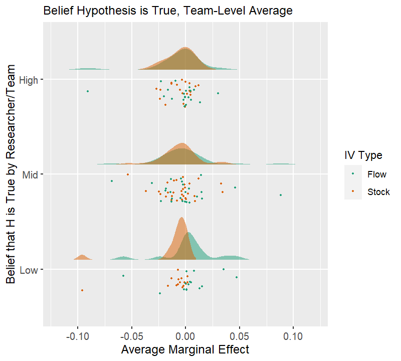

```


### Figure 5. Results Variability by Pro-Immigration Affect, Team-Level

```{r fig5, warning=F, message=F, echo=T}

fig5 <- ggplot(cri_team_combine, aes(x=pro_immigrant_cat_factor, y=AME_Zt, fill = iv_type2))+
  geom_flat_violin(aes(fill = iv_type2), position = position_nudge(x = .1, y = 0),adjust = 1.5, trim = F, alpha = .5, color = NA)+
  geom_point(aes(x = pro_immigrant_cat_offset, y = AME_Zt, color = iv_type2), position = position_jitter(width = .15), size = 1, shape = 20)+
  scale_x_discrete(limits = c("Low","Mid","High")) +
  labs(color = "IV Type") +
  ylab('Average Marginal Effect')+xlab('Average Pro-Immigration Affect by Researcher/Team')+
  ylim(-0.12,0.12)+
  coord_flip()+guides(fill = FALSE)+
  scale_colour_brewer(palette = "Dark2")+
  scale_fill_brewer(palette = "Dark2")+
  ggtitle('Figure 5. Pro-Immigration Affect, Team-Level Average') +
  theme(
    axis.text=element_text(size=10),
    axis.title=element_text(size=12),
    plot.title=element_text(size=12),
  )
png(filename = "results/Fig5_Rain_team.png", height = 720, width = 800, res = 144)
fig5
dev.off()

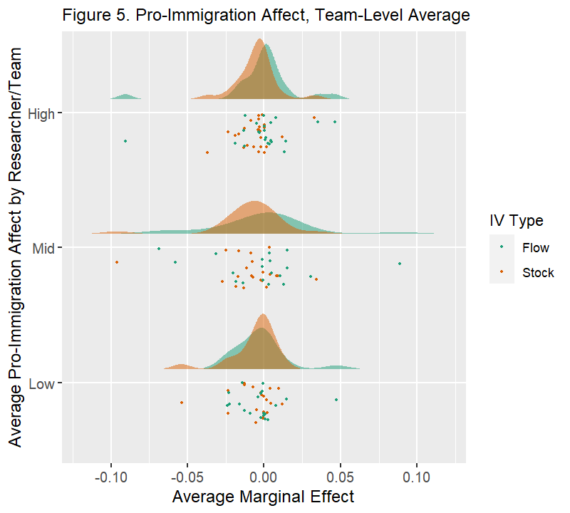


```

### Figure 6. Results Variability by Topical Knowledge, Team-Level

```{r fig6, warning=F, message=F, echo=T}

fig6 <- ggplot(cri_team_combine, aes(x=topic_cat_factor, y=AME_Zt, fill = iv_type2))+
  geom_flat_violin(aes(fill = iv_type2), position = position_nudge(x = .1, y = 0),adjust = 1.5, trim = F, alpha = .5, color = NA)+
  geom_point(aes(x = topic_cat_offset, y = AME_Zt, color = iv_type2), position = position_jitter(width = .15), size = 1, shape = 20)+
  scale_x_discrete(limits = c("Low","Mid","High")) +
  labs(color = "IV Type") +
  ylab('Average Marginal Effect')+xlab('Topical Knowledge by Researcher/Team')+
  ylim(-0.12,0.12)+
  coord_flip()+guides(fill = FALSE)+
  scale_colour_brewer(palette = "Dark2")+
  scale_fill_brewer(palette = "Dark2")+
  ggtitle('Figure 6. Topical Knowledge, Team-Level Average') +
  theme(
    axis.text=element_text(size=10),
    axis.title=element_text(size=12),
    plot.title=element_text(size=12),
  )
png(filename = "results/Fig6_Rain_team.png", height = 720, width = 800, res = 144)
fig6
dev.off()

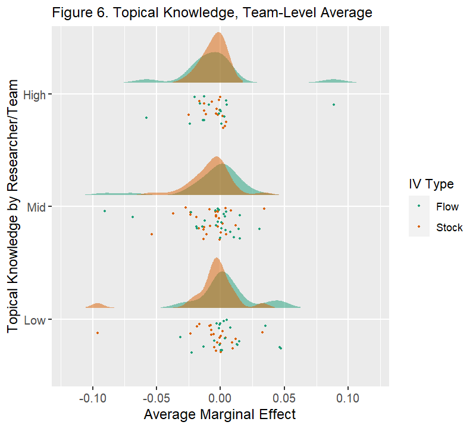


```


### Figure 7. Results Variability by Statistical Skills, Team-Level

```{r fig7, warning=F, message=F, echo=T}

fig7 <- ggplot(cri_team_combine, aes(x=stat_cat_factor, y=AME_Zt, fill = iv_type2))+
  geom_flat_violin(aes(fill = iv_type2), position = position_nudge(x = .1, y = 0),adjust = 1.5, trim = F, alpha = .5, color = NA)+
  geom_point(aes(x = stat_cat_offset, y = AME_Zt, color = iv_type2), position = position_jitter(width = .15), size = 1, shape = 20)+
  scale_x_discrete(limits = c("Low","Mid","High")) +
  labs(color = "IV Type") +
  ylab('Average Marginal Effect')+xlab('Statistical Skills by Researcher/Team')+
  ylim(-0.12,0.12)+
  coord_flip()+guides(fill = FALSE)+
  scale_colour_brewer(palette = "Dark2")+
  scale_fill_brewer(palette = "Dark2")+
  ggtitle('Figure 7. Statistics Skills, Team-Level Average') +
  theme(
    axis.text=element_text(size=10),
    axis.title=element_text(size=12),
    plot.title=element_text(size=12),
  )
png(filename = "results/Fig7_Rain_team.png", height = 720, width = 800, res = 144)
fig7
dev.off()

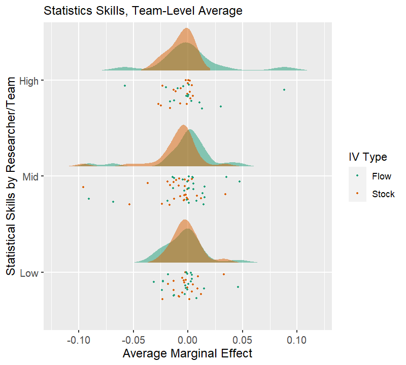


```


### Figure 8. Results Variability by Subjective Ranking, Team-Level

```{r fig8, warning=F, message=F, echo=T}

fig8 <- ggplot(cri_team_combine, aes(total_score_cat_factor, y=AME_Zt, fill = iv_type2))+
  geom_flat_violin(aes(fill = iv_type2), position = position_nudge(x = .1, y = 0),adjust = 1.5, trim = F, alpha = .5, color = NA)+
  geom_point(aes(x = total_score_cat_offset, y = AME_Zt, color = iv_type2), position = position_jitter(width = .15), size = 1, shape = 20)+
  scale_x_discrete(limits = c("Low","Mid","High")) +
  labs(color = "IV Type") +
  ylab('Average Marginal Effect')+xlab('Average Model Score by Researcher/Team')+
  ylim(-0.12,0.12)+
  coord_flip()+guides(fill = FALSE)+
  scale_colour_brewer(palette = "Dark2")+
  scale_fill_brewer(palette = "Dark2")+
  ggtitle('Figure 8. Subjective Ranking, Team-Level Average') +
  theme(
    axis.text=element_text(size=10),
    axis.title=element_text(size=12),
    plot.title=element_text(size=12),
  )
png(filename = "results/Fig8_Rain_team.png", height = 720, width = 800, res = 144)
fig8
dev.off()

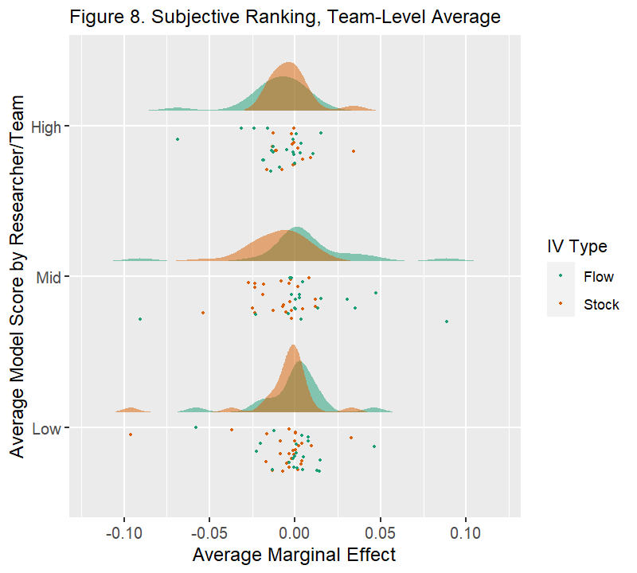


```

### Model Specification

Choose most important, but probably don't combine


## Model-level

Repeat all five figures from above but at the model-level, in the same order.

### Figure X. Results Variability by Model and DV Type

```{r figX, warning=F, message=F, echo=T}

figX <- ggplot(cri, aes(x=DVn, y=AME_Zt, fill = iv_type2))+
  geom_flat_violin(aes(fill = iv_type2), position = position_nudge(x = .1, y = 0),adjust = 1.5, trim = F, alpha = .5, color = NA)+
  geom_point(aes(x = DVnn, y = AME_Zt, color = iv_type2), position = position_jitter(width = .15), size = 1, shape = 20)+
  scale_x_discrete(limits = c("Scale","Health", "House","IncDiff","OldAge","Jobs","Unemp")) +
  labs(color = "IV Type") +
  ylab('Average Marginal Effect')+xlab('Dependent Variable Type')+
  ylim(-0.12,0.12)+
  coord_flip()+guides(fill = FALSE)+
  scale_colour_brewer(palette = "Dark2")+
  scale_fill_brewer(palette = "Dark2")+
  ggtitle('Figure X. DV Type, Model-Level') +
  theme(
    axis.text=element_text(size=10),
    axis.title=element_text(size=12),
    plot.title=element_text(size=12),
  )
png(filename = "results/FigX_Rain.png", height = 720, width = 800, res = 168)
figX
dev.off()

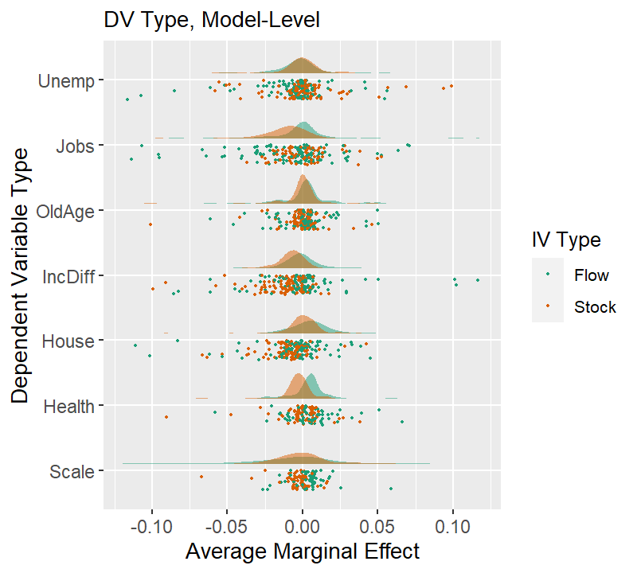

```


### Figure 9. Results Variability by Strength of Belief H is True, Model-Level

```{r fig4, warning=F, message=F, echo=T}

fig9 <- ggplot(cri, aes(x=belief_cat_factor, y=AME_Zt, fill = iv_type2))+
  geom_flat_violin(aes(fill = iv_type2), position = position_nudge(x = .1, y = 0),adjust = 1.5, trim = F, alpha = .5, color = NA)+
  geom_point(aes(x = belief_cat_offset, y = AME_Zt, color = iv_type2), position = position_jitter(width = .15), size = 1, shape = 20)+
  scale_x_discrete(limits = c("Low","Mid","High")) +
  labs(color = "IV Type") +
  ylab('Average Marginal Effect')+xlab('Belief that H is True by Researcher/Model')+
  ylim(-0.12,0.12)+
  coord_flip()+guides(fill = FALSE)+
  scale_colour_brewer(palette = "Dark2")+
  scale_fill_brewer(palette = "Dark2")+
  ggtitle('Figure 9. Belief that H is True, Model-Level') +
  theme(
    axis.text=element_text(size=10),
    axis.title=element_text(size=12),
    plot.title=element_text(size=12),
  )
png(filename = "results/Fig9_Rain_model.png", height = 720, width = 800, res = 144)
fig9
dev.off()

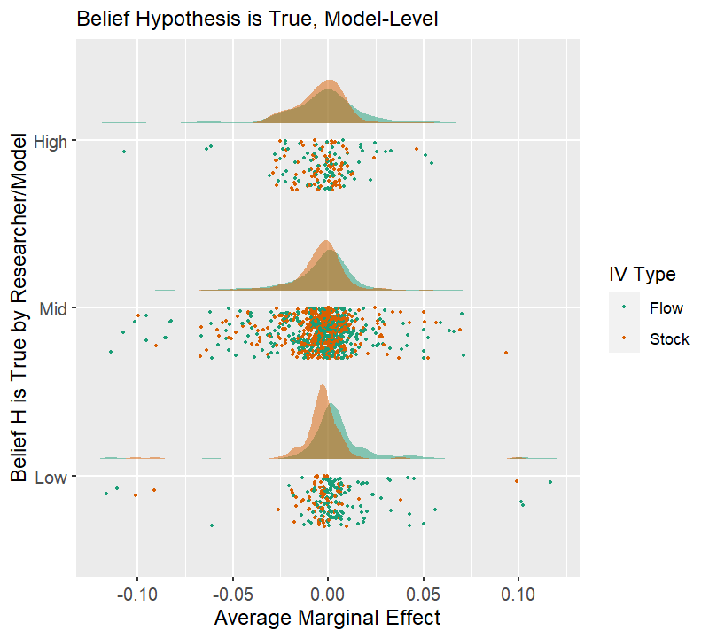

```


### Figure 5. Results Variability by Pro-Immigration Affect, Team-Level

```{r fig5, warning=F, message=F, echo=T}

fig10 <- ggplot(cri, aes(x=pro_immigrant_cat_factor, y=AME_Zt, fill = iv_type2))+
  geom_flat_violin(aes(fill = iv_type2), position = position_nudge(x = .1, y = 0),adjust = 1.5, trim = F, alpha = .5, color = NA)+
  geom_point(aes(x = pro_immigrant_cat_offset, y = AME_Zt, color = iv_type2), position = position_jitter(width = .15), size = 1, shape = 20)+
  scale_x_discrete(limits = c("Low","Mid","High")) +
  labs(color = "IV Type") +
  ylab('Average Marginal Effect')+xlab('Average Pro-Immigration Affect by Researcher/Team')+
  ylim(-0.12,0.12)+
  coord_flip()+guides(fill = FALSE)+
  scale_colour_brewer(palette = "Dark2")+
  scale_fill_brewer(palette = "Dark2")+
  ggtitle('Figure 10. Pro-Immigration Affect, Model-Level') +
  theme(
    axis.text=element_text(size=10),
    axis.title=element_text(size=12),
    plot.title=element_text(size=12),
  )
png(filename = "results/Fig10_Rain_model.png", height = 720, width = 800, res = 144)
fig10
dev.off()

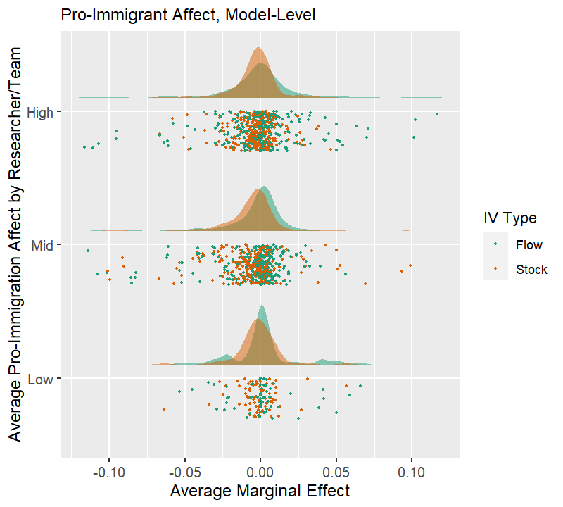


```

### Figure 6. Results Variability by Topical Knowledge, Team-Level

```{r fig6, warning=F, message=F, echo=T}

fig11 <- ggplot(cri, aes(x=topic_cat_factor, y=AME_Zt, fill = iv_type2))+
  geom_flat_violin(aes(fill = iv_type2), position = position_nudge(x = .1, y = 0),adjust = 1.5, trim = F, alpha = .5, color = NA)+
  geom_point(aes(x = topic_cat_offset, y = AME_Zt, color = iv_type2), position = position_jitter(width = .15), size = 1, shape = 20)+
  scale_x_discrete(limits = c("Low","Mid","High")) +
  labs(color = "IV Type") +
  ylab('Average Marginal Effect')+xlab('Topical Knowledge by Researcher/Team')+
  ylim(-0.12,0.12)+
  coord_flip()+guides(fill = FALSE)+
  scale_colour_brewer(palette = "Dark2")+
  scale_fill_brewer(palette = "Dark2")+
  ggtitle('Figure 11. Topical Knowledge, Model-Level') +
  theme(
    axis.text=element_text(size=10),
    axis.title=element_text(size=12),
    plot.title=element_text(size=12),
  )
png(filename = "results/Fig11_Rain_model.png", height = 720, width = 800, res = 144)
fig11
dev.off()

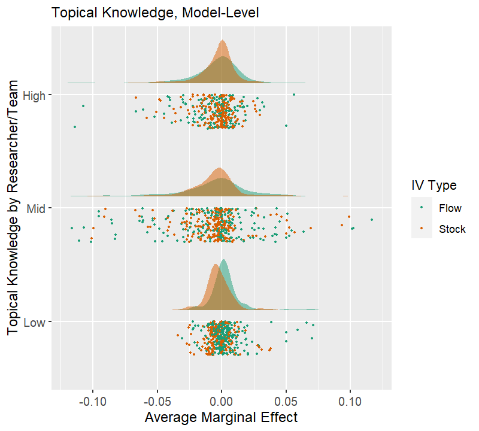


```


### Figure 7. Results Variability by Statistical Skills, Team-Level

```{r fig7, warning=F, message=F, echo=T}

fig12 <- ggplot(cri, aes(x=stat_cat_factor, y=AME_Zt, fill = iv_type2))+
  geom_flat_violin(aes(fill = iv_type2), position = position_nudge(x = .1, y = 0),adjust = 1.5, trim = F, alpha = .5, color = NA)+
  geom_point(aes(x = stat_cat_offset, y = AME_Zt, color = iv_type2), position = position_jitter(width = .15), size = 1, shape = 20)+
  scale_x_discrete(limits = c("Low","Mid","High")) +
  labs(color = "IV Type") +
  ylab('Average Marginal Effect')+xlab('Statistical Skills by Researcher/Team')+
  ylim(-0.12,0.12)+
  coord_flip()+guides(fill = FALSE)+
  scale_colour_brewer(palette = "Dark2")+
  scale_fill_brewer(palette = "Dark2")+
  ggtitle('Figure 12. Statistics Skills, Model-Level') +
  theme(
    axis.text=element_text(size=10),
    axis.title=element_text(size=12),
    plot.title=element_text(size=12),
  )
png(filename = "results/Fig12_Rain_model.png", height = 720, width = 800, res = 144)
fig12
dev.off()

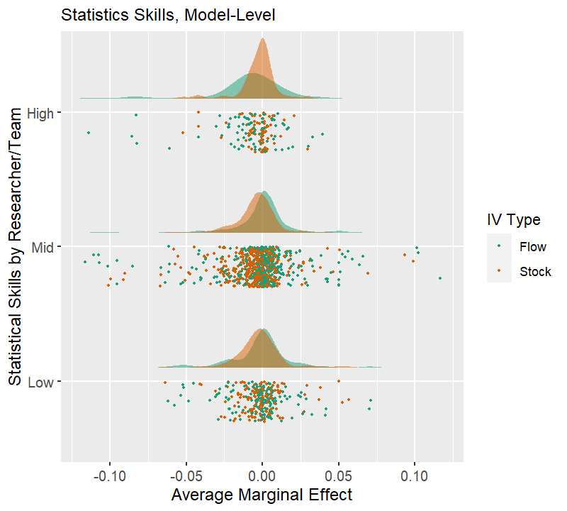


```


### Figure 8. Results Variability by Subjective Ranking, Team-Level

```{r fig8, warning=F, message=F, echo=T}

fig13 <- ggplot(cri, aes(total_score_cat_factor, y=AME_Zt, fill = iv_type2))+
  geom_flat_violin(aes(fill = iv_type2), position = position_nudge(x = .1, y = 0),adjust = 1.5, trim = F, alpha = .5, color = NA)+
  geom_point(aes(x = total_score_cat_offset, y = AME_Zt, color = iv_type2), position = position_jitter(width = .15), size = 1, shape = 20)+
  scale_x_discrete(limits = c("Low","Mid","High")) +
  labs(color = "IV Type") +
  ylab('Average Marginal Effect')+xlab('Average Model Score by Researcher/Team')+
  ylim(-0.12,0.12)+
  coord_flip()+guides(fill = FALSE)+
  scale_colour_brewer(palette = "Dark2")+
  scale_fill_brewer(palette = "Dark2")+
  ggtitle('Figure 13. Subjective Ranking, Model-Level') +
  theme(
    axis.text=element_text(size=10),
    axis.title=element_text(size=12),
    plot.title=element_text(size=12),
  )
png(filename = "results/Fig13_Rain_model.png", height = 720, width = 800, res = 144)
fig13
dev.off()

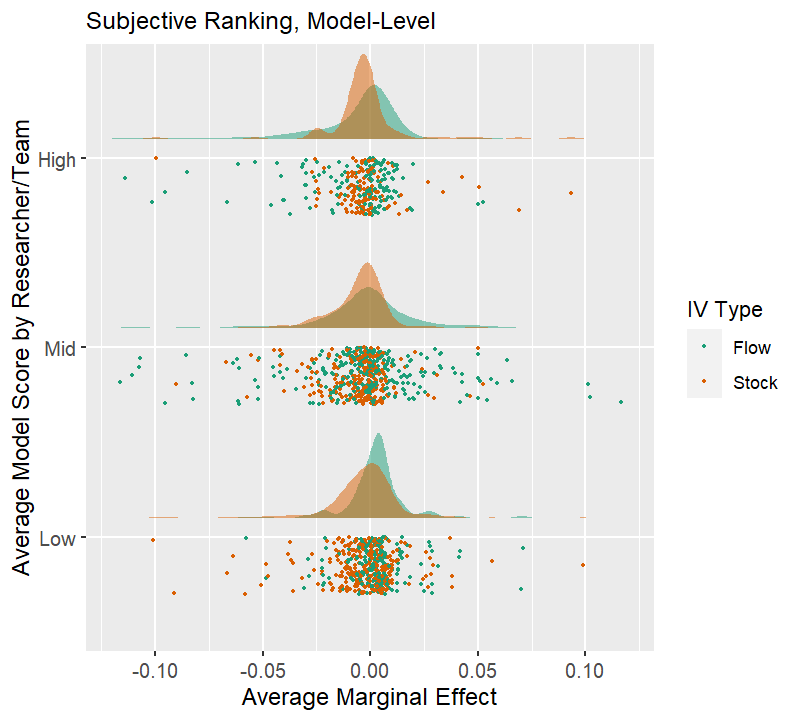

```

### Now put all 10 plots together
```{r fig14}
fig14 <- ggarrange(fig4, fig5, fig6, fig7, fig8, fig9, fig10, fig11, fig12, fig13,
                   ncol = 5, nrow = 2, common.legend = TRUE, legend = "right")

fig14 <- annotate_figure(p = fig14, bottom =  text_grob("Results Variability by Researcher/Team Characteristics, Team and Model Levels",
                                                    color = "red", face = "bold", size = 32))


png(filename = "results/Fig14.png", height = 3600, width = 4800, res = 144)
fig14
dev.off()

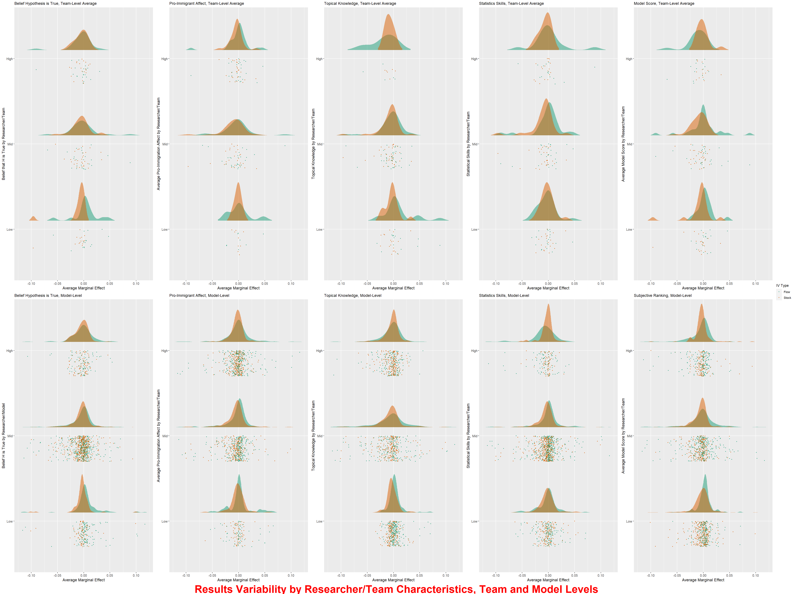
```

