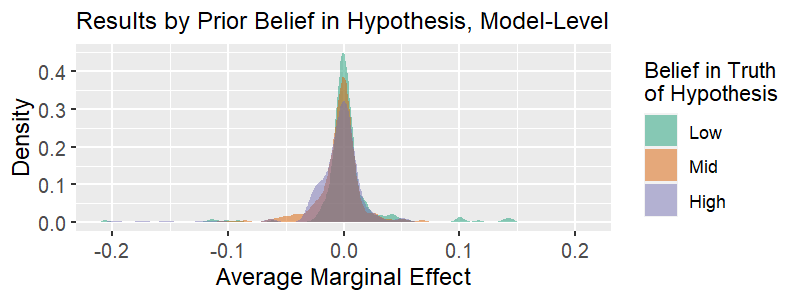
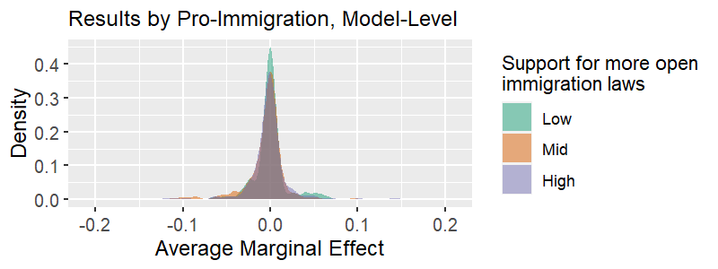
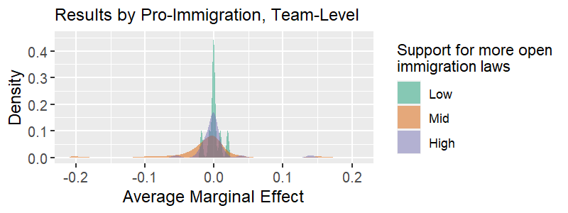
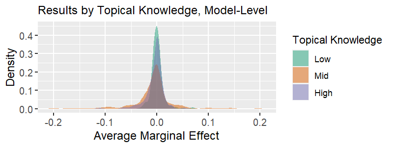
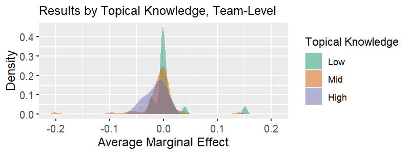
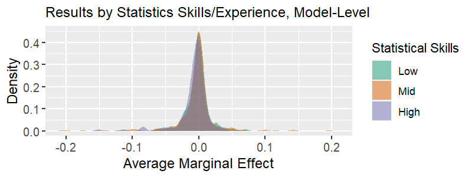
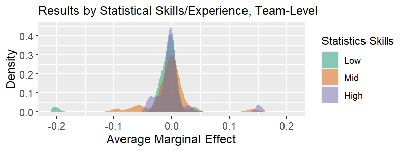
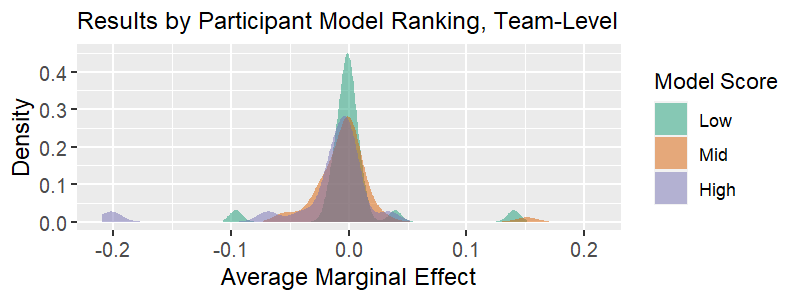

### Notes

The file 'R_rainclouds.R' is from https://github.com/RainCloudPlots/RainCloudPlots

Allen M, Poggiali D, Whitaker K et al. Raincloud plots: a multi-platform tool for robust data visualization [version 1; peer review: 2 approved]. Wellcome Open Res 2019, 4:63. DOI: https://doi.org/10.12688/wellcomeopenres.15191.1

#### Primary Variables of Interest

(empirical beliefs, normative beliefs (about immigration), topical knowledge, statistics knowledge, subjective model quality ranking, objective model specifications)

```{r setup, include=FALSE}
rm(list = ls())
library(pacman)

pacman::p_load("ggplot2","dplyr","readr","plotscale","lattice","tidyr","jtools","sjPlot","sjmisc","sjlabelled","knitr","cowplot", "ggpubr")

# set up raincloud function in ggplot, 
source("data/R_rainclouds.R")
 
#Column no missing function
completeFun <- function(data, desiredCols) {
  completeVec <- complete.cases(data[, desiredCols])
  return(data[completeVec, ])
}
```

### Data Prep

These datasets were worked up from the file 01_CRI_Data_Prep.Rmd. 

cri = numerical values
cri_str = string values
cri_team = team-level data (by conclusion)
cri_team_combine = team-level data with indep observations for stock and flow models

cri_ml_in = data created in the 04_CRI_Main_Analyses file, for merging in unexp variance


```{r load, warning=F,message=F}
cri <- read.csv(file = "data/cri.csv", header = T)
cri_str <- read.csv(file = "data/cri_str.csv", header = T)
cri_team <- read.csv(file = "data/cri_team.csv", header = T)
cri_team_combine <- read.csv(file = "data/cri_team_combine.csv", header = T)
cri_ml_in <- readRDS(file = "data/cri_ml_in.Rda")

# merge unexp var


cri_ml_v <- as.data.frame(cri_ml_in[["m13_e"]])
cri_ml_in <- select(cri_ml_in, id)
cri_ml_in <- cbind(cri_ml_in, cri_ml_v)
colnames(cri_ml_in) <- c("id","m13_e")
cri <- left_join(cri, cri_ml_in, by = "id")

rm(cri_ml_in, cri_ml_v)
```


### Raincloud Plots

```{r rain_prep, warning=F, message=F}


# drop duplicate teams

# get clean grouping variable (all scale types in one factor)
cri <- cri %>%
  mutate(DVs = ifelse(Scale == 1,"Scale",DV),
         AME_Zt = ifelse(AME_Z > 1, 1, AME_Z),
         AME_Zt = ifelse(AME_Zt < -1, -1, AME_Zt),
         iv_type2 = ifelse(main_IV_type=="Change in Flow","Flow",main_IV_type),
         iv_type2 = as.factor(iv_type2),
         DVn = as.factor(DVs),
         stat_cat_factor = factor(STATISTICS_SKILL, levels = c("Low","Mid","High")),
         belief_cat_factor = factor(BELIEF_HYPOTHESIS, levels = c("Low","Mid","High")),
         topic_cat_factor = factor(TOPIC_KNOWLEDGE, levels = c("Low","Mid","High")),
         total_score_cat_factor = factor(MODEL_SCORE, levels = c("Low","Mid","High")),
         pro_immigrant_cat_factor = factor(PRO_IMMIGRANT, levels = c("Low","Mid","High"))
         )

cri <- subset(cri, !is.na(belief_cat_factor))

# team level
cri_team_combine <- cri_team_combine %>%
  mutate(AME_Zt = ifelse(AME_Z > 1, 1, AME_Z),
         AME_Zt = ifelse(AME_Zt < -1, -1, AME_Zt),
         iv_type2 = ifelse(Stock == 1, "Stock", "Flow"),
         iv_type2 = as.factor(iv_type2),
         stat_cat_factor = factor(STATISTICS_SKILL, levels = c("Low","Mid","High")),
         belief_cat_factor = factor(BELIEF_HYPOTHESIS, levels = c("Low","Mid","High")),
         topic_cat_factor = factor(TOPIC_KNOWLEDGE, levels = c("Low","Mid","High")),
         total_score_cat_factor = factor(MODEL_SCORE, levels = c("Low","Mid","High")),
         pro_immigrant_cat_factor = factor(PRO_IMMIGRANT, levels = c("Low","Mid","High"))
  )
# without stock/flow split and recombine

   cri_team <- cri_team %>%
  mutate(AME_Zt = ifelse(AME_Z > 1, 1, AME_Z),
         AME_Zt = ifelse(AME_Zt < -1, -1, AME_Zt),
         iv_type2 = ifelse(Stock == 1, "Stock", "Flow"),
         iv_type2 = as.factor(iv_type2),
         stat_cat_factor = factor(STATISTICS_SKILL, levels = c("Low","Mid","High")),
         belief_cat_factor = factor(BELIEF_HYPOTHESIS, levels = c("Low","Mid","High")),
         topic_cat_factor = factor(TOPIC_KNOWLEDGE, levels = c("Low","Mid","High")),
         total_score_cat_factor = factor(MODEL_SCORE, levels = c("Low","Mid","High")),
         pro_immigrant_cat_factor = factor(PRO_IMMIGRANT, levels = c("Low","Mid","High"))
  )   

# make offset values so that scatterplots appear below the distribution plots

# model-level
cri$DVnn <- (as.numeric(as.factor(cri$DVn))-.15)
cri$stat_cat_offset <- as.numeric(as.factor(cri$stat_cat_factor))-.15

cri$belief_cat_offset <- as.numeric(as.factor(cri$belief_cat_factor))-.15

cri$topic_cat_offset <- as.numeric(as.factor(cri$topic_cat_factor))-.15

cri$total_score_cat_offset <- as.numeric(as.factor(cri$total_score_cat_factor))-.15

cri$pro_immigrant_cat_offset <- as.numeric(as.factor(cri$pro_immigrant_cat_factor))-.15

# team-level
  
cri_team_combine$stat_cat_offset <- as.numeric(as.factor(cri_team_combine$stat_cat_factor))-.15

cri_team_combine$belief_cat_offset <- as.numeric(as.factor(cri_team_combine$belief_cat_factor))-.15

cri_team_combine$topic_cat_offset <- as.numeric(as.factor(cri_team_combine$topic_cat_factor))-.15

cri_team_combine$total_score_cat_offset <- as.numeric(as.factor(cri_team_combine$total_score_cat_factor))-.15

cri_team_combine$pro_immigrant_cat_offset <- as.numeric(as.factor(cri_team_combine$pro_immigrant_cat_factor))-.15

# create a version of m13_e with outliers trimmed
cri$m13_e_trim <- ifelse(cri$m13_e > 0.3, NA, ifelse(cri$m13_e < -0.3, NA, cri$m13_e))

```


### Main figure 5 qualities by 3 levels

```{r geom_F_V}
# first we need to stack the data
cri_stack_a <- select(cri, AME_Zt, stat_cat_factor, u_teamid)
cri_stack_b <- select(cri, AME_Zt, belief_cat_factor, u_teamid)
cri_stack_c <- select(cri, AME_Zt, topic_cat_factor, u_teamid)
cri_stack_d <- select(cri, AME_Zt, total_score_cat_factor, u_teamid)
cri_stack_e <- select(cri, AME_Zt, pro_immigrant_cat_factor, u_teamid)

cnm <- c("AME","Level","u_teamid")

colnames(cri_stack_a) <- cnm
colnames(cri_stack_b) <- cnm
colnames(cri_stack_c) <- cnm
colnames(cri_stack_d) <- cnm
colnames(cri_stack_e) <- cnm

cri_stack_a$Aspect <- "Stats"
cri_stack_b$Aspect <- "Belief"
cri_stack_c$Aspect <- "Topic"
cri_stack_d$Aspect <- "Score"
cri_stack_e$Aspect <- "Immigrant"

# combine in desired order

cri_stack <- rbind(cri_stack_b, cri_stack_e, cri_stack_c, cri_stack_a, cri_stack_d)

cri_stack <- completeFun(cri_stack, "AME")
cri_stack$Aspect <- as.factor(cri_stack$Aspect)

# get descriptive statistics

counts <- cri_stack %>%
  count(Aspect, Level, u_teamid)

counts <- counts %>%
  group_by(Aspect,Level) %>%
  mutate(teamn = length(u_teamid))

counts2 <- cri_stack %>%
  count(Aspect, Level)

counts <- select(counts, Aspect, Level, teamn)
counts <- aggregate(counts, by = list(counts$Aspect, counts$Level), FUN = "mean")
colnames(counts) <- c("Aspect","Level","x","v","teamn")
counts <- select(counts, Aspect, Level, teamn)

# descriptive statistics for the violin plots
counts2 <- left_join(counts2, counts, by = c("Aspect","Level"))

#means
counts2[1,5] <- mean(cri_stack$AME[cri_stack$Aspect == "Belief" & cri_stack$Level == "Low"])
counts2[2,5] <- mean(cri_stack$AME[cri_stack$Aspect == "Belief" & cri_stack$Level == "Mid"])
counts2[3,5] <- mean(cri_stack$AME[cri_stack$Aspect == "Belief" & cri_stack$Level == "High"])
counts2[4,5] <- mean(cri_stack$AME[cri_stack$Aspect == "Immigrant" & cri_stack$Level == "Low"])
counts2[5,5] <- mean(cri_stack$AME[cri_stack$Aspect == "Immigrant" & cri_stack$Level == "Mid"])
counts2[6,5] <- mean(cri_stack$AME[cri_stack$Aspect == "Immigrant" & cri_stack$Level == "High"])
counts2[7,5] <- mean(cri_stack$AME[cri_stack$Aspect == "Score" & cri_stack$Level == "Low"])
counts2[8,5] <- mean(cri_stack$AME[cri_stack$Aspect == "Score" & cri_stack$Level == "Mid"])
counts2[9,5] <- mean(cri_stack$AME[cri_stack$Aspect == "Score" & cri_stack$Level == "High"])
counts2[10,5] <- mean(cri_stack$AME[cri_stack$Aspect == "Stats" & cri_stack$Level == "Low"])
counts2[11,5] <- mean(cri_stack$AME[cri_stack$Aspect == "Stats" & cri_stack$Level == "Mid"])
counts2[12,5] <- mean(cri_stack$AME[cri_stack$Aspect == "Stats" & cri_stack$Level == "High"])
counts2[13,5] <- mean(cri_stack$AME[cri_stack$Aspect == "Topic" & cri_stack$Level == "Low"])
counts2[14,5] <- mean(cri_stack$AME[cri_stack$Aspect == "Topic" & cri_stack$Level == "Mid"])
counts2[15,5] <- mean(cri_stack$AME[cri_stack$Aspect == "Topic" & cri_stack$Level == "High"])

#sd
counts2[1,6] <- sd(cri_stack$AME[cri_stack$Aspect == "Belief" & cri_stack$Level == "Low"])
counts2[2,6] <- sd(cri_stack$AME[cri_stack$Aspect == "Belief" & cri_stack$Level == "Mid"])
counts2[3,6] <- sd(cri_stack$AME[cri_stack$Aspect == "Belief" & cri_stack$Level == "High"])
counts2[4,6] <- sd(cri_stack$AME[cri_stack$Aspect == "Immigrant" & cri_stack$Level == "Low"])
counts2[5,6] <- sd(cri_stack$AME[cri_stack$Aspect == "Immigrant" & cri_stack$Level == "Mid"])
counts2[6,6] <- sd(cri_stack$AME[cri_stack$Aspect == "Immigrant" & cri_stack$Level == "High"])
counts2[7,6] <- sd(cri_stack$AME[cri_stack$Aspect == "Score" & cri_stack$Level == "Low"])
counts2[8,6] <- sd(cri_stack$AME[cri_stack$Aspect == "Score" & cri_stack$Level == "Mid"])
counts2[9,6] <- sd(cri_stack$AME[cri_stack$Aspect == "Score" & cri_stack$Level == "High"])
counts2[10,6] <- sd(cri_stack$AME[cri_stack$Aspect == "Stats" & cri_stack$Level == "Low"])
counts2[11,6] <- sd(cri_stack$AME[cri_stack$Aspect == "Stats" & cri_stack$Level == "Mid"])
counts2[12,6] <- sd(cri_stack$AME[cri_stack$Aspect == "Stats" & cri_stack$Level == "High"])
counts2[13,6] <- sd(cri_stack$AME[cri_stack$Aspect == "Topic" & cri_stack$Level == "Low"])
counts2[14,6] <- sd(cri_stack$AME[cri_stack$Aspect == "Topic" & cri_stack$Level == "Mid"])
counts2[15,6] <- sd(cri_stack$AME[cri_stack$Aspect == "Topic" & cri_stack$Level == "High"])

colnames(counts2) <- c("Aspect","Level","N","TeamN","mean","sd")
counts2$mean <- round(counts2$mean, 3)
counts2$sd <- round(counts2$sd, 3)

b1 <- paste(counts2[1,3],counts2[1,4],counts2[1,5],counts2[1,6], sep = ", ")
b2 <- paste(counts2[2,3],counts2[2,4],counts2[2,5],counts2[2,6], sep = ", ")
b3 <- paste(counts2[3,3],counts2[3,4],counts2[3,5],counts2[3,6], sep = ", ")
i1 <- paste(counts2[4,3],counts2[4,4],counts2[4,5],counts2[4,6], sep = ", ")
i2 <- paste(counts2[5,3],counts2[5,4],counts2[5,5],counts2[5,6], sep = ", ")
i3 <- paste(counts2[6,3],counts2[6,4],counts2[6,5],counts2[6,6], sep = ", ")
sc1 <- paste(counts2[7,3],counts2[7,4],counts2[7,5],counts2[7,6], sep = ", ")
sc2 <- paste(counts2[8,3],counts2[8,4],counts2[8,5],counts2[8,6], sep = ", ")
sc3 <- paste(counts2[9,3],counts2[9,4],counts2[9,5],counts2[9,6], sep = ", ")
st1 <- paste(counts2[10,3],counts2[10,4],counts2[10,5],counts2[10,6], sep = ", ")
st2 <- paste(counts2[11,3],counts2[11,4],counts2[11,5],counts2[11,6], sep = ", ")
st3 <- paste(counts2[12,3],counts2[12,4],counts2[12,5],counts2[12,6], sep = ", ")
t1 <- paste(counts2[13,3],counts2[13,4],counts2[13,5],counts2[13,6], sep = ", ")
t2 <- paste(counts2[14,3],counts2[14,4],counts2[14,5],counts2[14,6], sep = ", ")
t3 <- paste(counts2[15,3],counts2[15,4],counts2[15,5],counts2[15,6], sep = ", ")

# reset limits to 0.5

cri_stack$AMEc <- ifelse(cri_stack$AME > 0.5, NA, ifelse(cri_stack$AME < -0.5, NA, cri_stack$AME))
```


```{r geom_F_V2}
ggplot(cri_stack, aes(x=Aspect, y=AMEc, fill = Level)) +
  geom_flat_violin() +
  coord_flip(ylim = c(-0.5,0.5), clip = 'off') +
  scale_fill_brewer(palette = "Paired") +
  annotate("text", x = 0.9, y = 0.55, label = paste0("(",b1,")"), size = 2, hjust = 0) +
  annotate("text", x = 1.05, y = 0.55, label = paste0("(",b2,")"), size = 2, hjust = 0) +
  annotate("text", x = 1.2, y = 0.55, label = paste0("(",b3,")"), size = 2, hjust = 0) +
  theme_classic() +
  guides(fill = guide_legend(reverse=T)) +
  theme(axis.ticks.y = element_blank(),
        legend.box.margin=margin(1,1,1,60))
  
#
+
  coord_cartesian(ylim = c(-0.5,0.5))
```


## Pooled Models - Category Overlays

### Table 2 Fig

```{r tbl2fig}
t2f_belief <- ggplot(cri, aes(x=0, y=m13_e_trim, fill = belief_cat_factor))+
  geom_flat_violin(aes(fill = belief_cat_factor), position = position_nudge(x = 0, y = 0),adjust = 1.5, trim = F, alpha = .5, color = NA)+
  labs(fill = "") +
  xlab('Density')+
  ylim(-0.05,0.05)+
  coord_flip()+
  #guides(fill = FALSE)+
  scale_colour_brewer(palette = "Dark2")+
  scale_fill_brewer(palette = "Dark2")+
  ggtitle('Prior Belief in Hypothesis') +
  theme(
    axis.text=element_text(size=10),
    axis.title=element_text(size=12),
    plot.title=element_text(size=12),
  )

t2f_belief

t2f_proimm <- ggplot(cri, aes(x=0, y=m13_e, fill = pro_immigrant_cat_factor))+
  geom_flat_violin(aes(fill = pro_immigrant_cat_factor), position = position_nudge(x = 0, y = 0),adjust = 1.5, trim = F, alpha = .5, color = NA)+
  labs(fill = "") +
  xlab('Density')+
  ylim(-0.05,0.05)+
  coord_flip()+
  #guides(fill = FALSE)+
  scale_colour_brewer(palette = "Dark2")+
  scale_fill_brewer(palette = "Dark2")+
  ggtitle('Pro Immigration') +
  theme(
    axis.text=element_text(size=10),
    axis.title=element_text(size=12),
    plot.title=element_text(size=12),
  )

t2f_proimm

t2f_topic <- ggplot(cri, aes(x=0, y=m13_e, fill = topic_cat_factor))+
  geom_flat_violin(aes(fill = topic_cat_factor), position = position_nudge(x = 0, y = 0),adjust = 1.5, trim = F, alpha = .5, color = NA)+
  labs(fill = "") +
  xlab('Density')+
  ylim(-0.05,0.05)+
  coord_flip()+
  #guides(fill = FALSE)+
  scale_colour_brewer(palette = "Dark2")+
  scale_fill_brewer(palette = "Dark2")+
  ggtitle('Topical Knowledge') +
  theme(
    axis.text=element_text(size=10),
    axis.title=element_text(size=12),
    plot.title=element_text(size=12),
  )

t2f_topic

t2f_stat <- ggplot(cri, aes(x=0, y=m13_e, fill = stat_cat_factor))+
  geom_flat_violin(aes(fill = stat_cat_factor), position = position_nudge(x = 0, y = 0),adjust = 1.5, trim = F, alpha = .5, color = NA)+
  labs(fill = "") +
  xlab('Density')+
  ylim(-0.05,0.05)+
  coord_flip()+
  #guides(fill = FALSE)+
  scale_colour_brewer(palette = "Dark2")+
  scale_fill_brewer(palette = "Dark2")+
  ggtitle('Statistical Skills') +
  theme(
    axis.text=element_text(size=10),
    axis.title=element_text(size=12),
    plot.title=element_text(size=12),
  )

t2f_stat

t2f_score <- ggplot(cri, aes(x=0, y=m13_e, fill = total_score_cat_factor))+
  geom_flat_violin(aes(fill = total_score_cat_factor), position = position_nudge(x = 0, y = 0),adjust = 1.5, trim = F, alpha = .5, color = NA)+
  labs(fill = "") +
  xlab('Density')+
  ylim(-0.05,0.05)+
  coord_flip()+
  #guides(fill = FALSE)+
  scale_colour_brewer(palette = "Dark2")+
  scale_fill_brewer(palette = "Dark2")+
  ggtitle('Statistical Skills') +
  theme(
    axis.text=element_text(size=10),
    axis.title=element_text(size=12),
    plot.title=element_text(size=12),
  )

t2f_score


```


### Belief in H

#### Figure 4a. Results Variability by Researcher Qualities, Model-Level

```{r fig4a, warning=F, message=F, echo=T}

fig4a <- ggplot(cri, aes(x=0, y=AME_Zt, fill = belief_cat_factor))+
  geom_flat_violin(aes(fill = belief_cat_factor), position = position_nudge(x = 0, y = 0),adjust = 1.5, trim = F, alpha = .5, color = NA)+
  labs(fill = "Belief in Truth\nof Hypothesis") +
  ylab('Average Marginal Effect')+xlab('Density')+
  ylim(-0.21,0.21)+
  coord_flip()+
  #guides(fill = FALSE)+
  scale_colour_brewer(palette = "Dark2")+
  scale_fill_brewer(palette = "Dark2")+
  ggtitle('Results by Prior Belief in Hypothesis, Model-Level') +
  theme(
    axis.text=element_text(size=10),
    axis.title=element_text(size=12),
    plot.title=element_text(size=12),
  )
png(filename = "results/Fig4a_Rain_team.png", height = 300, width = 800, res = 144)
fig4a
dev.off()



```

#### Figure 4b. Results Variability by Researcher Qualities, Team-Level

```{r fig4b, warning=F, message=F, echo=T}

fig4b <- ggplot(cri_team, aes(x=0, y=AME_Zt, fill = belief_cat_factor))+
  geom_flat_violin(aes(fill = belief_cat_factor), position = position_nudge(x = 0, y = 0),adjust = 1.5, trim = F, alpha = .5, color = NA)+
  labs(fill = "Belief in Truth\nof Hypothesis") +
  ylab('Average Marginal Effect')+xlab('Density')+
  ylim(-0.21,0.21)+
  coord_flip()+
  #guides(fill = FALSE)+
  scale_colour_brewer(palette = "Dark2")+
  scale_fill_brewer(palette = "Dark2")+
  ggtitle('Results by Prior Belief in Hypothesis, Team-Level') +
  theme(
    axis.text=element_text(size=10),
    axis.title=element_text(size=12),
    plot.title=element_text(size=12),
  )
png(filename = "results/Fig4b_Rain_team.png", height = 300, width = 800, res = 144)
fig4b
dev.off()

knitr::include_graphics( "results/Fig4b_Rain_team.png")

```

### Pro-Immigrant

#### Figure 5a. Results Variability by Researcher Qualities, Model-Level

```{r fig5a, warning=F, message=F, echo=T}

fig5a <- ggplot(cri, aes(x=0, y=AME_Zt, fill = pro_immigrant_cat_factor))+
  geom_flat_violin(aes(fill = pro_immigrant_cat_factor), position = position_nudge(x = 0, y = 0),adjust = 1.5, trim = F, alpha = .5, color = NA)+
  labs(fill = "Support for more open\nimmigration laws") +
  ylab('Average Marginal Effect')+xlab('Density')+
  ylim(-0.21,0.21)+
  coord_flip()+
  #guides(fill = FALSE)+
  scale_colour_brewer(palette = "Dark2")+
  scale_fill_brewer(palette = "Dark2")+
  ggtitle('Results by Pro-Immigration, Model-Level') +
  theme(
    axis.text=element_text(size=10),
    axis.title=element_text(size=12),
    plot.title=element_text(size=12),
  )
png(filename = "results/Fig5a_Rain_team.png", height = 300, width = 800, res = 144)
fig5a
dev.off()



```

#### Figure 5b. Results Variability by Researcher Qualities, Team-Level

```{r fig5b, warning=F, message=F, echo=T}

fig5b <- ggplot(cri_team, aes(x=0, y=AME_Zt, fill = pro_immigrant_cat_factor))+
  geom_flat_violin(aes(fill = pro_immigrant_cat_factor), position = position_nudge(x = 0, y = 0),adjust = 1.5, trim = F, alpha = .5, color = NA)+
  labs(fill = "Support for more open\nimmigration laws") +
  ylab('Average Marginal Effect')+xlab('Density')+
  ylim(-0.21,0.21)+
  coord_flip()+
  #guides(fill = FALSE)+
  scale_colour_brewer(palette = "Dark2")+
  scale_fill_brewer(palette = "Dark2")+
  ggtitle('Results by Pro-Immigration, Team-Level') +
  theme(
    axis.text=element_text(size=10),
    axis.title=element_text(size=12),
    plot.title=element_text(size=12),
  )
png(filename = "results/Fig5b_Rain_team.png", height = 300, width = 800, res = 144)
fig5b
dev.off()



```

### Topical Knowledge

#### Figure 6a. Results Variability by Researcher Qualities, Model-Level

```{r fig6a, warning=F, message=F, echo=T}

fig6a <- ggplot(cri, aes(x=0, y=AME_Zt, fill = topic_cat_factor))+
  geom_flat_violin(aes(fill = topic_cat_factor), position = position_nudge(x = 0, y = 0),adjust = 1.5, trim = F, alpha = .5, color = NA)+
  labs(fill = "Topical Knowledge") +
  ylab('Average Marginal Effect')+xlab('Density')+
  ylim(-0.21,0.21)+
  coord_flip()+
  #guides(fill = FALSE)+
  scale_colour_brewer(palette = "Dark2")+
  scale_fill_brewer(palette = "Dark2")+
  ggtitle('Results by Topical Knowledge, Model-Level') +
  theme(
    axis.text=element_text(size=10),
    axis.title=element_text(size=12),
    plot.title=element_text(size=12),
  )
png(filename = "results/Fig6a_Rain_team.png", height = 300, width = 800, res = 144)
fig6a
dev.off()



```

#### Figure 6b. Results Variability by Researcher Qualities, Team-Level

```{r fig6b, warning=F, message=F, echo=T}

fig6b <- ggplot(cri_team, aes(x=0, y=AME_Zt, fill = topic_cat_factor))+
  geom_flat_violin(aes(fill = topic_cat_factor), position = position_nudge(x = 0, y = 0),adjust = 1.5, trim = F, alpha = .5, color = NA)+
  labs(fill = "Topical Knowledge") +
  ylab('Average Marginal Effect')+xlab('Density')+
  ylim(-0.21,0.21)+
  coord_flip()+
  #guides(fill = FALSE)+
  scale_colour_brewer(palette = "Dark2")+
  scale_fill_brewer(palette = "Dark2")+
  ggtitle('Results by Topical Knowledge, Team-Level') +
  theme(
    axis.text=element_text(size=10),
    axis.title=element_text(size=12),
    plot.title=element_text(size=12),
  )
png(filename = "results/Fig6b_Rain_team.png", height = 300, width = 800, res = 144)
fig6b
dev.off()



```


### Statistics Skills

#### Figure 7a. Results Variability by Researcher Qualities, Model-Level

```{r fig7a, warning=F, message=F, echo=T}

fig7a <- ggplot(cri, aes(x=0, y=AME_Zt, fill = stat_cat_factor))+
  geom_flat_violin(aes(fill = stat_cat_factor), position = position_nudge(x = 0, y = 0),adjust = 1.5, trim = F, alpha = .5, color = NA)+
  labs(fill = "Statistical Skills") +
  ylab('Average Marginal Effect')+xlab('Density')+
  ylim(-0.21,0.21)+
  coord_flip()+
  #guides(fill = FALSE)+
  scale_colour_brewer(palette = "Dark2")+
  scale_fill_brewer(palette = "Dark2")+
  ggtitle('Results by Statistics Skills/Experience, Model-Level') +
  theme(
    axis.text=element_text(size=10),
    axis.title=element_text(size=12),
    plot.title=element_text(size=12),
  )
png(filename = "results/Fig7a_Rain_team.png", height = 300, width = 800, res = 144)
fig7a
dev.off()



```

#### Figure 7b. Results Variability by Researcher Qualities, Team-Level

```{r fig7b, warning=F, message=F, echo=T}

fig7b <- ggplot(cri_team, aes(x=0, y=AME_Zt, fill = stat_cat_factor))+
  geom_flat_violin(aes(fill = stat_cat_factor), position = position_nudge(x = 0, y = 0),adjust = 1.5, trim = F, alpha = .5, color = NA)+
  labs(fill = "Statistics Skills") +
  ylab('Average Marginal Effect')+xlab('Density')+
  ylim(-0.21,0.21)+
  coord_flip()+
  #guides(fill = FALSE)+
  scale_colour_brewer(palette = "Dark2")+
  scale_fill_brewer(palette = "Dark2")+
  ggtitle('Results by Statistical Skills/Experience, Team-Level') +
  theme(
    axis.text=element_text(size=10),
    axis.title=element_text(size=12),
    plot.title=element_text(size=12),
  )
png(filename = "results/Fig7b_Rain_team.png", height = 300, width = 800, res = 144)
fig7b
dev.off()



```


### Model Ranking

#### Figure 8a. Results Variability by Ranking, Model-Level

```{r fig8a, warning=F, message=F, echo=T}

fig8a <- ggplot(cri, aes(x=0, y=AME_Zt, fill = total_score_cat_factor))+
  geom_flat_violin(aes(fill = total_score_cat_factor), position = position_nudge(x = 0, y = 0),adjust = 1.5, trim = F, alpha = .5, color = NA)+
  labs(fill = "Model Score") +
  ylab('Average Marginal Effect')+xlab('Density')+
  ylim(-0.21,0.21)+
  coord_flip()+
  #guides(fill = FALSE)+
  scale_colour_brewer(palette = "Dark2")+
  scale_fill_brewer(palette = "Dark2")+
  ggtitle('Results by Participant Model Ranking, Model-Level') +
  theme(
    axis.text=element_text(size=10),
    axis.title=element_text(size=12),
    plot.title=element_text(size=12),
  )
png(filename = "results/Fig8a_Rain_team.png", height = 300, width = 800, res = 144)
fig8a
dev.off()

knitr::include_graphics( "results/Fig8a_Rain_team.png")

```

#### Figure 8b. Results Variability by Researcher Qualities, Team-Level

```{r fig8b, warning=F, message=F, echo=T}

fig8b <- ggplot(cri_team, aes(x=0, y=AME_Zt, fill = total_score_cat_factor))+
  geom_flat_violin(aes(fill = total_score_cat_factor), position = position_nudge(x = 0, y = 0),adjust = 1.5, trim = F, alpha = .5, color = NA)+
  labs(fill = "Model Score") +
  ylab('Average Marginal Effect')+xlab('Density')+
  ylim(-0.21,0.21)+
  coord_flip()+
  #guides(fill = FALSE)+
  scale_colour_brewer(palette = "Dark2")+
  scale_fill_brewer(palette = "Dark2")+
  ggtitle('Results by Participant Model Ranking, Team-Level') +
  theme(
    axis.text=element_text(size=10),
    axis.title=element_text(size=12),
    plot.title=element_text(size=12),
  )
png(filename = "results/Fig8b_Rain_team.png", height = 300, width = 800, res = 144)
fig8b
dev.off()



```
TO DO:

```{r}
# levene test
library(car)

leveneTest(AME_Zt ~ topic_cat_factor, data= cri)
a <- sd(cri$AME_Zt, na.rm= T)
b <- sd(cri$AME_Zt[cri$topic_cat_factor == "Low"], na.rm = T)
c <- sd(cri$AME_Zt[cri$topic_cat_factor == "Mid"], na.rm = T)
d <- sd(cri$AME_Zt[cri$topic_cat_factor == "High"], na.rm = T)

sd_topic <- matrix(nrow = 4, ncol = 2)
colnames(sd_topic) <- c("Group", "SD")
sd_topic[,1] <- c("Pooled Results","Low Topical Knowledge", "Mid Topical Knowledge", "High Topical Knowledge")
sd_topic[1,2] <- round(a,2)
sd_topic[2,2] <- round(b,2)
sd_topic[3,2] <- round(c,2)
sd_topic[4,2] <- round(d,2)

kable(sd_topic)

t.test(AME_Zt ~ topic_cat_factor, data= cri[cri$topic_cat_factor != "High",])
```

ADD LEVENE or other measures of comparison of variance

SPLIT by Stock and FLOW models


## Models Splitting by Stock/Flow

### Team-Level Plots Stock/Flow

#### Figure 4. Results Variability by Strength of Belief H is True, Team-Level

```{r fig4, warning=F, message=F, echo=T}

fig4 <- ggplot(cri_team_combine, aes(x=belief_cat_factor, y=AME_Zt, fill = iv_type2))+
  geom_flat_violin(aes(fill = iv_type2), position = position_nudge(x = .1, y = 0),adjust = 1.5, trim = F, alpha = .5, color = NA)+
  geom_point(aes(x = belief_cat_offset, y = AME_Zt, color = iv_type2), position = position_jitter(width = .15), size = 1, shape = 20)+
  scale_x_discrete(limits = c("Low","Mid","High")) +
  labs(color = "IV Type") +
  ylab('Average Marginal Effect')+xlab('Belief that H is True by Researcher/Team')+
  ylim(-0.12,0.12)+
  coord_flip()+guides(fill = FALSE)+
  scale_colour_brewer(palette = "Dark2")+
  scale_fill_brewer(palette = "Dark2")+
  ggtitle('Belief Hypothesis is True, Team-Level Average') +
  theme(
    axis.text=element_text(size=10),
    axis.title=element_text(size=12),
    plot.title=element_text(size=12),
  )
png(filename = "results/Fig4_Rain_team.png", height = 720, width = 800, res = 144)
fig4
dev.off()

knitr::include_graphics( "results/Fig4_Rain_team.png")

```


#### Figure 5. Results Variability by Pro-Immigration Affect, Team-Level

```{r fig5, warning=F, message=F, echo=T}

fig5 <- ggplot(cri_team_combine, aes(x=pro_immigrant_cat_factor, y=AME_Zt, fill = iv_type2))+
  geom_flat_violin(aes(fill = iv_type2), position = position_nudge(x = .1, y = 0),adjust = 1.5, trim = F, alpha = .5, color = NA)+
  geom_point(aes(x = pro_immigrant_cat_offset, y = AME_Zt, color = iv_type2), position = position_jitter(width = .15), size = 1, shape = 20)+
  scale_x_discrete(limits = c("Low","Mid","High")) +
  labs(color = "IV Type") +
  ylab('Average Marginal Effect')+xlab('Average Pro-Immigration Affect by Researcher/Team')+
  ylim(-0.12,0.12)+
  coord_flip()+guides(fill = FALSE)+
  scale_colour_brewer(palette = "Dark2")+
  scale_fill_brewer(palette = "Dark2")+
  ggtitle('Pro-Immigrant Affect, Team-Level Average') +
  theme(
    axis.text=element_text(size=10),
    axis.title=element_text(size=12),
    plot.title=element_text(size=12),
  )
png(filename = "results/Fig5_Rain_team.png", height = 720, width = 800, res = 144)
fig5
dev.off()

knitr::include_graphics( "results/Fig5_Rain_team.png")


```

#### Figure 6. Results Variability by Topical Knowledge, Team-Level

```{r fig6, warning=F, message=F, echo=T}

fig6 <- ggplot(cri_team_combine, aes(x=topic_cat_factor, y=AME_Zt, fill = iv_type2))+
  geom_flat_violin(aes(fill = iv_type2), position = position_nudge(x = .1, y = 0),adjust = 1.5, trim = F, alpha = .5, color = NA)+
  geom_point(aes(x = topic_cat_offset, y = AME_Zt, color = iv_type2), position = position_jitter(width = .15), size = 1, shape = 20)+
  scale_x_discrete(limits = c("Low","Mid","High")) +
  labs(color = "IV Type") +
  ylab('Average Marginal Effect')+xlab('Topical Knowledge by Researcher/Team')+
  ylim(-0.12,0.12)+
  coord_flip()+guides(fill = FALSE)+
  scale_colour_brewer(palette = "Dark2")+
  scale_fill_brewer(palette = "Dark2")+
  ggtitle('Topical Knowledge, Team-Level Average') +
  theme(
    axis.text=element_text(size=10),
    axis.title=element_text(size=12),
    plot.title=element_text(size=12),
  )
png(filename = "results/Fig6_Rain_team.png", height = 720, width = 800, res = 144)
fig6
dev.off()

knitr::include_graphics( "results/Fig6_Rain_team.png")


```


#### Figure 7. Results Variability by Statistical Skills, Team-Level

```{r fig7, warning=F, message=F, echo=T}

fig7 <- ggplot(cri_team_combine, aes(x=stat_cat_factor, y=AME_Zt, fill = iv_type2))+
  geom_flat_violin(aes(fill = iv_type2), position = position_nudge(x = .1, y = 0),adjust = 1.5, trim = F, alpha = .5, color = NA)+
  geom_point(aes(x = stat_cat_offset, y = AME_Zt, color = iv_type2), position = position_jitter(width = .15), size = 1, shape = 20)+
  scale_x_discrete(limits = c("Low","Mid","High")) +
  labs(color = "IV Type") +
  ylab('Average Marginal Effect')+xlab('Statistical Skills by Researcher/Team')+
  ylim(-0.12,0.12)+
  coord_flip()+guides(fill = FALSE)+
  scale_colour_brewer(palette = "Dark2")+
  scale_fill_brewer(palette = "Dark2")+
  ggtitle('Statistics Skills, Team-Level Average') +
  theme(
    axis.text=element_text(size=10),
    axis.title=element_text(size=12),
    plot.title=element_text(size=12),
  )
png(filename = "results/Fig7_Rain_team.png", height = 720, width = 800, res = 144)
fig7
dev.off()

knitr::include_graphics( "results/Fig7_Rain_team.png")


```


#### Figure 8. Results Variability by Subjective Ranking, Team-Level

```{r fig8, warning=F, message=F, echo=T}

fig8 <- ggplot(cri_team_combine, aes(total_score_cat_factor, y=AME_Zt, fill = iv_type2))+
  geom_flat_violin(aes(fill = iv_type2), position = position_nudge(x = .1, y = 0),adjust = 1.5, trim = F, alpha = .5, color = NA)+
  geom_point(aes(x = total_score_cat_offset, y = AME_Zt, color = iv_type2), position = position_jitter(width = .15), size = 1, shape = 20)+
  scale_x_discrete(limits = c("Low","Mid","High")) +
  labs(color = "IV Type") +
  ylab('Average Marginal Effect')+xlab('Average Model Score by Researcher/Team')+
  ylim(-0.12,0.12)+
  coord_flip()+guides(fill = FALSE)+
  scale_colour_brewer(palette = "Dark2")+
  scale_fill_brewer(palette = "Dark2")+
  ggtitle('Model Score, Team-Level Average') +
  theme(
    axis.text=element_text(size=10),
    axis.title=element_text(size=12),
    plot.title=element_text(size=12),
  )
png(filename = "results/Fig8_Rain_team.png", height = 720, width = 800, res = 144)
fig8
dev.off()

knitr::include_graphics( "results/Fig8_Rain_team.png")


```

#### Model Specification

Choose most important, but probably don't combine


## Model-level

Repeat all five figures from above but at the model-level, in the same order.

#### Figure X. Results Variability by Model and DV Type

```{r figX, warning=F, message=F, echo=T}

figX <- ggplot(cri, aes(x=DVn, y=AME_Zt, fill = iv_type2))+
  geom_flat_violin(aes(fill = iv_type2), position = position_nudge(x = .1, y = 0),adjust = 1.5, trim = F, alpha = .5, color = NA)+
  geom_point(aes(x = DVnn, y = AME_Zt, color = iv_type2), position = position_jitter(width = .15), size = 1, shape = 20)+
  scale_x_discrete(limits = c("Scale","Health", "House","IncDiff","OldAge","Jobs","Unemp")) +
  labs(color = "IV Type") +
  ylab('Average Marginal Effect')+xlab('Dependent Variable Type')+
  ylim(-0.12,0.12)+
  coord_flip()+guides(fill = FALSE)+
  scale_colour_brewer(palette = "Dark2")+
  scale_fill_brewer(palette = "Dark2")+
  ggtitle('DV Type, Model-Level') +
  theme(
    axis.text=element_text(size=10),
    axis.title=element_text(size=12),
    plot.title=element_text(size=12),
  )
png(filename = "results/FigX_Rain.png", height = 720, width = 800, res = 168)
figX
dev.off()

knitr::include_graphics( "results/FigX_Rain.png")

```


#### Figure 9. Results Variability by Strength of Belief H is True, Model-Level

```{r fig4, warning=F, message=F, echo=T}

fig9 <- ggplot(cri, aes(x=belief_cat_factor, y=AME_Zt, fill = iv_type2))+
  geom_flat_violin(aes(fill = iv_type2), position = position_nudge(x = .1, y = 0),adjust = 1.5, trim = F, alpha = .5, color = NA)+
  geom_point(aes(x = belief_cat_offset, y = AME_Zt, color = iv_type2), position = position_jitter(width = .15), size = 1, shape = 20)+
  scale_x_discrete(limits = c("Low","Mid","High")) +
  labs(color = "IV Type") +
  ylab('Average Marginal Effect')+xlab('Belief H is True by Researcher/Model')+
  ylim(-0.12,0.12)+
  coord_flip()+guides(fill = FALSE)+
  scale_colour_brewer(palette = "Dark2")+
  scale_fill_brewer(palette = "Dark2")+
  ggtitle('Belief Hypothesis is True, Model-Level') +
  theme(
    axis.text=element_text(size=10),
    axis.title=element_text(size=12),
    plot.title=element_text(size=12),
  )
png(filename = "results/Fig9_Rain_model.png", height = 720, width = 800, res = 144)
fig9
dev.off()

knitr::include_graphics( "results/Fig9_Rain_model.png")

```


#### Figure 5. Results Variability by Pro-Immigration Affect, Team-Level

```{r fig5, warning=F, message=F, echo=T}

fig10 <- ggplot(cri, aes(x=pro_immigrant_cat_factor, y=AME_Zt, fill = iv_type2))+
  geom_flat_violin(aes(fill = iv_type2), position = position_nudge(x = .1, y = 0),adjust = 1.5, trim = F, alpha = .5, color = NA)+
  geom_point(aes(x = pro_immigrant_cat_offset, y = AME_Zt, color = iv_type2), position = position_jitter(width = .15), size = 1, shape = 20)+
  scale_x_discrete(limits = c("Low","Mid","High")) +
  labs(color = "IV Type") +
  ylab('Average Marginal Effect')+xlab('Average Pro-Immigration Affect by Researcher/Team')+
  ylim(-0.12,0.12)+
  coord_flip()+guides(fill = FALSE)+
  scale_colour_brewer(palette = "Dark2")+
  scale_fill_brewer(palette = "Dark2")+
  ggtitle('Pro-Immigrant Affect, Model-Level') +
  theme(
    axis.text=element_text(size=10),
    axis.title=element_text(size=12),
    plot.title=element_text(size=12),
  )
png(filename = "results/Fig10_Rain_model.png", height = 720, width = 800, res = 144)
fig10
dev.off()

knitr::include_graphics( "results/Fig10_Rain_model.png")


```

#### Figure 6. Results Variability by Topical Knowledge, Team-Level

```{r fig6, warning=F, message=F, echo=T}

fig11 <- ggplot(cri, aes(x=topic_cat_factor, y=AME_Zt, fill = iv_type2))+
  geom_flat_violin(aes(fill = iv_type2), position = position_nudge(x = .1, y = 0),adjust = 1.5, trim = F, alpha = .5, color = NA)+
  geom_point(aes(x = topic_cat_offset, y = AME_Zt, color = iv_type2), position = position_jitter(width = .15), size = 1, shape = 20)+
  scale_x_discrete(limits = c("Low","Mid","High")) +
  labs(color = "IV Type") +
  ylab('Average Marginal Effect')+xlab('Topical Knowledge by Researcher/Team')+
  ylim(-0.12,0.12)+
  coord_flip()+guides(fill = FALSE)+
  scale_colour_brewer(palette = "Dark2")+
  scale_fill_brewer(palette = "Dark2")+
  ggtitle('Topical Knowledge, Model-Level') +
  theme(
    axis.text=element_text(size=10),
    axis.title=element_text(size=12),
    plot.title=element_text(size=12),
  )
png(filename = "results/Fig11_Rain_model.png", height = 720, width = 800, res = 144)
fig11
dev.off()

knitr::include_graphics( "results/Fig11_Rain_model.png")


```


#### Figure 7. Results Variability by Statistical Skills, Team-Level

```{r fig7, warning=F, message=F, echo=T}

fig12 <- ggplot(cri, aes(x=stat_cat_factor, y=AME_Zt, fill = iv_type2))+
  geom_flat_violin(aes(fill = iv_type2), position = position_nudge(x = .1, y = 0),adjust = 1.5, trim = F, alpha = .5, color = NA)+
  geom_point(aes(x = stat_cat_offset, y = AME_Zt, color = iv_type2), position = position_jitter(width = .15), size = 1, shape = 20)+
  scale_x_discrete(limits = c("Low","Mid","High")) +
  labs(color = "IV Type") +
  ylab('Average Marginal Effect')+xlab('Statistical Skills by Researcher/Team')+
  ylim(-0.12,0.12)+
  coord_flip()+guides(fill = FALSE)+
  scale_colour_brewer(palette = "Dark2")+
  scale_fill_brewer(palette = "Dark2")+
  ggtitle('Statistics Skills, Model-Level') +
  theme(
    axis.text=element_text(size=10),
    axis.title=element_text(size=12),
    plot.title=element_text(size=12),
  )
png(filename = "results/Fig12_Rain_model.png", height = 720, width = 800, res = 144)
fig12
dev.off()

knitr::include_graphics( "results/Fig12_Rain_model.png")


```


#### Figure 8. Results Variability by Subjective Ranking, Team-Level

```{r fig8, warning=F, message=F, echo=T}

fig13 <- ggplot(cri, aes(total_score_cat_factor, y=AME_Zt, fill = iv_type2))+
  geom_flat_violin(aes(fill = iv_type2), position = position_nudge(x = .1, y = 0),adjust = 1.5, trim = F, alpha = .5, color = NA)+
  geom_point(aes(x = total_score_cat_offset, y = AME_Zt, color = iv_type2), position = position_jitter(width = .15), size = 1, shape = 20)+
  scale_x_discrete(limits = c("Low","Mid","High")) +
  labs(color = "IV Type") +
  ylab('Average Marginal Effect')+xlab('Average Model Score by Researcher/Team')+
  ylim(-0.12,0.12)+
  coord_flip()+guides(fill = FALSE)+
  scale_colour_brewer(palette = "Dark2")+
  scale_fill_brewer(palette = "Dark2")+
  ggtitle('Subjective Ranking, Model-Level') +
  theme(
    axis.text=element_text(size=10),
    axis.title=element_text(size=12),
    plot.title=element_text(size=12),
  )
png(filename = "results/Fig13_Rain_model.png", height = 720, width = 800, res = 144)
fig13
dev.off()

knitr::include_graphics( "results/Fig13_Rain_model.png")

```

#### Now put all 10 plots together
```{r fig14}
fig14 <- ggarrange(fig4, fig5, fig6, fig7, fig8, fig9, fig10, fig11, fig12, fig13,
                   ncol = 5, nrow = 2, common.legend = TRUE, legend = "right")

fig14 <- annotate_figure(p = fig14, bottom =  text_grob("Results Variability by Researcher/Team Characteristics, Team and Model Levels",
                                                    color = "red", face = "bold", size = 32))


png(filename = "results/Fig14.png", height = 3600, width = 4800, res = 144)
fig14
dev.off()

knitr::include_graphics( "results/Fig14.png")
```

#### Example Plot

```{r rain1}


rain1 <- ggplot(cri,aes(x=DVs,y=AME_Zt,fill = DVs))+
  geom_flat_violin(position = position_nudge(x = .2, y = 0),adjust =2)+
  geom_point(position = position_jitter(width = .15), size = .25)+
  ylab('Avg. Marginal Effect of Immigration')+xlab('DVs: Type of Policy Preference')+
  coord_flip()+theme_cowplot()+guides(fill = FALSE)+
  ylim(-0.1,0.1)+
  scale_x_discrete(limits = c("Scale","Health", "House","IncDiff","OldAge","Jobs","Unemp")) +
  ggtitle('Research Variability by Outcome Measument Type')
rain1


```


